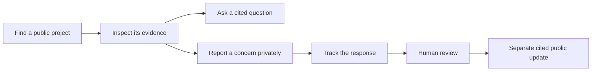
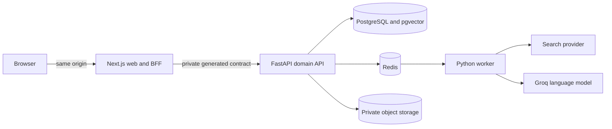

# ShaidaGo

> Track promises. Verify progress. Take action.

ShaidaGo helps residents understand local public projects, inspect the evidence behind each claim, report a concern privately, and follow what happens next.

The proof of concept starts in Abuja with AMAC and Bwari Area Councils. Its interface is available in English, Hausa, Igbo, and Yoruba, and its locality model can be adapted without turning ShaidaGo into a different product.

| Reviewer entry point | Link                                                                |
| -------------------- | ------------------------------------------------------------------- |
| Live application     | [Open the English demo](https://web-staging-0edf.up.railway.app/en) |
| Product scope        | [Read the product brief](docs/PRODUCT_BRIEF.md)                     |
| Technical design     | [Read the implementation plan](docs/IMPLEMENTATION_PLAN.md)         |
| AI disclosure        | [Read the AI build log](docs/AI_BUILD_LOG.md)                       |

The hosted environment contains public source-backed records and fictional reporting data. The reviewer workspace requires a private credential and is not open to anonymous visitors.

## The problem

Information about a public project may be spread across announcements, institutional websites, news reports, and later updates. A resident can spend time finding those pieces and still be unable to answer basic questions: What was promised? What does the source actually support? Is the information still current? Where can I raise a concern safely?

ShaidaGo brings that journey together. It gives residents a public record they can inspect, a private route to contribute evidence, and a way to follow the response.

## What to try

1. Open the [live application](https://web-staging-0edf.up.railway.app/en) and browse the public project directory.
2. Open a project record. Check its recorded status, last-checked date, cited facts, source passages, and original source links.
3. Ask a question. ShaidaGo answers only from approved project evidence and returns an insufficient-evidence response when the sources cannot support an answer.
4. Start a private report. No account, email address, or phone number is required. Use fictional information only.
5. Visit the trust page to see how sources, AI limits, private reports, and human review are explained to residents.
6. Switch the interface between English, Hausa, Igbo, and Yoruba from the language selector.

## How it works



Residents can browse records without signing in. Anonymous reporting works without an account or contact details. A private tracking code lets the reporter return without putting that code in a URL or persistent browser storage.

Reviewers work in a restricted, non-cacheable area. They can assess private evidence, request follow-up information, record notes and decisions, and publish only a separately written update supported by approved citations. A private report never becomes a public record automatically.

## Why it fits the challenge

ShaidaGo addresses the Transparency and Accountability track and supports the Safety, Reporting and Protection track.

| Hackathon requirement       | ShaidaGo response                                                                                                                                             |
| --------------------------- | ------------------------------------------------------------------------------------------------------------------------------------------------------------- |
| Trust and verification      | Public facts show approved citations, source passages, review state, and last-checked dates.                                                                  |
| Low bandwidth               | Public pages are server-rendered. Low-data mode reduces background work, and saved public records remain readable offline with a freshness notice.            |
| Accessibility and inclusion | The interface uses semantic HTML, visible focus, text labels, keyboard support, responsive layouts, reduced-motion support, and text alongside status colour. |
| Privacy and security        | Reports are private by default. Anonymous reporting needs no account or contact details, and reviewer data is excluded from public responses and caches.      |
| Multilingual access         | The complete interface catalogue is available in English, Hausa, Igbo, and Yoruba.                                                                            |
| Local relevance             | AMAC and Bwari are the starting localities. Institutions, sources, languages, and escalation routes remain local configuration.                               |
| Clear next steps            | Residents can report a concern, keep a private tracking code, follow progress, and answer a reviewer.                                                         |

## Trust and safety

- Every public fact and timeline update must resolve to approved evidence.
- AI output is an explanation, never a source or publication decision.
- New reports, attachments, contact details, reviewer notes, and follow-up answers remain private.
- Human review is required before community evidence or discovered material can affect a public record.
- Source Scout labels discovered material as unreviewed until a reviewer makes a decision.
- The prototype uses fictional reports and is not an emergency service.

See [`docs/PRIVACY_AND_SAFETY.md`](docs/PRIVACY_AND_SAFETY.md) for the implemented controls and production blockers.

## How AI is used

AI coding tools assisted with design, implementation, testing, debugging, and documentation. The decisions, accepted changes, verification evidence, and known limitations are recorded in [`docs/AI_BUILD_LOG.md`](docs/AI_BUILD_LOG.md).

Inside the product, AI can explain approved evidence and help find related public material. It receives no authority to verify an allegation, change a project status, or publish content. The default demo uses deterministic recorded replays because the live model did not meet the repository's evaluation standard.

## Architecture



- `apps/web` contains the Next.js App Router frontend and thin browser-facing BFF.
- `services/platform` contains the FastAPI modular monolith and Dramatiq worker.
- FastAPI owns authorisation, visibility, state transitions, citations, audit events, and publication rules.
- PostgreSQL is the source of truth. Redis holds bounded jobs and shared rate limits, not durable domain state.
- The browser calls only the Next.js origin. The private API and provider credentials never enter client bundles.
- FastAPI generates the OpenAPI contract and the web client is generated from it.

## Run locally

You need Docker, Node.js from [`.nvmrc`](.nvmrc), `pnpm`, and `uv`. The deterministic setup uses fictional data and replay providers, so it does not need an AI or search API key.

```bash
make setup
```

Start the API and web application in separate terminals:

```bash
uv --directory services/platform run --frozen --env-file "$(pwd)/.env" python -m shaidago.api.serve
```

```bash
set -a
source .env
set +a
pnpm --dir apps/web dev
```

Open `http://localhost:3000/en`. Run `make worker` in another terminal if you want to exercise Source Scout jobs.

## Verify the repository

Install the pinned browser engines once:

```bash
pnpm --dir apps/web exec playwright install chromium webkit
```

Then run the complete deterministic gate:

```bash
make verify
```

The gate checks backend formatting, lint, strict types, tests, coverage, migrations, contracts, security scans, frontend formatting, lint, strict types, tests, generated-client drift, privacy boundaries, browser journeys, and automated accessibility checks. Live provider tests are opt-in and are not part of the deterministic gate.

## Repository map

```text
apps/web/             Next.js frontend and BFF
services/platform/    FastAPI API and Dramatiq worker
contracts/            Generated OpenAPI contract
data/                 Public source register inputs and deterministic fixtures
docs/                 Product, architecture, build, safety, and evidence documents
infra/                Local PostgreSQL, Redis, object storage, and scanner services
railway/              Deployment configuration
```

The [documentation index](docs/README.md) links to the full product brief, build orders, architecture decisions, privacy model, threat model, deployment guide, and verification evidence.

## Prototype limits

This is a hackathon proof of concept, not a production service.

- The hosted environment is staging and uses a generated Railway domain.
- Reports are fictional, and the product does not provide emergency response.
- Hausa, Igbo, and Yoruba have maintainer review but no independent second-language review.
- The scripted manual screen-reader review has not been completed.
- Some candidate public sources block automated access, so the product does not present unsupported facts for those records.
- Live language-model performance did not meet the evaluation target, so the demonstration uses clearly labelled recorded responses.
- Legal, privacy, security, and operational reviews are still required before production use.

The exact release evidence and remaining work are recorded in [`docs/evidence/BE-122-final-backend-review.md`](docs/evidence/BE-122-final-backend-review.md) and [`docs/evidence/FE-162-hosted-smoke.md`](docs/evidence/FE-162-hosted-smoke.md).

## Contributing, security, and licence

Read [`CONTRIBUTING.md`](CONTRIBUTING.md) before making changes. Report suspected vulnerabilities privately through [`SECURITY.md`](SECURITY.md); do not place sensitive scenarios in a public issue.

ShaidaGo's original code and documentation are available under the [MIT License](LICENSE). Third-party sources and datasets retain their own terms and attribution requirements.
