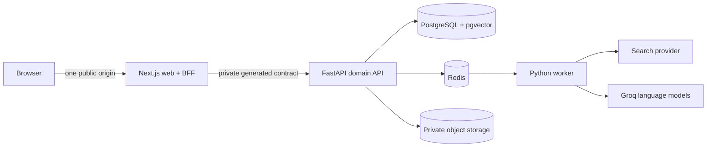

# ShaidaGo

> Track promises. Verify progress. Take action.

ShaidaGo is a low-bandwidth civic accountability platform for understanding local public projects, checking the evidence behind public claims, and reporting concerns through a private, human-reviewed workflow.

The hackathon pilot covers Abuja's AMAC and Bwari Area Councils. The public experience is designed for English, Hausa, Igbo, and Yoruba.

## Repository status

**Backend release gate in progress.** `services/platform` contains the FastAPI application, reviewed migrations, restricted database roles, deterministic tests, production container, staging configuration, and the frozen frontend contract. The Next.js application under `apps/web` has not been scaffolded yet, so this repository does not currently claim to provide the complete runnable product.

The remaining backend gates are explicit: human source and language review, live-provider evidence,
a complete private-network staging smoke, and the first green hosted CI run for the release branch.
Public seed facts remain limited to the exact evidence and caveats recorded in the source register.

## The problem

Information about local projects is fragmented across budgets, procurement records, public statements, and institutional websites. Residents may see that reality does not match a public promise but still lack a clear way to verify the record, understand uncertainty, contribute evidence safely, or follow up.

ShaidaGo brings the public project record, citations, plain-language explanations, community evidence, and safe reporting into one trust-aware journey.

## Core journeys

1. Browse or search cited projects in AMAC and Bwari.
2. Inspect facts, status, responsible institutions, timelines, and original sources.
3. Ask a question answered only from approved project evidence.
4. Submit a fictional anonymous-first concern and receive a non-identifying tracking code.
5. Track the public-safe status without an account.
6. Review evidence privately and publish only a separately authored, approved update.
7. Use Source Scout to discover public information through a previewed privacy-safe query.

## Architecture

- **Frontend/BFF:** Next.js App Router, React, strict TypeScript, Tailwind CSS, accessible project-owned components, and `next-intl`.
- **Backend:** FastAPI, Pydantic, SQLAlchemy, Alembic, PostgreSQL, Redis, and Dramatiq.
- **Contract:** FastAPI owns domain rules and emits OpenAPI; the web client is generated from that schema.
- **Boundary:** browsers call only the Next.js origin. The BFF handles browser concerns, while FastAPI remains the sole authority for domain policy, authorisation, privacy, and publication.

The rationale, exact boundaries, rejected alternatives, data model, tests, deployment model, and build order are in [docs/IMPLEMENTATION_PLAN.md](docs/IMPLEMENTATION_PLAN.md).

## Trust and safety commitments

- Every public project fact must resolve to approved evidence.
- Private reports never publish automatically.
- AI does not decide whether an allegation is true and cannot publish a claim.
- Anonymous reporting does not require an account, email address, or phone number.
- Contact details, report content, attachments, tracking codes, and reviewer notes stay outside public responses, logs, caches, analytics, and public AI retrieval.
- Search results remain “discovered — not yet reviewed” until a reviewer makes an explicit decision.
- This proof of concept is not an emergency service and must use only fictional report data.

## Documentation

Start with the [documentation index](docs/README.md).

| Document | Purpose |
| --- | --- |
| [PRODUCT.md](PRODUCT.md) | Durable product scope, users, operating context, and non-goals |
| [Product brief](docs/PRODUCT_BRIEF.md) | Detailed problem, journeys, functional requirements, and acceptance criteria |
| [Implementation plan](docs/IMPLEMENTATION_PLAN.md) | Chosen stack, architecture, security model, quality gates, and build order |
| [Backend build order](docs/BACKEND_BUILD_ORDER.md) | Closed implementation circles for the FastAPI API, worker, data, security, tests, and deployment |
| [Frontend build order](docs/FRONTEND_BUILD_ORDER.md) | Closed implementation circles for the Next.js UI/BFF, localisation, accessibility, PWA, and visual finish |
| [AGENTS.md](AGENTS.md) | Repository-wide implementation and code-review rules for coding agents |
| [CONTRIBUTING.md](CONTRIBUTING.md) | Human contribution workflow and pull-request expectations |
| [SECURITY.md](SECURITY.md) | Private vulnerability reporting and prototype data policy |
| [Privacy and safety](docs/PRIVACY_AND_SAFETY.md) | Implemented privacy controls, evidence, and production blockers |
| [AI build log](docs/AI_BUILD_LOG.md) | Transparent record of AI-assisted engineering work and human review status |

## Unattended build loops

The tracked Claude commands [`backend-build-loop`](.claude/commands/backend-build-loop.md) and [`frontend-build-loop`](.claude/commands/frontend-build-loop.md) execute the respective build orders task by task. Each requires an explicit task packet, verification evidence, documentation, and one Conventional Commit per task; neither may publish, deploy, or substitute human decisions for source, language, or visual review.

## Development

`services/platform` has a pinned Python toolchain (see its README); the root `Makefile` provides `make backend-*` targets (`make backend-verify` is the backend gate); the judge-facing `make setup`/`make verify` do not exist yet. The frozen frontend handoff is [`docs/FRONTEND_BACKEND_CONTRACT.md`](docs/FRONTEND_BACKEND_CONTRACT.md), backed by generated OpenAPI and MSW-ready response fixtures. `make infra-up-core` (after `cp .env.example .env`) starts local PostgreSQL 18 + pgvector, Redis, and MinIO through Docker Compose on loopback-only ports; `make infra-up` adds the ClamAV scanner, which needs 1.5-3 GB of memory. `make migrate` then `make db-roles` prepare the database (schema, roles, and role logins), and `make seed-demo` loads local demo data, refreshes approved public source chunks, and loads a matching checked-in embedding fixture when present. It never calls an AI provider. `make embeddings` is the separate, explicit generation command for an OpenAI-compatible embeddings endpoint and requires `EMBEDDING_API_KEY`; Groq serves no embedding model, so retrieval otherwise runs keyword-only and says so (ADR-0009).

When implementation starts, the separate stacks remain independently owned:

- `pnpm` manages `apps/web`.
- `uv` manages `services/platform`.
- root `make` targets orchestrate cross-stack judge workflows only.

## Known limitations

This remains a fictional-data prototype, not an emergency service. Three source-register projects
have no verified fact, multilingual Q&A copy awaits fluent human review, live Groq/Brave evidence
has not been run, the hosted demo has no malware scanner, the complete staging smoke is pending,
and production is closed until legal, privacy, security, and operational review. See the
[`BE-122 evidence review`](docs/evidence/BE-122-final-backend-review.md) for the exact release items.

## Contributing and security

Read [CONTRIBUTING.md](CONTRIBUTING.md) before making changes. Do not put vulnerabilities or sensitive report scenarios in a public issue; follow [SECURITY.md](SECURITY.md).

## License

ShaidaGo's original code and documentation are available under the [MIT License](LICENSE). Copyright © 2026 Aniekan Winner Anietie. Third-party source material and datasets retain their own terms and attribution requirements.
