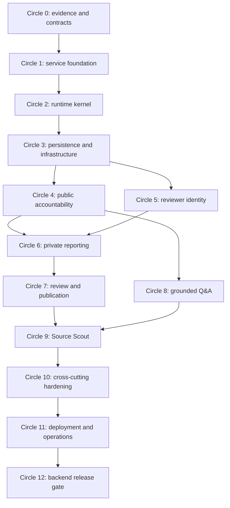

# ShaidaGo backend build order

- **Status:** execution specification
- **Applies to:** `services/platform`, backend-owned contracts, migrations, workers, local infrastructure, and backend CI
- **Primary runtime:** Python 3.14, FastAPI, Pydantic 2, SQLAlchemy 2 async, Alembic, PostgreSQL 18 + pgvector, Redis 8, Dramatiq
- **Pilot:** Abuja — AMAC and Bwari Area Councils
- **Last updated:** 19 September 2026

This document turns the backend architecture in [`IMPLEMENTATION_PLAN.md`](IMPLEMENTATION_PLAN.md) into a low-level, dependency-ordered execution plan. It is intentionally explicit enough for a coding model with limited context. It does not authorise changing product scope, weakening trust controls, fabricating public records, or using real reports.

## 1. How to execute this build order

### 1.1 A “circle” is a closed group of work

Each numbered circle groups tasks that belong to one verifiable capability. Work moves around the same closed loop:

1. **Orient:** read the named inputs and inspect the current repository state.
2. **Specify:** write or confirm schemas, state transitions, interfaces, and failure behaviour before implementation.
3. **Implement:** make the smallest vertical change that satisfies the specification.
4. **Prove:** run unit, integration, contract, migration, and adversarial checks appropriate to the risk.
5. **Inspect:** review public/private outputs, logs, generated artifacts, and the final diff.
6. **Record:** update documentation, contract snapshots, migrations, fixtures, and the AI build log.
7. **Hand off:** leave a stable input and explicit evidence for the next circle.

A circle is not complete because its files exist. It is complete only when its exit gate passes from a clean checkout and the evidence named in the circle is committed.

### 1.2 Required task packet

Before a coding model starts any task ID, it must restate this packet in its working notes:

| Field | Required content |
| --- | --- |
| Task | Exact task ID and title from this document |
| Outcome | One observable capability delivered by the task |
| Dependencies | Prior task IDs and files/contracts that must already exist |
| In scope | Exact modules, tables, endpoints, jobs, or tests to change |
| Out of scope | Adjacent features the task must not begin |
| Inputs | Authoritative documents, schemas, fixtures, and environment assumptions |
| Failure behaviour | Expected safe result for invalid input, dependency outage, denial, timeout, and partial failure |
| Verification | Exact checks and expected results |
| Evidence | Files, test names, generated diffs, or screenshots/log summaries to preserve |
| Handoff | What the next task may rely on without reinterpreting this task |

If any field is unknowable, stop that task and resolve the decision in documentation. Do not invent a security boundary, public fact, credential, translation, or provider behaviour.

### 1.3 Execution rules

- Complete circles in order. Tasks within a circle may run in parallel only when their dependency lines do not overlap files or contracts.
- Use one focused commit per task or tightly coupled pair of tasks. Use Conventional Commit messages.
- Start every task with `git status --short --branch`; preserve unrelated work, including `CLAUDE.md` until its owner chooses to commit it.
- The commands in this document become real only after the circle that creates them. Never report a planned command as executed.
- Use fixture adapters by default. Live OpenAI, Brave, R2, or hosted-service checks are opt-in and never required for deterministic CI.
- A new dependency requires a written purpose, maintenance/security check, licence check, and lockfile update.
- Never lower a test threshold, bypass a migration, loosen a database grant, or suppress an error to make a gate pass.
- Backend code owns domain rules. The BFF may transport and reshape safe responses, but it must not become a second authority.

### 1.4 Dependency map



## 2. Repository target owned by the backend

The backend implementation should converge on this shape. Add directories only when their owning circle starts.

```text
services/platform/
├── pyproject.toml
├── README.md
├── src/shaidago/
│   ├── __init__.py
│   ├── api/
│   │   ├── app.py
│   │   ├── dependencies.py
│   │   ├── errors.py
│   │   ├── middleware.py
│   │   └── v1/
│   ├── auth/
│   ├── audit/
│   ├── discovery/
│   ├── files/
│   ├── projects/
│   ├── reports/
│   ├── retrieval/
│   ├── review/
│   ├── sources/
│   └── shared/
│       ├── clock.py
│       ├── config.py
│       ├── crypto.py
│       ├── database.py
│       ├── ids.py
│       ├── logging.py
│       └── problems.py
├── migrations/
├── tests/
│   ├── unit/
│   ├── integration/
│   ├── contract/
│   ├── security/
│   ├── evaluation/
│   └── fixtures/
└── Dockerfile
contracts/openapi.json
data/
├── seed-projects.json
├── seed-demo-reports.json
├── source-notes/
├── embeddings/
└── discovery-fixtures/
infra/docker/
scripts/
```

Domain modules use the same internal layers where needed: `models.py` for domain values, `schemas.py` for Pydantic boundaries, `tables.py` for ORM mappings, `repository.py` for persistence, `service.py` for use cases, and `routes.py` for HTTP. Do not create empty layers or generic base classes merely to match the pattern.

## 3. Circle 0 — evidence, vocabulary, and irreversible decisions

- **Purpose:** prevent implementation from encoding guesses about public facts, private data, status meaning, or provider rights.

- **Entry:** planning-only repository; no application code required.
- **Exit:** product vocabulary, source evidence, data classification, state machines, and backend decision records are reviewable and internally consistent.

### BE-000 — Reconcile backend scope

1. Read `PRODUCT.md`, `AGENTS.md`, `docs/PRODUCT_BRIEF.md`, and `docs/IMPLEMENTATION_PLAN.md` completely.
2. Create a checklist mapping every backend-owned acceptance criterion to one circle and task ID in this document.
3. Confirm the five backend journeys: public project read, grounded Q&A, anonymous report and tracking, reviewer processing/publication, and Source Scout.
4. Record explicit non-goals: public accounts, real whistleblower data, emergency dispatch, automatic truth scoring, automatic publication, nationwide ingestion, and generic crawling.
5. Fail this task if a must-have requirement has no owner, test, or exit gate.

- **Evidence:** requirements-to-task traceability table added to the implementing pull request.
- **Done when:** no acceptance criterion is orphaned or assigned to the BFF alone.

> **Execution status (2026-09-19): complete.** The requirements-to-task traceability table is `docs/REQUIREMENTS_TRACEABILITY.md`, the five journeys and the non-goals (for example NG-01, no public accounts) are mapped there, and no criterion is orphaned or assigned to the BFF alone.

### BE-001 — Build the verified source register

> **Execution status (2026-09-19): deferred by maintainer.** Complete this task as part of the evidence-backed demo seeding work immediately before BE-043. The deferral changes execution order only: BE-001 remains a prerequisite for BE-043 and the Circle 0 exit gate remains open until the register and validator pass.

> **Execution status (2026-09-19): complete, with an evidence caveat.** `data/source-register.json` (rendered to `docs/SOURCE_REGISTER.md`) holds six projects, three AMAC and three Bwari, covering health, education, water, and roads, and `scripts/validate_source_register.py --self-test` rejects a fact without a source, a missing or future last-checked date, an unlabeled fictional report, a tampered passage, judgemental wording, and seven other faults. Each source was requested on 2026-09-19: **three (Punch, The Nation, Abuja Times) were read in full and seven facts have passages verified word for word; three (FCT UBEB twice, The Hospital Book) returned HTTP 403 and were not bypassed, so their three facts are recorded as not verified and are not eligible for seeding.** The supplied draft was corrected where the evidence did not support it (placeholder hashes replaced by real ones or none, a truncated quote, the 7.2 km figure moved to the Punch source, an unsupported purpose clause removed, English text no longer labelled reviewed, and four unsourced escalation routes marked unverified).

1. Create `docs/SOURCE_REGISTER.md` or an equivalently reviewable structured register.
2. Select six public projects: three AMAC and three Bwari, spanning at least health, education, water, and road/public works.
3. For each fact, capture the source URL/document reference, publisher, publication date, exact page/section/passage, retrieval date, content hash where permitted, reuse constraints, and unresolved gap.
4. Record source availability independently from fact verification.
5. Use neutral wording. “No public completion update found as of DATE” is acceptable when supported; “abandoned” is not inferred.
6. Keep report fixtures fictional and visibly marked. Do not derive an allegation from a real person or organisation.

- **Tests:** a schema/validator rejects a fact without at least one source candidate, a missing last-checked date, or an unlabeled fictional report.
- **Done when:** every seed fact has exact supporting evidence and can survive a manual source audit.

### BE-002 — Freeze controlled vocabularies and state machines

> **Execution status (2026-09-19): complete.** The canonical values are in `contracts/controlled-vocabulary.json`; `docs/CONTROLLED_VOCABULARY.md` is its generated review view, and the dependency-free validator enforces value and transition integrity.

Document machine values, display meanings, allowed transitions, terminal states, and who may perform each transition for:

- project categories and public project status;
- source type, review state, and availability;
- verification state;
- report concern category and risk level;
- report lifecycle: `received`, `needs_information`, `under_review`, `verified_for_public_update`, `referred`, `closed`, plus explicit reopen transitions;
- evidence sanitation and malware-scan states;
- discovery lifecycle: `queued`, `searching`, `analysing`, `needs_review`, `complete`, `failed`, `cancelled`;
- discovered-source decision: attach, reject, defer;
- translation status: `reviewed`, `machine_assisted`, `unavailable`.

Choose lowercase snake-case machine values. Never reuse one value with two meanings. Each future database `CHECK`, Pydantic enum/literal, API example, translation key, and test fixture must derive from this vocabulary.

- **Done when:** one transition table answers current state, command, actor, next state, audit event, public visibility, and failure code.

### BE-003 — Classify data and draw trust boundaries

> **Execution status (2026-09-19): complete.** `docs/THREAT_MODEL.md` is the reviewed design contract; `scripts/validate_threat_model.py --self-test` enforces asset, zone, flow, allowlist, lifecycle, STRIDE, and task-reference coverage. Every control it names remains planned until its owning task passes.

Create `docs/THREAT_MODEL.md` with:

1. Assets: public facts, private report text, contacts, handles, tracking codes, evidence, reviewer credentials, session tokens, encryption keys, provider keys, audit history.
2. Actors: anonymous visitor, reporter with tracking code, reporter with optional handle, reviewer, worker, BFF, maintainer, external search/AI/storage provider, attacker.
3. Trust zones: browser, public Next.js origin, private API, worker, database roles, Redis, object storage, external providers.
4. Data-flow diagrams for report submission, status lookup, reviewer download, project Q&A, public discovery, and report-scoped discovery.
5. Classification: public, public-after-review, private, secret, and security metadata.
6. Retention owner and deletion/unlink behaviour for every private class.
7. STRIDE-style threats and mandatory tests already named in `AGENTS.md`.

- **Done when:** every outbound data flow has an allowlist and every private class has a storage, encryption, logging, caching, and deletion rule.

### BE-004 — Record backend architecture decisions

> **Execution status (2026-09-19): complete.** Eight accepted records are in `docs/decisions/` with an index; `scripts/validate_decisions.py --self-test` enforces structure, numbering, index accuracy, topic coverage, and task references. ADR-0005 also resolves how BE-063's idempotent replay returns a tracking code that is never stored.

Create accepted ADRs under `docs/decisions/` for decisions that are difficult to reverse:

- modular monolith with API and worker entry points;
- BFF/private API authority split and internal-service authentication;
- PostgreSQL roles, public views, row security, and no-`RETURNING` private submission path;
- envelope encryption and key versioning for private fields;
- tracking-code structure and keyed storage;
- object sanitation pipeline and hosted-demo scanner limitation;
- OpenAPI-first generated browser contract;
- provider isolation, replay fixtures, and live-test policy.

Each ADR includes context, decision, alternatives, consequences, migration impact, status, and links to enforcing tests.

### Circle 0 exit gate

> **Gate status (2026-09-19): open.** BE-000, BE-002, BE-003, and BE-004 are complete. The gate closes when deferred BE-001 delivers the six-project source register and its validator, immediately before BE-043. Circle 1 may start because it depends on no source evidence.

> **Gate status (2026-09-19, updated): closed, with a caveat.** BE-001 delivered the register and its validator, so every exit criterion holds: the register is reviewable, the state tables and threat model are complete, the ADRs are accepted, and no code or seed may claim more than the register proves (only exact-passage facts are eligible). The caveat is evidence coverage, not structure: three of six projects have no verified fact until the maintainer supplies readable sources for the FCT UBEB and Hospital Book claims.

- Six-project source register is manually reviewable.
- State/value tables contain no ambiguous or missing transition.
- Threat model covers each critical data flow and private data class.
- ADRs resolve authority, encryption, tracking, files, contract, and provider boundaries.
- No code or seed claims more than the evidence register proves.

## 4. Circle 1 — deterministic service and toolchain foundation

- **Purpose:** create a reproducible Python service before domain logic.
- **Entry:** Circle 0 complete.
- **Exit:** a clean clone can install, lint, type-check, and run an empty test suite with pinned tools.

### BE-010 — Scaffold the Python project

1. Create `services/platform/pyproject.toml`, `.python-version`, package source directory, test directories, and service README.
2. Set Python `>=3.14,<3.15`; make the actual runtime image and CI use the same minor line.
3. Add runtime dependencies by explicit purpose: FastAPI, Uvicorn, Pydantic settings, SQLAlchemy async, psycopg 3, Alembic, Dramatiq Redis broker, structured logging, cryptography, Argon2, HTTP client, document/image tooling, and provider SDKs only when their owning circles begin.
4. Add development groups: Ruff, Pyright, pytest, pytest-asyncio, Hypothesis, coverage, Testcontainers, Schemathesis, and security tools.
5. Configure Ruff formatting/linting and Pyright strict mode. Avoid broad per-file ignores; any exception names the reason.
6. Generate and commit `uv.lock`. Verify frozen sync from an empty virtual environment.

- **Required files:** `pyproject.toml`, `.python-version`, `uv.lock`, `src/shaidago/__init__.py`, `tests/conftest.py`, service README.
- **Verification:** `uv sync --all-groups --frozen`, Ruff check/format check, Pyright, and pytest collection all succeed.
- **Do not:** add domain tables, provider calls, or placeholder secrets.

> **Execution status (2026-09-19): complete.** `services/platform` has a pinned Python 3.14 project with a committed `uv.lock`; from an empty `.venv`, `uv sync --all-groups --frozen`, Ruff check and format check, Pyright strict, and pytest (one package-import test) all pass locally. Provider SDKs (OpenAI, S3) and `python-multipart` are deliberately absent until their owning circles. `psycopg` and `dramatiq` are LGPL-3.0 (used as unmodified, dynamically linked libraries); `hypothesis` is MPL-2.0; `pip-audit` reported no known vulnerabilities.

### BE-011 — Establish canonical backend commands

Add Make targets or scripts with one implementation behind each name:

- `backend-sync`: frozen dependency sync;
- `backend-format`: write formatting;
- `backend-format-check`: check formatting only;
- `backend-lint`;
- `backend-typecheck`;
- `backend-unit`;
- `backend-integration`;
- `backend-contract`;
- `backend-security`;
- `backend-test` for all deterministic backend tests;
- `backend-verify` for the complete backend gate;
- `openapi-generate` and `openapi-check` once Circle 2 creates the app.

Targets must fail on the first failed child command, use no developer-global packages, and produce the same result locally and in CI.

> **Execution status (2026-09-19): complete.** The root `Makefile` provides every listed target (`openapi-generate` and `openapi-check` were added later; see below). `make backend-verify` ran green locally, and negative checks confirmed that a failing test and a lint violation each produce a non-zero exit. The integration layer holds no tests yet, so its target prints that fact and exits 0 (pytest exit code 5 only); BE-030 must add the first tests there. `openapi-generate` and `openapi-check` were added at the Circle 2 gate and `openapi-check` is part of `backend-verify`.

### BE-012 — Add backend CI without false claims

1. Create a least-privilege GitHub Actions workflow pinned by full action commit SHA with version comments.
2. Separate fast static/unit checks from service-backed integration checks while preserving one required aggregate result.
3. Cache only safe dependency artifacts; never cache `.env`, generated secrets, database volumes, or private fixtures.
4. Use PostgreSQL/Redis/MinIO/ClamAV services only in jobs that require them.
5. Upload coverage and logs only after the central redaction test exists; until then, keep artifacts minimal.
6. Prove the workflow on the repository branch before making it required.

> **Execution status (2026-09-19): partial.** `.github/workflows/backend.yml` is written with `contents: read` permissions, `actions/checkout` v7.0.1 and `astral-sh/setup-uv` v10.1.0 pinned by full commit SHA (resolved read-only through the GitHub API), a lockfile-keyed uv cache only, and one aggregate `Backend required` job over the static/unit job. The YAML parses locally, but no linter such as actionlint was available and **the workflow has never run: CI green is pending** because pushing is a maintainer action. Service-backed integration jobs and coverage/log upload are deliberately absent until BE-030 and the redaction test (BE-023). The maintainer should note that the `paths` filter means a required check would not report on unrelated pull requests; decide that before marking `Backend required` as required.

> **Execution status (2026-09-19, updated): complete.** The workflow has run: `gh run list` shows the backend workflow green on `main` and on the reviewed pull-request branches (after one failure that was fixed by adding a Redis service). The integration job now also starts MinIO (creating the private bucket) and ClamAV as pinned containers so the storage, scanner, and readiness tests run in CI. That addition has only been validated locally (the YAML parses; no actionlint was available), so its first CI run will be its proof.

### Circle 1 exit gate

- Frozen install works from a clean environment.
- Static checks and empty tests are green locally and in CI.
- `uv.lock` changes only when dependencies change.
- No backend command depends on an undeclared global tool.

> **Gate status (2026-09-19): open.** Met locally: frozen install from an empty `.venv`, green static checks and tests through `make backend-verify`, `uv lock --check` clean, and the only global tools are `make` and `uv`. Missing: green CI on the repository branch (BE-012), which needs a maintainer push.

## 5. Circle 2 — runtime kernel, configuration, errors, and observability

- **Purpose:** make every future endpoint inherit safe configuration, lifecycle, error, and logging behaviour.
- **Entry:** deterministic toolchain.
- **Exit:** the API starts, authenticates its BFF caller, emits safe health responses, and produces redacted structured logs.

### BE-020 — Typed environment configuration

Create `shared/config.py` using Pydantic settings with separate models for application, database, Redis, storage, crypto, authentication, providers, rate limits, and observability.

Requirements:

- environment is exactly `development`, `test`, `staging`, or `production`;
- production/staging refuse debug mode, default secrets, insecure cookie policy, `SCANNER_MODE=not_deployed` in production, public object buckets, and missing encryption/session/tracking keys;
- secrets use secret types and never appear in model repr or validation output;
- URLs are parsed and validated, not string-concatenated;
- provider model IDs and budgets come from configuration;
- `.env.example` documents purpose and safe placeholder, never a usable credential;
- a settings test covers each fail-fast production invariant.

> **Execution status (2026-09-19): complete.** `load_settings` validates nine typed sections and every fail-fast production and staging invariant is covered by `tests/unit/shared/test_config.py` (51 passing tests, Ruff and Pyright strict clean); `.env.example` is loaded by a test and refused in production.

### BE-021 — Application factory and lifespan

1. Implement `create_app(settings, dependencies)` rather than constructing global I/O at import time.
2. Register versioned routers under `/v1` and unversioned `/health/live` and `/health/ready` only.
3. Open connection pools and provider clients during lifespan; close them deterministically.
4. Keep docs/OpenAPI available in development/test, authenticated or disabled in staging/production, while still supporting deterministic schema generation.
5. Add a test factory that injects clocks, randomness, repositories, and provider fixtures.

> **Execution status (2026-09-19): partial.** The factory, `/v1` router mount, config-gated docs, deterministic schema generation, and reverse-order resource lifecycle are implemented and tested (60 passing tests, Ruff and Pyright strict clean). Item 5's clock and randomness injection is deferred to BE-034, which owns those primitives, and real pools and provider clients arrive with BE-031 and later; the lifespan is proven with recording fakes.

> **Execution status (2026-09-19, updated): complete.** The deferred item is delivered: the application receives its clock and identifier generator through `Dependencies`, backed by the BE-034 primitives, and every report, session, and audit path uses them with deterministic test doubles.

### BE-022 — Internal caller authentication

The API is private but must not trust network location alone.

1. Define a rotated internal credential used by the Next.js server/BFF and approved worker paths.
2. Verify it before public or reviewer routers execute; use constant-time comparison and generic denial.
3. Never expose the credential to browser bundles or logs.
4. Provide distinct credentials/identities for web and worker if their permissions diverge.
5. Test missing, malformed, expired/rotated, and valid credentials.

Do not confuse internal caller authentication with reviewer authentication or report tracking credentials.

> **Execution status (2026-09-19): complete.** `InternalAuthMiddleware` runs before every router; `tests/unit/auth/test_internal_auth.py` covers missing, malformed, wrong-caller, rotated, retired, and valid credentials (79 passing tests, Ruff and Pyright strict clean). No worker identity exists because the worker does not call the API (ADR-0001).

### BE-023 — Request context and structured logging

1. Accept a syntactically valid inbound request ID from the trusted BFF or generate a UUIDv7.
2. Propagate it through logs, database audit metadata, worker messages, and safe responses.
3. Emit JSON logs with timestamp, level, service, environment, request/job ID, route template, method, safe status/error code, latency, and dependency class.
4. Build a recursive redactor for exact keys and pattern classes covering passwords, cookies, authorisation, contacts, report text, tracking codes, handles/passphrases, signed URLs, prompts, file bytes, and IP addresses.
5. Add canary tests that fail if any sensitive value reaches captured logs or exception output.
6. Never log full request/response bodies.

> **Execution status (2026-09-19): partial.** Request context, the redacting JSON logger, and canary tests for logs and exception output are implemented (99 passing tests, Ruff and Pyright strict clean). Propagation of the request ID into database audit metadata and worker messages is deferred to the tasks that create the audit table and the worker envelope (BE-090), and the error code in the access line arrives with BE-024.

> **Execution status (2026-09-19, updated): partial.** The request ID now reaches the database audit metadata (`AuditWriter` records it, and the sign-in, sign-out, and follow-up paths pass it). Only propagation into worker messages remains, and it belongs to the worker envelope in BE-090.

### BE-024 — Problem details and exception boundary

Implement one RFC 9457-style `application/problem+json` shape containing `type`, `title`, safe `status`, stable `code`, safe `detail`, `instance` or request ID, and field errors where appropriate.

- Map validation, authentication, authorisation, conflict, rate limit, dependency unavailable, unsupported media, payload too large, and internal failure centrally.
- Keep internal exceptions chained in server logs after redaction; never return stack traces, SQL, object keys, provider text, or record existence.
- Test response media type, schema, stable code, localisation handoff field if used, and redaction.

> **Execution status (2026-09-19): complete.** One problem+json shape and one exception boundary are implemented; `tests/unit/api/test_errors.py` proves canary values never reach responses or redacted logs and that framework, validation, domain, and unexpected errors share the shape.

### BE-025 — Health and readiness

- Liveness checks process responsiveness only.
- Readiness checks database connectivity and migration revision, Redis, and required object storage; it reports only safe component status.
- OpenAI and search outages do not make the API globally unready.
- Bound every dependency check by a short timeout and run independent checks concurrently where safe.
- Test healthy, degraded optional provider, required dependency failure, timeout, and no-detail public output.

> **Execution status (2026-09-19): partial.** Liveness, readiness semantics (ready, degraded, unavailable), bounded concurrent checks, and no-detail output are implemented and proven with fake probes (117 passing tests). The database probe (BE-031) and the migration-revision probe (BE-033) are now registered; Redis and object-storage probes are still not, and belong to the tasks that add those clients.

> **Execution status (2026-09-19, updated): complete.** Redis (`PING`), object storage (`HEAD` of the configured bucket), and the scanner (clamd `PING`, only when `SCANNER_MODE=clamd`) are registered as required probes beside the database and migration revision. Integration tests prove each passes against the real service and fails when it is gone, and the configured-app tests show all five components in the readiness response.

### Circle 2 exit gate

- App starts and stops without leaked resources.
- Unknown/untrusted callers cannot reach routes.
- All errors use the safe problem contract.
- Canary secrets never appear in logs or responses.
- Health semantics distinguish live, ready, and optional-feature degradation.
- Deterministic `contracts/openapi.json` generation is available even with external providers offline.

> **Gate status (2026-09-19): open, with two named gaps.** Evidence: (1) a real `uvicorn --factory` process started, served `/health/live` (200, request ID, `no-store`) and `/health/ready` (401 without the credential, 200 with it), logged redacted JSON, and shut down cleanly, and lifespan open/close order is unit-tested with fakes; (2) unauthenticated callers, including for unknown paths, get one generic 401 before any router; (3) framework, validation, domain, and unexpected errors all use the problem shape; (4) canary values are absent from redacted logs, exception output, and responses in tests; (5) `contracts/openapi.json` is generated deterministically from synthetic settings and `make openapi-check` is part of `make backend-verify` (121 tests passing, exit 0). **Gaps:** BE-021's clock/randomness injection is deferred to BE-034, and BE-025's real database, migration-revision, Redis, and object-storage probes are not registered (the API currently reports `ready` with no components), so "readiness distinguishes required dependency failure" is proven only with fake probes. BE-023 request-ID propagation into audit metadata and worker messages also remains. Circle 3 may start: it supplies those pieces.

> **Gate status (2026-09-19, updated): open, one named gap.** BE-021's clock and randomness injection is delivered, and BE-023's audit-metadata propagation is delivered. Remaining: BE-025's Redis and object-storage probes are not registered, so readiness is proven against real dependency failure only for the database and migration revision, and request-ID propagation into worker messages waits for BE-090.

> **Gate status (2026-09-19, updated again): closed.** BE-025's Redis, object-storage, and scanner probes are registered and proven, so the only remaining item is request-ID propagation into worker messages, which belongs to the worker envelope (BE-090) and is tracked there. CI has run green on the repository.

## 6. Circle 3 — local infrastructure, database roles, and migration baseline

- **Purpose:** establish the real persistence and service topology before domain repositories.
- **Entry:** runtime kernel complete.
- **Exit:** migrations run from empty, restricted roles are tested, and local dependencies are reproducible.

### BE-030 — Compose development infrastructure

Create Docker Compose definitions for:

- PostgreSQL 18 with a pinned pgvector-enabled image and health check;
- Redis 8 with persistence appropriate for local jobs and a health check;
- MinIO with a private evidence bucket provisioner;
- ClamAV for local/CI scanning with readiness based on loaded signatures.

Use named project-scoped volumes, explicit ports configurable for local use, resource limits where supported, and no default production passwords. `make infra-up`, `infra-down`, `infra-logs`, and `infra-clean` must target only ShaidaGo resources. `infra-clean` requires an explicit destructive confirmation variable and never targets an unresolved path or external database.

> **Execution status (2026-09-19): partial.** PostgreSQL 18 + pgvector, Redis, and MinIO with a private bucket were brought up healthy, persisted data across restart, and were removed only by a confirmed `infra-clean`; static Compose guards run in the unit suite. ClamAV is defined with a signature-aware health check but was **not started** (the Docker VM had about 2.6 GB free alongside unrelated containers), so scanner readiness and `make infra-up` end to end are unproven.

> **Execution status (2026-09-19, updated): complete.** ClamAV was started with `make infra-up` and became healthy (signature-aware health check). `make backend-integration` now runs a real scan against it: clean content passes and the standard EICAR test file is reported as malware, a dead scanner fails closed, and readiness reports the scanner. `make infra-up` end to end (PostgreSQL, Redis, MinIO with a private bucket, ClamAV) is proven on this machine.

### BE-031 — Async database kernel

1. Build async engine/session factories with pool configuration, statement timeout, UTC session expectations, and connection health checks.
2. Scope one session/transaction to one use case. Route functions do not call `commit()` opportunistically.
3. Translate known integrity/serialization errors into domain outcomes; unknown database errors remain internal.
4. Add repository integration fixtures that create isolated transactions or disposable databases without hiding committed-transaction behaviour.

> **Execution status (2026-09-19): complete.** The async engine, unit-of-work, SQLSTATE translation, pre-ping recovery, and readiness probe are proven against PostgreSQL 18 in 12 integration tests (`make backend-verify` exit 0, 144 passed). Separate public/reviewer pools wait for BE-032's roles.

### BE-032 — Roles, schemas, grants, and row security

Create migration-managed roles or deployment SQL for:

- migration owner;
- public read/submission application role;
- reviewer application role;
- worker role.

Implement public views/projections, least-privilege grants, and row-security policies for private tables. Anonymous submission may insert but cannot select private reports. Generate IDs/timestamps in the application and configure mappings so private inserts do not issue `RETURNING` or read server defaults.

**Mandatory integration tests:** connect as each role and assert allowed and denied `SELECT`, `INSERT`, `UPDATE`, and private/public view paths. The restricted submission test must inspect emitted SQL or database behaviour to prove no read-back occurs.

> **Execution status (2026-09-19): partial.** Roles, schemas, default-deny grants, forced row security, and the no-read-back mapping are proven by 11 integration tests that log in as each role (`make backend-verify` exit 0, 155 passed). The proof uses synthetic probe tables because the real private tables do not exist yet; the baseline is executed by BE-033's migration, and each real table must add its own grants, policies, and allow/deny test.

> **Execution status (2026-09-19, updated): complete.** The real tables now carry their own grants, forced row security, and allow/deny tests: reports, contacts, status events, tracking keys, evidence, reporter handles, and follow-up questions and answers (`test_private_reports.py`, `test_reporter_handles.py`, `test_follow_ups.py`), including the insert-only public role and the definer functions each one exposes.

### BE-033 — Alembic discipline and baseline

1. Configure Alembic to import one metadata registry without importing the running app.
2. Create the extension/baseline migration, including `CREATE EXTENSION IF NOT EXISTS vector` and readiness verification.
3. Give every constraint and index a stable name.
4. Add a migration test: empty database → head, head → one revision down/up when reversible, model metadata drift check, and second run idempotence where applicable.
5. Never edit an applied migration; use a corrective revision.

> **Execution status (2026-09-19): complete.** Alembic runs empty-to-head, head-to-base-and-back, and repeat upgrades against PostgreSQL 18, drift and ownership checks pass, and readiness now includes a migration-revision probe (`make backend-verify` exit 0, 170 passed). The drift check is vacuous until the first model tables arrive.

### BE-034 — Shared identifiers, clock, pagination, and idempotency primitives

Implement and test:

- injectable UTC clock;
- monotonic UUIDv7 generation with deterministic test adapter;
- opaque cursor encode/decode with version and tamper protection;
- page-size caps and stable ordering with ID tie-breaker;
- idempotency-key validation, request fingerprinting, result storage, conflict response, expiry, and concurrent duplicate handling.

These primitives must exist before any create/list endpoint uses a local alternative.

> **Execution status (2026-09-19): complete.** Clock, monotonic UUIDv7, signed cursors, and idempotency (sealed replay, conflict, expiry, concurrent duplicates) are proven by Hypothesis property tests and PostgreSQL integration tests (`make backend-verify` exit 0, 227 passed). The tests also exposed and led to two corrections in the BE-032 and BE-033 baseline, recorded in the build log.

### Circle 3 exit gate

- Compose services become healthy and shut down cleanly.
- Empty-to-head migration and schema drift checks pass.
- Every database role is proven by allow/deny integration tests.
- Shared ID, time, cursor, and idempotency primitives have deterministic property tests.

> **Gate status (2026-09-19): open, one named gap.** Evidence: empty database to head, head to one revision down and up, head to base and back, repeat upgrade, and model drift all pass against PostgreSQL 18 (`tests/integration/test_migrations.py`); every application role is proven by allow/deny tests through real logins, on synthetic probe tables and on the real idempotency functions (`test_database_roles.py`, `test_idempotency.py`); the ID, clock, cursor, and idempotency primitives have Hypothesis property tests; `make backend-verify` exit 0 with 227 passing tests, and `make migrate` then `make db-roles` prepare a database end to end. **Gap:** the ClamAV service is defined but was never started (the Docker VM had about 2.6 GB free alongside unrelated containers), so "Compose services become healthy" is proven for PostgreSQL, Redis, and MinIO only. CI has also never run. The grant model for the real report, contact, and evidence tables remains to be proven by their owning tasks.

> **Gate status (2026-09-19, updated): open, one named gap.** The grant model for the real report, contact, evidence, handle, and follow-up tables is now proven (BE-032 update). Remaining: the ClamAV service was never started, so "Compose services become healthy" is proven for PostgreSQL, Redis, and MinIO only, and CI has never run (needs a maintainer push).

> **Gate status (2026-09-19, updated again): closed.** ClamAV now starts healthy, so every Compose service (PostgreSQL, Redis, MinIO, ClamAV) is proven healthy, and CI has run green on the repository.

## 7. Circle 4 — public accountability domain and APIs

- **Purpose:** deliver a complete, cited, read-only public project journey before private reporting.
- **Entry:** verified source register and persistence baseline.
- **Exit:** six projects can be seeded idempotently and retrieved through citation-complete public DTOs.

### BE-040 — Locality, project, and translation model

Create migrations, ORM mappings, domain types, repositories, and services for:

- `localities`: Abuja parent plus AMAC/Bwari child records, stable slugs, enabled locales;
- `projects`: UUIDv7, slug, locality, category, public status, visibility, last checked, timestamps;
- `project_translations`: locale, title, summary, promised deliverable, translation status and review metadata.

Constraints enforce unique slugs, supported locale values, non-future last-checked dates unless explicitly allowed for scheduled data, and no public project without at least one approved locale representation. Repositories return explicit projections, not ORM entities.

> **Execution status (2026-09-19): complete.** Three tables, the deferred English-source-text rule, and public views are proven by 19 PostgreSQL integration tests plus vocabulary parity tests (`make backend-verify` exit 0, 246 passed). No rows were seeded; the repository never labels fallback text as translated.

### BE-041 — Sources, immutable versions, and citations

Implement `sources`, `source_versions`, `project_facts`, `fact_citations`, `project_updates`, and `update_citations`.

Rules:

- source metadata and source availability are distinct from fact verification;
- retrieved versions are immutable and content-addressed;
- a public fact/update has at least one approved citation to an approved public source version and exact supporting passage;
- citation passages are bounded and preserve page/section location;
- changing a source creates a new version; it never rewrites historical evidence;
- publication service validates citation completeness transactionally.

Add database constraints where feasible and service-level checks where cross-row conditions require them. Add mutation tests proving incomplete publication fails closed.

> **Execution status (2026-09-19): complete.** Six tables, exact-passage citations, immutable content-addressed versions, database-backstopped fail-closed publication, and citation-complete public views are proven by 45 PostgreSQL test cases plus unit tests (`make backend-verify` exit 0, 284 passed). Reviewer identity, audit events, and reviewer-role write grants come with Circle 5 to 7.

### BE-042 — Escalation routes and trust vocabulary

Implement locality/category/locale escalation records with organisation, instructions, source/verification date, non-emergency disclaimer, validity window, and active state. Do not seed an unverified phone number, address, or protection promise.

Expose public trust metadata: information class, verification state, source dates, last checked, translation status, and AI-generated explanation label.

> **Execution status (2026-09-19): complete.** Cited, dated, validity-windowed escalation routes with no contact columns and honest locale fallback are proven by 14 PostgreSQL and unit tests (`make backend-verify` exit 0, 295 passed). No route was seeded.

### BE-043 — Idempotent evidence-backed seed pipeline

1. Define versioned JSON schemas for projects, translations, facts, sources, versions, citations, updates, escalation routes, and clearly fictional report fixtures.
2. Validate all records before opening a transaction.
3. Resolve stable natural keys and upsert only explicitly mutable fields; never duplicate sources or rewrite historical versions.
4. Refuse production unless an explicit, separately named production seed mode exists; demo seed must refuse non-local/test targets by default.
5. Print counts added/updated/unchanged and evidence gaps without private values.
6. Run twice and prove identical database state on the second run.

> **Execution status (2026-09-19): complete for the verified evidence.** Previously blocked on BE-001, which now exists. `python -m shaidago.seed` (`make seed-demo`) validates the source register before opening a transaction, refuses any `APP_ENV` other than development or test and any non-local host (there is no production seed mode), then upserts by natural key in one transaction and prints added, updated, and unchanged counts plus the evidence gaps. It seeds only facts with a passage verified word for word: 3 projects, 6 translations, 3 sources, 3 pending versions holding just the cited excerpts, 7 draft facts, and 11 citations. Nothing is published or approved: versions stay `pending`, facts stay drafts, and public status stays `unknown` until a reviewer acts. Three projects (AMAC-02, AMAC-03, BWARI-03) are not seeded because no fact about them was verified, no escalation route is seeded, and the fictional reports wait for the report tables. A second run leaves the database byte-for-byte identical (`tests/integration/test_seed.py`), reviewer-owned fields and reviewed text survive a rerun, and changed evidence adds a version without rewriting history.

### BE-044 — Public list and detail services

Implement:

- `GET /v1/localities`;
- `GET /v1/projects` with cursor pagination and allowlisted filters for locality, category, public status, verification state, and text query;
- `GET /v1/projects/{slug}` returning the complete public-safe project projection;
- `GET /v1/projects/{slug}/sources/{source_id}` returning approved metadata and permitted excerpt only.

Requirements:

- deterministic sort order;
- bounded query length and page size;
- unknown/hidden records return the same public not-found response;
- locale selection never silently labels fallback text as translated;
- ETag or cache metadata changes when the public projection changes;
- DTO allowlists contain no private identifiers, reviewer identity, raw storage key, or internal notes.

> **Execution status (2026-09-19): complete.** Four public endpoints with cursor pagination, allowlisted filters, ETag revalidation, honest locale fallback, and uniform not-found are proven by 33 end-to-end tests on a seeded synthetic catalogue (`make backend-verify` exit 0, 329 passed); the regenerated contract is committed. The API uses the restricted public role.

### BE-045 — Public contract and query quality

1. Add indexes justified by the list/detail query plans.
2. Capture `EXPLAIN` evidence for representative AMAC/Bwari filters and text search.
3. Generate OpenAPI examples from synthetic/cited-safe fixtures.
4. Add Schemathesis/property tests for malformed cursors, unknown filters, oversized values, Unicode, and response schema.
5. Add snapshot/denylist tests proving private field names and values cannot appear in any public DTO.

> **Execution status (2026-09-19): complete.** Indexes are justified by committed plan evidence, the contract is property-tested with Schemathesis (which found and led to fixing two contract gaps), and response shapes are snapshot- and denylist-guarded (`make backend-verify` exit 0, 333 passed).

### Circle 4 exit gate

- Seed command is valid, idempotent, and refuses unsafe targets.
- Six cited projects load with four locale records or honest unavailable/machine-assisted status.
- Every displayed fact/update resolves to an approved citation.
- Public endpoints are paginated, indexed, contract-tested, and contain no private data.
- Generated OpenAPI is committed with no unexplained diff.

> **Gate status (2026-09-19): open.** Met: public endpoints are paginated, indexed with committed plan evidence, contract-tested with Schemathesis, snapshot- and denylist-guarded, and contain no private data; every displayed fact and update resolves to an approved citation (enforced by database triggers and proven adversarially); locale fallback is labelled honestly; the generated OpenAPI is committed and `make openapi-check` is part of `make backend-verify` (333 passing tests). **Not met:** the seed command and the six real cited projects. BE-001 (the verified source register) is deferred by the maintainer, so BE-043 is blocked and no project, source, escalation route, or translation exists outside synthetic tests. The Circle 4 exit criteria "six cited projects load" and "seed command is valid, idempotent, and refuses unsafe targets" stay open until then, together with the Circle 0 gate.

> **Gate status (2026-09-19, superseded):** see the updated note below; the seed command and cited projects were delivered by BE-043 once BE-001 landed.

> **Gate status (2026-09-19, updated): closed for the verified evidence, with a caveat.** The seed command is valid, idempotent, and refuses unsafe targets. Three cited projects load, not six: each has facts with verified passages, and every displayed fact or update still needs an approved citation, which the database enforces (seeded facts are drafts and are not shown). The other three projects wait for readable sources. Locale records exist for one project in four languages (all `machine_assisted`) and one language for the others, with an honest English-fallback label. The generated OpenAPI has no unexplained diff.

## 8. Circle 5 — reviewer identity, sessions, and authorisation

- **Purpose:** create a hardened reviewer security boundary before exposing private records.
- **Entry:** runtime and persistence foundations.
- **Exit:** reviewer sessions are opaque, revocable, role-checked, rate-limited, and safely transported through the BFF.

### BE-050 — Reviewer user and bootstrap path

1. Implement reviewer users with normalised identifier, Argon2id password hash, role, active/locked state, credential version, and timestamps.
2. Configure Argon2 parameters centrally and add a rehash-on-success path when parameters change.
3. Provide an explicit local/demo bootstrap command using environment-provided credentials; never commit a working password.
4. Refuse duplicate identifiers and weak/demo defaults outside development/test.
5. Make disablement revoke active sessions transactionally.

> **Execution status (2026-09-19): complete.** Reviewer users, the append-only audit log, Argon2id hashing with rehash-on-success, and an idempotent bootstrap are proven (`make backend-verify` exit 0, 58 new tests). Step 5, disablement revoking active sessions in the same transaction, depends on the session store that BE-051 introduced, so it was delivered there (`ReviewerService.disable`); `tests/integration/test_sessions.py` proves both that disabling revokes every session and that a failed disable rolls the revocation back. The task was marked partial only because this note was written before BE-051 and never updated.

### BE-051 — Opaque sessions and cookie contract

1. Generate at least 256 bits of session entropy.
2. Store only `HMAC(session_pepper, token)`, reviewer ID, role snapshot/version, created/last-used/absolute expiry, and revocation metadata.
3. Rotate the token at sign-in and privilege/credential changes; support explicit logout and bulk revocation.
4. Define the required cookie policy contract: production/staging uses `__Host-sg_session; Secure; HttpOnly; SameSite=Lax; Path=/` with no Domain; development/test uses `sg_session` without `Secure` on `http://localhost`.
5. FastAPI owns session creation and validity. It returns the raw token exactly once to the trusted BFF in an internal `no-store` response; the BFF owns the final same-origin `Set-Cookie`/clear-cookie header. The internal response and token never reach client JavaScript, logs, traces, or error bodies.
6. Apply idle and absolute expiry using the injectable clock.

> **Execution status (2026-09-19): complete.** Opaque HMAC-stored sessions, session-bound CSRF tokens, idle and absolute expiry, revocation on disable, password change, and role change, and the production and development cookie contracts are proven (`make backend-verify` exit 0, 395 passed). Two real bugs found by property and fuzz tests were fixed. The HTTP endpoints and BFF header contract are BE-052 and BE-054.

### BE-052 — CSRF, origin, and internal boundary

- The BFF performs browser Origin and CSRF checks before forwarding cookie-authenticated mutations.
- FastAPI requires the trusted internal caller credential and validates the reviewer session for every reviewer operation.
- Define a CSRF token contract that is bound to the session, readable only where the browser must echo it, rotated appropriately, and excluded from logs.
- Reject missing/mismatched origin proof with the same safe problem shape.
- Never treat possession of the internal service credential as reviewer authorisation.

> **Execution status (2026-09-19): complete.** The reviewer session and CSRF dependency, the separate reviewer database login, and the rule that the internal credential is never reviewer authority are proven by 9 integration tests (`make backend-verify` exit 0). Browser Origin checks remain the BFF's job.

### BE-053 — Role policy and authorisation tests

Define explicit policies for reviewer queue read, report detail read, evidence download, notes, status transition, discovery, discovered-source decision, and public-update publication. Keep policy functions independent of HTTP.

Test:

- unauthenticated, inactive, expired, revoked, and wrong-role sessions;
- horizontal access to a report outside a future assignment/tenant rule;
- role downgrade during an active session;
- session fixation and replay after logout;
- generic failures without record-existence leakage.

> **Execution status (2026-09-19): complete.** A deny-by-default capability policy independent of HTTP, an exhaustive role-by-capability matrix, and route-level checks (identical generic denials, immediate effect of a downgrade) are proven (`make backend-verify` exit 0). Horizontal-assignment tests are not possible because no assignment model exists.

### BE-054 — Authentication endpoints and abuse controls

Implement `POST /v1/auth/sessions` and `DELETE /v1/auth/sessions/current` with generic credential failures, per-IP-HMAC and per-identifier backoff, bounded request size, audit events, and no username/password logging. Do not hard-lock an account in a way an attacker can weaponise without an administrative recovery path.

> **Execution status (2026-09-19): complete.** Sign-in and sign-out, per-client and per-client-and-identifier limits that cannot lock an account from another address, generic credential failures, audit events without identifiers, and a fail-closed Redis limiter are proven (`make backend-verify` exit 0, 505 passed; the fuzz test was repeated 15 times cleanly). The BFF owns the browser cookie.

### Circle 5 exit gate

- Session tokens never persist or log in raw form.
- Production and local cookie-policy metadata plus the BFF's final `Set-Cookie` behaviour have dedicated contract tests.
- Every reviewer capability has allow/deny policy tests.
- Disabled/revoked/expired sessions fail consistently.
- Authentication responses do not reveal identifier or record existence.

> **Gate status (2026-09-19): open, one named gap.** Met: session tokens are stored only as an HMAC and never appear in logs, audit rows, or storage (canary tests); the production and development cookie policy is a tested contract; every reviewer capability has an allow/deny policy test, exhaustive across roles; disabled, revoked, expired, downgraded, and replayed sessions fail with one identical response; sign-in responses are identical for unknown identifiers, wrong passwords, and disabled accounts, and rate limits cannot lock a reviewer out from another address (505 passing tests). **Gap:** "the BFF's final `Set-Cookie` behaviour" cannot be tested here because the Next.js BFF does not exist yet; the API supplies the exact policy and only the frontend build order can prove the final header. Horizontal-access tests wait for an assignment model that the pilot does not define.

## 9. Circle 6 — anonymous reporting, tracking, evidence, and optional handles

- **Purpose:** deliver the private reporting path without making any report public.
- **Entry:** public projects, reviewer identity, encryption ADR, and private DB roles.
- **Exit:** a fictional anonymous report can be submitted, sanitised, stored privately, and tracked through a public-safe projection.

### BE-060 — Versioned encryption envelope

Implement AES-256-GCM field encryption with:

- random nonce per value;
- authenticated context binding table, row ID, field, and schema version;
- key identifier/version stored with ciphertext;
- environment-injected active and read-old keys;
- independent encryption for description, contact channel/value, internal notes, and private follow-up answers;
- explicit decrypt errors that reveal nothing publicly;
- rotation command that is resumable, audited, idempotent, and never logs plaintext.

Use known-answer, tamper, wrong-context, wrong-key, and rotation tests. Production documentation must state the later KMS migration path.

> **Execution status (2026-09-19): complete.** AES-256-GCM envelope encryption with authenticated context, per-purpose data keys wrapped by versioned KEKs, crypto-shredding, and a resumable audited rotation command are proven by a known-answer vector and 26 tests including PostgreSQL rotation and tamper matrices (`make backend-verify` exit 0, 531 passed). The KMS adapter itself is future work, documented in `docs/KEY_MANAGEMENT.md`.

### BE-061 — Private report persistence

Create `reports`, `report_contacts`, `report_status_events`, `report_tracking_keys`, and `evidence_files` with the constraints in the implementation plan.

- Contact is a separate table and never loaded by public/tracking repositories.
- Initial `received` event is inserted in the same transaction as the report.
- Status history is append-only.
- Current status is a projection updated only by the state-machine service.
- Private mappings disable implicit `RETURNING`; application generates ID/time.
- Public/tracking DB role cannot select the private rows.

> **Execution status (2026-09-19): complete.** Five private tables, an insert-only public role with no read-back, separately encrypted description and contact, append-only status history with a commit-time projection check, and vocabulary-derived constraints are proven by 37 PostgreSQL cases (`make backend-verify` exit 0).

### BE-062 — Tracking code design and lookup primitive

Implement `SG-XXXXX-XXXXX-XXXXX-XXXXX-C` using 100 random bits of Crockford Base32 and a versioned typo checksum.

1. Generate with a cryptographically secure injectable source.
2. Normalise case and permitted separators without accepting ambiguous characters silently.
3. Validate format/checksum before database work.
4. Store only `HMAC-SHA-256(server_pepper, normalised_code)` plus checksum version and safe lookup metadata.
5. Show the raw code exactly once in the create response.
6. Property-test round trips, typo detection, entropy source calls, normalisation, and collision handling.

> **Execution status (2026-09-19): partial.** Code generation, strict normalisation with a Luhn mod 32 check (every single-symbol typo detected; transposition misses measured under 5%), redacting code objects, and the keyed lookup hash with pepper ordering are proven by 30 tests (`make backend-verify` exit 0, 561 passed). The tracking-key table, indexed lookup, and one-time create response depend on BE-061 and BE-063 and are not built.

> **Execution status (2026-09-19, updated): complete.** The remaining items are delivered: the tracking-key table and unique indexed lookup (BE-061), the one-time code in the create response (BE-063), and the generic lookup function (BE-065), all proven by integration tests on PostgreSQL.

### BE-063 — Multipart report submission

Implement `POST /v1/reports`:

- require `Idempotency-Key` and a supported project/category;
- bound total request, text fields, file count, and per-file bytes before full buffering;
- accept anonymous mode by default and optional contact only by explicit choice;
- validate contact channel/value without using it as identity;
- never create public content;
- allow report creation if an attachment fails safety processing only when the UI can clearly report that the report was accepted without that file;
- return raw tracking code once plus safe next steps, report ID only if needed internally, and `Cache-Control: no-store`;
- replay the exact safe result for a matching idempotency key and reject a key reused with a different fingerprint.

Test concurrent duplicate submission and transaction rollback at each failure boundary.

> **Execution status (2026-09-19): complete.** `POST /v1/reports` is implemented in `api/v1/reports.py` with 29 integration tests against PostgreSQL and the public role: anonymous and contact reports, per-attachment outcomes with the report still accepted, replay and conflict, concurrent duplicates, declared and streamed size caps, rate limiting, and rollback (plus file discard) at the unknown-project, evidence-insert, and duplicate-tracking-code boundaries. OpenAPI regenerated. The BFF does not exist yet, so the client HMAC header is exercised directly.

### BE-064 — Streaming evidence sanitation pipeline

Build an explicit state machine:

1. receive to bounded temporary storage;
2. sanitise filename and sniff MIME/magic bytes;
3. reject unsupported, polyglot, active SVG/script, encrypted PDF, decompression bomb, oversized dimensions/pages, and malformed content;
4. images: decode with resource limits, normalise orientation, resize only by documented policy, re-encode without EXIF/IPTC/XMP/GPS;
5. PDFs: remove metadata, embedded files, JavaScript/actions, dangerous links where tooling supports it, and serve only as attachment;
6. scan sanitised artifact with ClamAV in local/CI; fail closed when scanner is configured but unavailable;
7. hosted demo records `not_scanned_demo` under the explicit non-production mode;
8. hash sanitised content and upload only it to a private random object key;
9. delete raw temporary content in success and every exception path.

Mandatory fixtures: GPS EXIF, MIME spoof, EICAR, oversized image, decompression bomb, encrypted/malicious PDF, SVG script, truncated file, scanner timeout, storage timeout. Prove no raw artifact remains.

> **Execution status (2026-09-19): complete.** `shaidago/files/` streams uploads to a bounded temp file, sniffs, scans, sanitises in an executor, scans again, and stores only the sanitised artifact under a random key; every mandatory fixture is covered by 34 unit tests and a MinIO round trip, and the scratch directory is proven empty after each outcome. The ClamAV daemon itself was not started here: the client is tested against a protocol-faithful local server, and a live clamd run stays pending.

### BE-065 — Tracking status lookup

Implement `POST /v1/report-status:lookup` with code in the body:

- normalise/checksum before storage lookup;
- rate-limit a rotating HMAC of IP plus safe code prefix;
- add bounded timing equalisation where practical;
- return the same generic problem/shape for invalid, missing, or inaccessible records;
- successful response contains only public-safe current status, last update, reviewer-safe message, next action, and allowed follow-up questions;
- set `Cache-Control: no-store` and never echo the code.

Add public-response denylist tests for description, contact, handle, evidence, reviewer, internal notes, private discovery, and database IDs not intended for the user.

> **Execution status (2026-09-19): complete.** `POST /v1/report-status:lookup` is served through migration `0011_tracking_lookup` (a `SECURITY DEFINER` function only the public role can run) and `reports/status_lookup.py`; 13 integration tests cover the safe view, code variants, newest-message selection, one identical response for eight kinds of failure, denylist assertions, the timing floor, per-client and per-prefix limits, retired-pepper lookup, and function grants. Rehashing a retired-pepper hit to the active pepper is not built (it needs an audited write function).

### BE-066 — Optional anonymous reporter handles

Build only after BE-060 through BE-065 pass end to end.

1. Generate `SG-H-XXXX-XXXX` and a six-word passphrase from a committed, reviewed EFF long-wordlist source.
2. Store the public handle and Argon2id passphrase hash only; no email, phone, IP, device, recovery, or free-form profile column.
3. Show both once; credentials are never put in cookies, URLs, analytics, or persistent browser storage.
4. Verify credentials at report submission; wrong credentials keep the report unsubmitted and use a generic error.
5. Implement handle report listing as public-safe statuses only.
6. Implement deletion as transactional unlinking of every report, then deletion/tombstone of the credential; reports remain fully anonymous.
7. Apply per-handle exponential backoff and rotating-IP-HMAC limit without permanent attacker-triggered lockout.
8. Reviewer history is contextual, never proof; reports sharing a handle count once in corroboration language.

Required endpoints: create, list reports, delete. Required tests: no-PII schema introspection, generic failure, backoff, unlink-on-delete, public/log absence, concurrency, and no recovery path.

> **Execution status (2026-09-19): complete.** Migration `0012_reporter_handles`, `reports/{handles,handle_store}.py`, and `api/v1/reporter_handles.py` implement creation, listing, deletion, and handle-linked submission with the committed EFF long list (provenance in `docs/evidence/BE-066-wordlist.md`); 16 unit and 13 integration tests cover every required test area. The word list was later reviewed and approved by the maintainer (see the update below), and reviewer-facing history exists only as the `reporter_handle_track_record` database function until the queue (BE-070) uses it.

### BE-067 — Report follow-up answers

Implement code-authenticated or handle-authenticated private follow-up answer submission with explicit question ownership, answer encryption, one-answer/idempotency semantics, safe skip/unsafe flags, and no ability to answer a question from another report. Never surface private answers through tracking response beyond an acknowledgement state.

> **Execution status (2026-09-19): complete.** Migration `0013_follow_up_answers`, `reports/follow_ups.py`, and `api/v1/follow_ups.py` add reviewer-authored questions, code- or handle-authenticated answers encrypted under their own data keys, one answer per question, skip and unsafe flags, and the state machine's `record_follow_up` transition; 24 integration tests cover ownership (seven failure kinds give one response), encryption and shredding, replay and conflict, concurrent answers, the acknowledgement-only tracking view, log absence, and role grants. Reviewer authoring of questions is a table grant only until the reviewer queue (BE-071).

### Circle 6 exit gate

- Fictional anonymous report path works with and without attachment/contact.
- Tracking code is one-time, non-sequential, keyed at rest, and safe in failure paths.
- Restricted DB role proves insert-without-read-back.
- Sanitised artifacts contain no test metadata/active content; raw files are removed.
- Tracking/public responses and logs contain no private data.
- Optional handle path, if included, passes every no-PII and unlink test; otherwise it remains cleanly absent.

> **Gate status (2026-09-19): closed for the fictional local path, with one open item.** Anonymous reports work with and without attachment and contact (BE-063 tests). Tracking codes are random, keyed at rest, shown once, and safe in failure paths (BE-062, BE-063, BE-065). The insert-only role's lack of read-back is proven (BE-061). Sanitised artifacts carry no test metadata or active content and no raw file remains (BE-064). Tracking, handle, follow-up, and submission responses and logs are tested for private-data absence. The handle path passes its no-PII and unlink tests (BE-066). **Open:** ClamAV was never started, so real malware scanning is proven only against a protocol double and EICAR through the test scanner, and the EFF word list has had no human review.

> **Gate status (2026-09-19, updated): closed.** ClamAV was started and a real scan is now proven (clean content passes; the EICAR test file is refused; a dead scanner fails closed). The only remaining item is human review of the EFF word list. One measured limit: ClamAV does not flag the EICAR string when it is appended to an image, so the pipeline's protection there is the sniff, decode, re-encode, and rewrite steps, not the scanner alone.

> **Gate status (2026-09-19, updated again): closed with no open item from this circle.** The maintainer reviewed and approved the EFF word list, so the handle path's last review item is done. What remains is outside the circle: the Next.js `Set-Cookie` proof and worker-message request-ID propagation.

## 10. Circle 7 — reviewer queue, decision history, and publication

- **Purpose:** allow authorised human review without conflating status changes with public publication.
- **Entry:** reviewer auth and reports complete.
- **Exit:** a reviewer can process a fictional report and publish only a separately authored, citation-backed safe update.

### BE-070 — Minimal-data queue and private detail projections

Implement reviewer list/detail services and endpoints with cursor pagination, allowlisted filters, stable ordering, and role checks.

- Queue projection contains only triage fields needed before opening a report.
- Detail projection decrypts only fields the authorised reviewer needs.
- Contacts require an explicit include/capability and an audit event.
- Evidence metadata never includes raw object keys or permanent URLs.
- Query count is bounded; add integration tests preventing N+1 regressions.

> **Execution status (2026-09-19): complete.** `GET /v1/reviewer/reports` (queue: triage fields only, oldest first, allowlisted filters, signed cursors, one statement per page) and `GET /v1/reviewer/reports/{id}` (detail: decrypted description and follow-up answers, evidence metadata without object keys, a contact only with `include_contact=true`, the new `contact_read` capability, and an audit event written by the database function `app.reviewer_read_contact` before any ciphertext returns) are proven by 16 integration tests against PostgreSQL 18 and the real reviewer role, including fixed statement counts (no N+1). Migration `0014_reviewer_queue` adds `reports.version` (raised by a trigger on any status or risk change) as the concurrency token for BE-071.

### BE-071 — Report state machine and append-only events

1. Encode allowed transitions as one pure policy/state-machine module.
2. Require expected current version/state to prevent concurrent lost updates.
3. Insert an append-only event and update the current projection in one transaction.
4. Separate private internal reason from public-safe reporter message.
5. Audit actor, command, previous/new state, request ID, and time without report text.
6. Reopen through an explicit audited command; never edit/delete history.

Generate a transition matrix test covering every allowed and denied state/role pair.

> **Execution status (2026-09-19): complete.** The pure state machine `review/state_machine.py` (a literal copy of the contract, parity-tested), the decision service `review/decisions.py`, and `POST /v1/reviewer/reports/{id}/status-transitions` apply one command with the caller's expected status and version, one append-only event, and the projection in one transaction; a stale view is `409 report_version_conflict`. Migration `0015_status_event_reason` adds an encrypted private reason to the event, kept apart from the reporter-facing message, and reopening requires one. Reviewer follow-up question authoring and withdrawal (the endpoint BE-067 left for this task) are included. Evidence: a 6 x 8 status-and-command matrix over HTTP for both roles and a 6 x 8 x 5 unit matrix of status, command, and actor (all against the contract); concurrency (four simultaneous decisions on one version apply once); refused commands audited; history immutable even for the reviewer role; 1056 tests passing under `make backend-verify`.

### BE-072 — Encrypted reviewer notes

Implement create/read notes with independent encryption, author/time metadata, append-only semantics, role checks, pagination if needed, and no public/tracking serialization path. Do not support arbitrary HTML. Audit note creation without logging content.

> **Execution status (2026-09-19): complete.** Migration `0016_report_notes`, `review/notes.py`, and `api/v1/reviewer_notes.py` add append-only notes, each encrypted under its own data key, with author and time, cursor pagination, plain-text-only bodies (markup is refused), and an audit event that records the note ID only. 9 integration tests prove ciphertext at rest, ordering and paging, refusal of markup and control characters, session and CSRF requirements, no note text in tracking, public API, detail, or logs, no public-role access, no edit or delete even by the owner role, and a shredded key leaving the note present but unreadable. The same change fixed the 405 `Allow` header for paths that have separate routes per method (found by the contract test).

### BE-073 — Evidence download broker

1. Authorise report/evidence access before generating access.
2. Require sanitised/allowed state; make hosted-demo unscanned status visible to reviewer.
3. Return a very short-lived signed URL or stream through an authorised endpoint.
4. Force `Content-Disposition: attachment`, safe filename, private/no-store caching, and restrictive content type.
5. Audit the download decision, not URL/token.
6. Test expiry, replay after expiry, wrong report, inactive reviewer, unsafe evidence state, and no object-key leakage.

> **Execution status (2026-09-19): complete.** `GET /v1/reviewer/reports/{report_id}/evidence/{evidence_id}/content` streams the sanitised file through the authorised endpoint instead of issuing a signed URL (the task allows either), so no token or storage URL exists to leak, replay, or outlive the session. Authorisation and the audit decision are committed before any byte is read; only sanitised evidence of an allowed type with a known scan state is served; the stored size and SHA-256 are re-checked; headers force `attachment`, `no-store`, `nosniff`, a sandboxing CSP, and expose `X-Evidence-Scan-State` so the hosted demo's `not_scanned_demo` label is visible. 8 integration and 20 unit tests cover session expiry and replay after it, a disabled reviewer, another report's file, unknown IDs (one identical 404), hostile file names, tampered and missing bytes (503, decision still audited), and no object key in any reviewer response. An unsafe-state row cannot be built through the database (its check constraint refuses it), so that refusal is covered by unit tests of `is_servable` plus the existing constraint tests.

### BE-074 — Separate public-update publication transaction

Create `public_updates` and a publication service:

1. Reviewer authors neutral public text separately from report description.
2. Link only approved public sources/evidence citations.
3. Generate a preview DTO exactly matching the future public projection.
4. On confirm, transactionally re-check role, report state, evidence safety, citation visibility, prohibited private-field references, and optimistic version.
5. Insert the public update/timeline entry and audit event; never copy report text automatically.
6. A status event alone never publishes.

Tests must try contact values, tracking code, handle, reviewer name, raw allegation, private source, stale preview, concurrent status change, and missing citation.

> **Execution status (2026-09-19): complete.** Migration `0017_public_updates`, `review/{publication,private_references}.py`, and `api/v1/reviewer_publication.py` add reviewer-authored drafts (`app.public_updates`, with the private report link kept only there, and `app.public_update_citations`), an exact preview built from the public API's own `UpdateOut` model, a preview digest the reviewer must quote to confirm, and one `SECURITY DEFINER` function (`app.publish_public_update`) that re-checks the draft state, report status, and report version under row locks and writes the public update (same ID as the draft) and its citations with the audit event in one transaction. Guards: private references (tracking code, handle, contact or any email or phone-like text, reviewer name, six-word runs copied from the report, answers, or notes) and guarded wording (corrupt, fraud, complete, abandoned and similar) that no cited passage contains block publication; citations must be exact passages of approved versions. 14 integration and 36 unit tests cover a publish that matches the public API output exactly, a status change that publishes nothing, each private-material case, a source rejected or a status changed after the preview, a concurrent status change, publish-once and withdraw, database-level refusal of shortcuts, and access control.

### Circle 7 exit gate

- Reviewer queue/detail obey least privilege and bounded queries.
- Complete transition matrix is tested.
- Notes and downloads are private, encrypted/short-lived, and audited safely.
- Publication requires a distinct authored update, exact preview, citations, and explicit confirmation.
- No report/status operation implicitly publishes text.

> **Gate status (2026-09-19): closed.** Reviewer queue and detail show triage fields only and use a fixed number of statements (BE-070 tests). Every status, command, and actor combination is tested against the contract, over HTTP for both roles and as a 240-case unit matrix (BE-071). Notes are encrypted per note and append-only, downloads are streamed through an authorised, audited endpoint with no storage URL, and neither appears in tracking, the public API, or logs (BE-072, BE-073). Publication needs a distinct authored update, an exact preview quoted by digest, approved exact-passage citations, and a separate explicit confirmation, and no status or report operation publishes text (BE-074). `make backend-verify` passed with 1143 tests. Two deliberate readings of the gate: "short-lived" downloads are met by having no bearer token at all (the response is authorised on every request and ends with the session), and the guarded-wording check is a deterministic floor, not a judgement of neutrality, which stays the reviewer's responsibility at the preview step.

## 11. Circle 8 — grounded project retrieval and Q&A

- **Purpose:** answer only from approved project evidence and fail closed when evidence is insufficient.
- **Entry:** approved public sources/citations exist.
- **Exit:** deterministic fixture and opt-in live Q&A produce validated statement-level citations in four locales.

### BE-080 — Approved source chunk pipeline

1. Chunk only approved, public, currently available source versions.
2. Preserve source/version/project IDs, page/section offsets, text hash, token count, language, and citation display metadata.
3. Use deterministic chunk boundaries; reprocessing unchanged content produces the same chunks.
4. Delete/deactivate chunks when source approval/availability changes without rewriting historical versions.
5. Never ingest reports, contacts, reviewer notes, private discovery, or unapproved sources.

> **Execution status (2026-09-19): complete.** Migration `0018_approved_source_chunks`, `retrieval/chunking.py`, and `retrieval/corpus.py` add deterministic paragraph/sentence/whitespace chunking and a worker-owned corpus that can read only the narrow `app.approved_source_documents` view. Each chunk preserves its project, source/version, exact character span, content hash, token count, source language, section label, and chunker version. A security-definer trigger rejects text, hashes, languages, source links, or active states that do not match an immutable approved source; the public retrieval view repeats current project visibility, source availability, and version approval checks so interrupted refreshes fail closed. Reprocessing is stable and keeps row IDs; unavailable, unapproved, or no-longer-public material is deactivated without changing the source version. Five unit and four PostgreSQL role/integration tests prove deterministic boundaries, approval and availability exclusion/reactivation, citation metadata, role grants, immutable language, and rejection of a private-text canary. `make backend-verify` passes with 1152 tests.

### BE-081 — Hybrid retrieval

- Add PostgreSQL full-text vector and pgvector embedding columns/indexes.
- Load checked-in seed embeddings keyed by chunk content hash.
- Generate embeddings only through an explicit command when a key exists; never during ordinary seed or request processing.
- Combine full-text and cosine ranks using reciprocal-rank fusion, restricted to selected project/approved chunks.
- Fall back to keyword mode when embeddings are unavailable and return `retrieval_mode` honestly.
- Test cross-project isolation, unavailable source exclusion, deterministic rank ties, empty corpus, and adversarial query length/Unicode.

> **Execution status (2026-09-19): complete.** Migration `0019_hybrid_retrieval` adds generated full-text search, nullable 1,536-dimension embeddings, completeness checks, and GIN/HNSW indexes to the approved-source corpus. `retrieval/search.py` performs project-scoped reciprocal-rank fusion with stable tie ordering and reports keyword mode unless a same-model semantic rank actually participates; the live eligibility-rechecking view still excludes unavailable or unapproved sources. Seed processing only loads strict checked-in JSONL records keyed by exact chunk hash and otherwise announces keyword fallback, while `make embeddings` is the sole explicit credentialed provider workflow. Unit and PostgreSQL integration tests cover bounded Unicode queries and vectors, fixture validation, provider request shape without a live call, cross-project isolation, empty results, immediate availability loss, deterministic ties, model mismatch, and hybrid activation. `make backend-verify` passes with 1167 tests.

### BE-082 — OpenAI provider and strict schema

Define a provider interface and Responses API adapter with configured model ID, timeout, retry classification, `store: false`, no tools, minimal passages, and opaque citation IDs.

Required output schema:

- `answer`;
- `statements[]` with text and citation IDs;
- `insufficient_evidence`;
- `confidence_note` as coverage language, not a truth score;
- generated timestamp supplied/validated by the application.

Implement deterministic fixture adapter for every CI path. Do not retry validation/policy failures blindly or log prompt/source text.

> **Execution status (2026-09-19): complete.** `retrieval/language.py` defines a strict, bounded `LanguageModel` contract, opaque citation passages, the required answer/statement/coverage/timestamp schema, safe retry classifications, stable request fingerprints, and a checked-in synthetic replay adapter. `retrieval/openai.py` sends only the bounded locale, question, approved passages, opaque IDs, and application timestamp to the configured Responses model using strict `text.format` JSON Schema, `store: false`, no tools, a 20-second default timeout, a 64 KiB response cap, and no internal retry loop; it accepts one completed text message, permits inert reasoning items, and rejects refusals, tool/action output, malformed content, or a changed timestamp without logging bodies. Twenty-four transport/schema/replay tests cover request allowlisting, fixture hygiene, strict object closure, timeout and HTTP classification, no blind retry, response limits, tool/refusal rejection, safe errors, and timestamp ownership. `make backend-verify` passes with 1191 tests.

### BE-083 — Deterministic citation and safety validator

Reject or fall back when output contains:

- unknown, cross-project, unavailable, or duplicate-only citation IDs;
- factual statements with no citation;
- citations whose passage does not support the statement according to deterministic linkage rules;
- accusations, guilt inference, person identification, or instructions to reveal private data;
- malformed schema, excessive length, wrong locale contract, or provider-added tools/actions.

Fallback is the approved insufficient-evidence message with relevant source links. Validation failure never returns partially trusted model prose.

> **Execution status (2026-09-19): complete.** `retrieval/validation.py` applies deterministic, project-scoped citation checks to every provider-authored statement, rejects unknown, ambiguous, duplicate, cross-project, unavailable, uncited, or lexically unsupported evidence, and blocks accusation/guilt language, person identification, private-data content or instructions, prompt-injection phrases, and truth scores. The provider schema is now `grounded-answer-v2` and binds output to the requested locale; the parser continues to reject malformed, excessive, timestamp-altered, refusal, tool, and action output. Any finding discards all provider prose and returns the exact approved English insufficient-evidence message with up to five deduplicated links from available evidence for the selected project, while preserving requested/served locale disclosure. Twenty validator tests achieve 100% statement and branch coverage, and `make backend-verify` passes with 1211 tests.

### BE-084 — Project question endpoint

Implement `POST /v1/projects/{slug}/questions` with bounded text, locale, project resolution, rate limit, retrieval metadata, validated answer, generation time, cited sources, safe cache policy, and problem responses for provider unavailability. Store metrics/prompt/model/schema versions; do not store a potentially sensitive raw question by default.

> **Execution status (2026-09-19): complete.** `POST /v1/projects/{slug}/questions` normalises and bounds one question, resolves only a public project and trusted BFF locale, applies the shared per-client Redis limit, searches the live approved-source view, and passes at most five opaque-ID passages through the configured replay/live language-model boundary and fail-closed validator. Successful responses contain generation time, requested/served locale, honest retrieval mode and count, statement citation IDs, and resolvable approved-source metadata; empty, malformed, or unsafe results return the exact fallback and useful eligible links, while retryable provider failures return a stable `question_answering_unavailable` problem. Every response is `no-store`. Migration `0020_question_metrics` lets the restricted public role append bounded outcome/count/duration and model/prompt/schema metadata but denies it read access and has no question, prompt, passage, client, or IP column. Conversational keyword fallback uses a bounded parameterised OR expression so filler words do not hide evidence. Six endpoint/database tests, API fuzzing, migration drift/rollback tests, and the full 1218-test backend gate pass.

### BE-085 — Four-language evaluation harness

Create a versioned golden corpus covering English, Hausa, Igbo, and Yoruba:

- answerable date/budget/responsibility questions;
- insufficient evidence;
- conflicting sources;
- cross-project injection;
- prompt injection in source text;
- changed names/numbers/dates under translation;
- malformed/unknown citations;
- provider timeout and invalid output.

Score citation validity and policy deterministically. Human language reviewers record whether meaning, names, amounts, dates, uncertainty, and safety wording are preserved. Live evaluation is opt-in and records model/prompt versions without secrets.

> **Execution status (2026-09-19): blocked.** The implementation portion is complete: `data/qa-evaluation/golden-v1.json` expands 11 required scenarios across `en`, `ha`, `ig`, and `yo`; the strict harness passes 44/44 deterministic cases, 28/28 citation scores, and 44/44 policy scores, rejects corpus/review/version drift, reports only safe aggregates, and provides a separately gated live runner that records only case outcomes and model/prompt/schema versions. No live call was made. Every locale review is honestly `pending`; this task can be marked complete only after fluent human reviewers check meaning, names, amounts, dates, uncertainty, and safety wording and record their name, absolute review date, and each dimension as `preserved` or `issue`.

### Circle 8 exit gate

> **Gate status (2026-09-19): open.** The approved-only corpus, keyless keyword mode, project-scoped citations, fail-closed validation, and four-language deterministic corpus all pass. The remaining criterion is substantive human language review: all four explicit review records are still `pending`, so Circle 8 is not complete and dependent Circle 9 work must not start.

- Retrieval corpus contains approved public chunks only.
- Keyword-only setup works without an OpenAI key.
- Every returned factual statement has valid project-scoped citations.
- Invalid/model-unsafe output fails closed.
- Four-language golden corpus passes deterministic checks and has an explicit human-review status.

## 12. Circle 9 — Source Scout discovery and worker lifecycle

- **Purpose:** discover related public information without leaking private context or treating search results as facts.
- **Entry:** projects, reports/review, jobs infrastructure, and citation patterns exist.
- **Exit:** public and reviewer-controlled discovery runs complete through safe query, fetch, provenance, analysis, review, cancellation, and replay fixtures.

### BE-090 — Dramatiq broker and job envelope

1. Configure Redis broker namespaces, queue names, middleware, time limits, bounded exponential retries, and dead-letter handling.
2. Job payload contains run/job IDs and safe configuration version only, never private report text, contacts, tracking codes, or attachment content.
3. Acquire idempotency/lease by run ID; handle duplicate delivery and worker crash between each stage.
4. Persist stage, attempt, timestamps, safe failure code, and progress counters in PostgreSQL.
5. Propagate request/run ID into structured worker logs through the same redactor.

> **Execution status (2026-09-19): complete.** Migration `0021_discovery_runs` (with a guard trigger enforcing the `discovery_status` machine and fixed run scope), `worker/{envelope,machine,store,process,broker,pipeline,entry}.py`, `DATABASE_URL_WORKER`, and `make worker` add a Dramatiq worker on namespaced Redis queues with bounded exponential retries, time and age limits, a dead-letter queue, and an `on_retry_exhausted` actor that marks the run `failed` with `retries_exhausted`. A job message is an identifier-only envelope (`extra` forbidden, so no private field can be added). A run's stage, attempts, lease, and progress live in PostgreSQL; each step is its own committed unit of work, a lease makes duplicate delivery a no-op, and a crash resumes from the persisted status. 16 integration tests (real worker role) and 313 unit cases (envelope, the discovery machine against the contract, and Dramatiq delivery, invalid messages, retries, and dead-lettering on the stub broker) cover them. Worker-message request-ID propagation is provided as a bound `run_id` in structured logs; the discovery stages themselves (`worker/pipeline.py` currently fails closed with `pipeline_not_configured`) arrive with BE-091 to BE-095. Running against a live Redis broker was not exercised in this run.

### BE-091 — Privacy-safe query planner

Build allowlisted public project terms from project name, public locality, authority, category, public dates, and neutral incident concepts.

For report-scoped discovery:

- AI may suggest concepts but deterministic rules remove names, contacts, tracking codes, exact private addresses, attachment text, internal notes, identifiers, and high-risk free text;
- detect email, phone, credentials, coordinates, URLs with embedded credentials, tracking/handle patterns, and named private persons;
- show exact outbound query and term provenance for reviewer approval;
- persist only the approved safe query and query-policy version;
- require a new approval after material query change.

Property-test canary PII/secret values and obfuscated variants. Any uncertain sensitive term is excluded, not sent.

> **Execution status (2026-09-19): complete.** `discovery/planner.py` builds a query only from an allowlist (the public project's title, locality, authority, category, and plausible years) plus, for a report-scoped run, suggested incident concepts that are wholly neutral vocabulary words; everything else is excluded, not sent. Deterministic detectors (email, phone, URL, credentials and long tokens, tracking-code and handle patterns, coordinates, and obfuscated variants: `at`/`dot` spellings, full-width characters, zero-width characters, spaced or letter-swapped digits) screen every term, and `assert_query_safe` re-screens the whole query before it can be used. Each term keeps its source and whether an AI suggested it; a plan has a digest, and an approval matches exactly one query under one policy version, so any material change needs a new approval. 51 unit tests, including hypothesis property tests for obfuscated emails and phone runs and a 20-canary suite, pass. Persisting the approved query and showing it to the reviewer are done by the run APIs (BE-096).

### BE-092 — Search provider adapter and budgets

Implement Brave Search behind an interface with maximum ten results, strict timeout, bounded retries for retryable failures, and fixture adapter.

- Do not use rank/popularity as truth.
- Do not persist provider snippets or ranks unless current terms explicitly allow it.
- Record provider/query version and safe operational metrics.
- Public runs: one shared fresh run per project per 24 hours, rotating IP-HMAC rate limit, global `DISCOVERY_PUBLIC_DAILY_RUNS` default 20, smaller model.
- Reviewer runs: authenticated/audited, separate per-reviewer cap, no public cache reuse for private scope.
- Budget exhaustion returns latest completed public run/date where safe, not a hidden provider error.

> **Execution status (2026-09-19): complete.** `discovery/search.py` defines a `SearchProvider` that returns URLs only (no rank, snippet, or popularity in the result type, so none can be persisted), with a Brave adapter (at most ten results, strict timeout, bounded retries for 429, 5xx, and network errors, non-retryable client errors, a response byte cap, http(s)-only deduplicated URLs, and an outbound query re-check before any request) and a labelled `demo_replay` fixture adapter keyed by query fingerprint. `discovery/budget.py` is the pure public-run decision: reuse a fresh or in-flight run, create while the daily budget (`DISCOVERY_PUBLIC_DAILY_RUNS`, default 20) remains, otherwise show the latest completed run or say unavailable; `RATE_DISCOVERY_REVIEWER_PER_HOUR` adds a per-reviewer cap. 72 unit tests use `httpx.MockTransport` (no network) and cover request shape, unsafe queries never reaching the transport, retry and backoff bounds, timeouts leaking nothing, every budget branch, and fixture-file validation. The atomic database function that applies the budget and the per-IP-HMAC limit belong to the run APIs (BE-096); a live Brave call was not made.

### BE-093 — SSRF-safe public fetcher

Implement from primitives; do not rely on a URL regex alone.

1. Parse canonical URL; allow only HTTP/HTTPS and ports 80/443.
2. Reject userinfo, malformed/ambiguous hosts, IP encodings, and unsupported schemes.
3. Resolve every A/AAAA result and reject loopback, private, link-local, multicast, reserved, unspecified, documentation, benchmark, and cloud metadata ranges.
4. Pin/connect safely enough to prevent DNS rebinding; re-resolve/revalidate every redirect.
5. Cap redirects, connect/read/total time, compressed and decompressed bytes, content types, and per-domain concurrency/rate.
6. Respect `robots.txt`, access controls, publisher terms, login/paywall/CAPTCHA/no-access responses.
7. Never forward internal cookies, auth headers, or arbitrary request headers.

Required fixtures include IPv4/IPv6 local forms, decimal/octal/hex-like host confusion, mixed DNS answers, rebinding simulation, redirect to private IP, metadata IPs, oversized/chunked bodies, compression bombs, slowloris, unsupported port/scheme, and credentials in URL.

> **Execution status (2026-09-19): complete.** `discovery/netguard.py` and `discovery/fetcher.py` implement the fetcher from primitives: strict URL parsing (http/https only, ports 80 and 443, no userinfo, no ambiguous IP spellings such as decimal, octal, hex, or shorthand, no `localhost` or internal suffixes), resolution of every A and AAAA address with the host refused unless all are globally routable (IPv4-mapped is unwrapped; NAT64, 6to4, Teredo, carrier-grade NAT, benchmark, and cloud-metadata ranges are blocked), and a connection pinned to the validated IP with the original `Host` header and TLS server name, so DNS rebinding cannot redirect it. Redirects are followed by hand (at most three), each re-parsed and re-resolved. Only a fixed header set is sent; a fresh client per hop keeps cookies out. The body is streamed under a compressed-byte cap and a decompressed-byte cap (gzip and deflate only, decoded incrementally so a bomb stops early), inside a total deadline, with a content-type allowlist, per-host concurrency and spacing, `robots.txt` (unavailable means do not fetch), and access barriers (401, 402, 403, 451, `WWW-Authenticate`, CAPTCHA and login-form markers) reported, never bypassed. 204 unit tests (0 network) cover every fixture the task lists; `netguard` has 100% branch coverage and the fetcher 98%.

### BE-094 — Inert extraction and provenance

Extract bounded inert text from permitted HTML/public PDFs:

- remove scripts, styles, forms, hidden/active content, and instruction authority;
- capture canonical/final URL, publisher/domain, title, publication date with provenance/uncertainty, discovery/retrieval dates, content type, status, permitted excerpt, content hash, and extraction version;
- classify source type preliminarily without calling it verified;
- deduplicate by canonical URL, content SHA-256, and SimHash; preserve duplicate relationships and every discovery event;
- never store a full page unless rights allow it.

Test hostile markup, prompt injection, malformed HTML/PDF, conflicting metadata dates, stale/unavailable pages, duplicate and near-duplicate content.

> **Execution status (2026-09-19): complete.** `discovery/extract.py` turns permitted HTML, public PDFs, and plain text into inert text using only the standard library and the existing `pypdf` (no new dependency): scripts, styles, templates, frames, forms, SVG, navigation, hidden elements, comments, and control or bidi characters are dropped; text that looks like an instruction to a model is kept as data and flagged; PDFs are page-capped and encrypted or malformed ones refused. Each page records its canonical and final URL (a canonical link is honoured only on the page's own host), publisher domain, title, publication date with its provenance (`meta_published`, `time_element`, `pdf_metadata`, or `none`) and a conflict flag when dates disagree, a domain-only preliminary type that never claims verification, a 1200-character excerpt, a content hash, a SimHash, and the extraction version; the full page is never stored. Migration `0022_discovered_sources` adds the scoped, constraint-checked tables, and `discovery/records.py` deduplicates by canonical URL, content SHA-256, and SimHash within one scope only (a private run never merges with a public one), keeps a duplicate with a pointer, and records every sighting. 34 extraction tests (hostile and malformed markup, injection, conflicting dates, empty and encrypted files) and 8 integration tests against PostgreSQL 18 with the real worker role pass.

### BE-095 — Structured discovery analysis

Use the configured provider with strict schema:

- neutral `summary`;
- `supported_facts` with sentence-level citations;
- `reported_claims` attributed to the publisher;
- `contradictions` naming source differences without resolving them automatically;
- `information_gaps`;
- up to five safe `follow_up_questions` with reason/sensitivity;
- `safety_note`;
- plain-language `confidence_note` about source coverage.

Validate every source/chunk citation, question count, private-term absence, and label. Invalid analysis becomes `needs_review`; it never attaches or publishes.

> **Execution status (2026-09-19): complete.** `discovery/analysis.py` defines the strict schema (`summary`, `supported_facts` with citations, publisher-attributed `reported_claims`, `contradictions`, `information_gaps`, at most five `follow_up_questions` with reason and sensitivity, `safety_note`, `confidence_note`), an `AnalysisProvider` boundary with an OpenAI Responses adapter (`store: false`, no tools, strict JSON schema, opaque citation IDs, sharing the Q&A transport) and a fixture adapter keyed by request fingerprint, and `validate_analysis`, which deterministically rejects unknown or duplicate citations, facts and claims not supported by their cited text (the Q&A validator's linkage rule), claims not attributed to the citing publisher, contradictions that do not span two publishers, more than five questions, questions asking for personal details, accusation, identification, private-data, truth-score, and stance wording, and any private term or copied report text. An invalid analysis becomes `needs_review` with a stable code and none of the model's text; a provider failure propagates for the worker to retry or fail; nothing is attached or published. 32 new unit tests pass. The same change fixed a false positive shared with the Q&A validator and the publication guard, where ordinary prose such as "pages give different" was read as a tracking code because spaces were removed before matching; codes are now matched at token boundaries.

### BE-096 — Discovery run APIs and state transitions

Implement public project and reviewer operations listed in `IMPLEMENTATION_PLAN.md`:

- create/reuse run;
- get progress/result through scope-safe DTO;
- cancel future work while retaining retrieved results;
- submit/skip/mark-unsafe follow-up answers;
- reviewer decision attach/reject/defer;
- attach only approved public source through a service that preserves `discovered — not yet reviewed` history.

Test state/role matrix, public/private run isolation, cancellation at every stage, retry exhaustion, stale polling cursor/version, and no private result through a public run ID.

> **Execution status (2026-09-19): complete.** Migration `0023_discovery_review`, `discovery/{pipeline,service,providers,pages,dispositions}.py`, the worker's `build_pipeline`, a Dramatiq job queue for the API, and `api/v1/{discovery,reviewer_discovery}.py` implement the run lifecycle. Public: `POST /v1/projects/{slug}/discovery-runs` creates or re-uses the one shared run per project (serialised by an advisory lock so the daily budget cannot be overspent, rate limited per client, re-enqueueing a queued run whose job was lost) and `GET /v1/discovery-runs/{id}` serves a scope-safe projection from `public_api` views (progress, unflagged non-duplicate non-rejected sources, and a result only when complete, all labelled `discovered — not yet reviewed`, with `since_version` polling that answers `304`). Reviewer: approve the exact outbound query (`…/discovery-runs:plan` shows terms with provenance and exclusions; creating a run must quote the plan digest or it is `409 query_changed`), read any run, cancel (immediately if queued, otherwise between stages, keeping retrieved results), approve or reject a run that needs review, answer follow-up questions (encrypted), and decide on a discovered source under the contract's machine with an encrypted reason; attaching creates a pending source and version only, never an approved one, a fact, or a public update. The worker stages run under replay or live providers. 18 API, 9 pipeline, and 85 machine and provider tests (real PostgreSQL roles; `make backend-verify` 1934 passed) cover the state and role matrix, isolation (a report run id is a 404 to the public and its rows are unreachable through the public role), budget exhaustion, cancellation, invalid model output, and provider failure classes. Two deliberate deviations from the plan's endpoint list: public cancel and public follow-up answers are not offered, because a shared anonymous run must not be steerable or cancellable by anyone (they are reviewer operations). The private-term check on model output cannot compare against report text because the worker role, by design, cannot read reports; privacy rests on the planner (no private term is ever sent) and on the analysis using only public excerpts.

### BE-097 — Replay fixtures and live evidence

Check in sanitised discovery fixtures for success, no results, duplicates, contradictions, unsafe URLs, prompt injection, stale pages, provider outage, extraction failure, invalid model result, cancellation, and dead letter. Fixture responses are visibly labelled `demo replay` through contract fields.

Run at least one controlled live public-project search before submission. Preserve only safe evidence of provider success—timestamp, query-policy/model version, counts, and reviewed public URLs—not secrets or private prompts.

> **Execution status (2026-09-19): partial.** Complete: sanitised, synthetic replay fixtures for every scenario the task lists (success, no results, duplicates, contradictions, unsafe URLs, prompt injection, stale page, provider outage, extraction failure, invalid model result, cancellation, dead letter) in `data/discovery-fixtures/`, generated by `services/platform/scripts/build_discovery_fixtures.py` (a drift test fails if a committed file differs), each exercised end to end against PostgreSQL by `tests/integration/test_discovery_replay.py` (14 tests, including a stub-broker dead-letter run that marks the run `failed` with `retries_exhausted`), with every replay result labelled `demo_replay: true` in the run response and the stored analysis. Supporting changes: analysis citation IDs are now derived from a page's own URL and content so replay fixtures stay valid across runs, the replay page source applies the same destination rules as the live fetcher, and migration `0024_public_run_query` stores the planned query on public runs at creation. **Missing: the controlled live public-project search.** It needs real Brave and OpenAI credentials and spends money, which this unattended run may not do (ADR-0008 hard stop); `docs/evidence/BE-097-live-evidence.md` gives the exact procedure and the safe fields to record, and `tests/live/test_discovery_live.py` is the opt-in check (skipped unless `SHAIDAGO_LIVE_TESTS=1`).

### Circle 9 exit gate

- Job delivery is idempotent and no job retries forever.
- Safe-query canary suite proves no private term leaves the system.
- Fetcher adversarial suite blocks all internal/ambiguous destinations and unsafe bodies.
- Every result preserves provenance and remains unverified until reviewer decision.
- Analysis citations/questions validate deterministically.
- Public and private discovery cannot cross scope through IDs, caches, logs, or DTOs.

> **Gate status (2026-09-19): closed except one named item.** Job delivery is idempotent through a database lease, a crash resumes from persisted status, and retries are bounded and dead-lettered with a visible `retries_exhausted` failure (BE-090, BE-097). The safe-query canary suite, including generated obfuscated emails and phone runs, shows no private term is sent (BE-091). The fetcher suite blocks internal, ambiguous, private, metadata, credentialed, and unsafe-port destinations, revalidates every redirect and DNS answer, and bounds bodies, compression, and time; the destination guard has 100% branch coverage (BE-093). Every result keeps provenance and stays `not_reviewed` until a reviewer decides, and attaching creates only a pending source (BE-094, BE-096). Analysis citations and question counts validate deterministically, and invalid output becomes `needs_review` (BE-095). Public and report-scoped discovery cannot cross by ID, view, DTO, or de-duplication (BE-094, BE-096). `make backend-verify` passed with 1948 tests. **Open:** the controlled live public-project search (BE-097) is pending maintainer credentials; nothing in the suite touched a live provider.

## 13. Circle 10 — cross-cutting hardening, resilience, and performance

- **Purpose:** attack the composed backend rather than trusting isolated unit tests.
- **Entry:** all user-facing backend capabilities implemented.
- **Exit:** mandatory threat, resilience, contract, and performance gates pass with accepted limitations documented.

### BE-100 — Central rate limits and abuse budgets

Implement Redis-backed token/sliding-window policies with fail behaviour chosen per endpoint:

- sign-in and handle verification: generic failure and progressive backoff;
- report submission: protect resources without losing a valid in-progress report silently;
- tracking: rotating IP HMAC plus code prefix, no raw address/code;
- Q&A/discovery: per-subject/IP-HMAC plus global provider budget;
- reviewer mutations/download: per-session/user audit-friendly limits.

Use atomic Redis operations/scripts, key expiry, clock tests, distributed concurrency tests, trusted proxy configuration, and safe `Retry-After`. Define degradation behaviour when Redis is unavailable; do not silently run expensive public provider calls unlimited.

### BE-101 — Cache and data-leak audit

Enumerate every response and set explicit cache policy. Public project GETs may use validators/safe shared caching. Authentication, reports, tracking, reviewer, Q&A requests, private discovery, signed URLs, and mutations are `private/no-store` as appropriate. Add integration assertions for headers and a search that proves no private DTO is registered with a public cache decorator.

### BE-102 — Contract fuzzing and public projection proof

Run Schemathesis against the generated OpenAPI with authentication fixtures, malformed bodies, boundary lengths, Unicode, duplicate multipart names, unknown fields, content-type mismatch, and invalid state commands. Snapshot every public DTO shape and run a canary denylist value through private records to prove it never appears in public/tracking errors or success.

### BE-103 — Concurrency and failure-injection suite

Test:

- duplicate idempotency keys arriving concurrently;
- two reviewers transitioning/publishing the same report;
- session revocation during a request;
- worker crash between search/fetch/analyse states;
- database/Redis/object-storage timeout and reconnect;
- upload disconnect and disk limit;
- provider rate limit/timeout/invalid response;
- encryption key version unavailable;
- migration lock/contention.

Each test asserts atomic result, retry safety, visible status, no leaked partial data, and no infinite work.

### BE-104 — Performance and resource budgets

Define testable budgets before measurement:

- public list/detail p95 under representative local load;
- tracking/auth p95 excluding intentional bounded equalisation;
- maximum SQL queries per endpoint;
- maximum response/page sizes;
- upload memory and temporary disk cap;
- worker concurrency and provider/domain limits;
- database pool size/timeout;
- readiness timeout.

Use realistic six-to-eight project data plus scaled synthetic rows to catch pagination/N+1 issues. Preserve command, dataset size, environment, results, and accepted variance. Optimise measured bottlenecks only.

### BE-105 — Security scanning and dependency review

Run Ruff security rules as selected, Semgrep, Bandit if retained, `pip-audit`, Gitleaks, Trivy for the container, and CodeQL. Triage findings with file, reachability, severity, decision, owner, and deadline. High/critical exploitable findings block release. Suppressions are narrow, justified inline/configured, and reviewed.

### BE-106 — Retention, deletion, and operational privacy

Implement or document enforceable prototype policies for:

- expired sessions/idempotency/rate-limit data;
- temporary upload cleanup;
- report/contact/evidence retention and later production legal review;
- handle deletion/unlinking;
- provider/replay data;
- audit retention and immutability;
- backup contents and encryption;
- reviewer access review and credential rotation.

Do not claim GDPR/NDPA or whistleblower compliance from technical controls alone. The production gate remains closed pending legal/privacy and operational assessment.

### Circle 10 exit gate

- Threat fixtures, contract fuzzing, leak snapshots, concurrency, and failure injection pass.
- Performance is measured against declared budgets.
- Security scans have no unowned blocker.
- Cache headers and public/private DTO paths are explicitly proven.
- Retention limitations are specific and visible.

## 14. Circle 11 — containers, Railway topology, migrations, and runbooks

- **Purpose:** turn the verified service into a reproducible deployable without weakening local/test controls.
- **Entry:** hardened backend.
- **Exit:** staging deployment uses private networking, pre-deploy migrations, isolated secrets/data, and actionable runbooks.

### BE-110 — Production container

Create one multi-stage backend image used by API and worker with different commands:

- pinned digest/base where practical;
- non-root runtime user and read-only filesystem except bounded temp path;
- frozen `uv` install without development dependencies;
- no compiler/cache/credentials in final image;
- health command or platform probe;
- Uvicorn binding to `::` and configured port for Railway private networking;
- OCI labels including commit/revision;
- reproducible build and Trivy scan.

Test API and worker commands from the same image and verify graceful termination drains requests/jobs within timeout.

### BE-111 — Railway services and environment matrix

Define web-independent backend topology:

- private `api` service;
- `worker` service using the same image;
- pgvector-enabled PostgreSQL 18 service/image;
- private Redis;
- environment-specific R2 bucket/credentials;
- staging and production separated for database, Redis, bucket, keys, reviewers, providers, and budgets.

Only the Next.js service receives the internal API URL/credential. Provider and object-storage secrets stay API/worker-side as needed. Document ownership and rotation for every secret.

### BE-112 — Pre-deploy migration and compatibility

1. Run migrations as a one-shot pre-deploy job under migration credentials.
2. Abort deployment on revision mismatch/failure.
3. Use expand/migrate/contract sequencing when a schema change is not backward compatible with the prior app version.
4. Never auto-seed production.
5. Back up and test restore before a destructive/irreversible migration.
6. Document rollback as app rollback plus schema/data decision, not simply `alembic downgrade`.

### BE-113 — Operational runbooks

Create concise runbooks for:

- API not ready;
- migration failure/lock;
- Redis/job backlog/dead letter;
- object storage unavailable;
- provider outage/budget exhausted;
- suspected private-data leak;
- credential/key rotation;
- reviewer account disablement/session revocation;
- evidence sanitation/scanner failure;
- database backup/restore;
- rollback and incident evidence preservation.

Each runbook has trigger, immediate containment, safe diagnostic commands, decision owner, recovery, verification, and follow-up. Commands must not print secrets/private rows.

### BE-114 — Staging smoke and rollback exercise

Run public project read, anonymous fictional submission, tracking, reviewer transition, Q&A fixture/live as approved, public Source Scout, report-scoped reviewer discovery, safe publication, logout/revocation, and failure states. Exercise one rollback and one secret rotation. Record commit/image, environment, timestamps, safe outcomes, and limitations.

### Circle 11 exit gate

- Container is non-root, scanned, and runs API/worker.
- Staging services use private network and isolated resources.
- Migrations gate deploy and rollback is exercised.
- Runbooks contain executable safe diagnostics.
- Staging smoke covers the complete fictional journey without public/private leakage.

## 15. Circle 12 — backend release and frontend handoff gate

- **Purpose:** freeze a backend contract that the frontend can consume without reverse-engineering implementation.
- **Entry:** staging-smoked backend.
- **Exit:** deterministic backend verification is green, contract is committed, and every frontend dependency has fixtures and semantics.

### BE-120 — Canonical backend verification

Make `make backend-verify` run, in a documented order:

1. frozen dependency sync check;
2. Ruff format check and lint;
3. Pyright strict type check;
4. unit/property tests with thresholds;
5. empty-to-head migration and drift checks;
6. service-backed integration/role tests;
7. OpenAPI generation and committed-diff check;
8. Schemathesis/contract tests;
9. security/adversarial suites;
10. deterministic AI/discovery evaluation fixtures;
11. container build and scan where CI resources allow.

Run twice: once locally from clean services/database and once in CI. Report targeted and full-suite results separately.

### BE-121 — Frontend contract package

Commit and document:

- `contracts/openapi.json` with stable operation IDs;
- response/error examples for every operation;
- authentication/session/cookie/CSRF forwarding rules;
- cache and idempotency rules;
- cursor usage;
- status/value dictionaries and transition constraints;
- polling cadence hints and terminal states;
- upload limits and partial-attachment behaviour;
- Q&A/discovery citation schema;
- fixture server or MSW-compatible examples for success, empty, stale, partial, denied, rate-limited, dependency-down, and validation states;
- fields that are one-time display only, especially tracking and handle credentials.

No frontend task should inspect ORM models or database tables to infer a UI contract.

### BE-122 — Final backend evidence review

1. Search tracked files and Git history for secrets, raw tracking codes, real contacts, report text, signed URLs, `.env`, and provider keys.
2. Review public OpenAPI schemas for private field names and overbroad models.
3. Confirm six projects and source links are accurate as of recorded last-check dates.
4. Confirm demo reports/replays are visibly fictional.
5. Confirm known limitations: prototype status, hosted scanner limitation, legal/privacy production gate, provider replay/live distinction.
6. Update README, API docs, threat/privacy docs, AI build log, and decision records.

### Backend final definition of done

The backend is ready for the frontend build only when:

- all Circle 12 verification steps pass from a clean checkout;
- committed OpenAPI regeneration produces no diff;
- migrations build an empty PostgreSQL instance and restricted-role tests pass;
- public DTO and log canary suites prove private values absent;
- anonymous fictional report, tracking, reviewer, publication, Q&A, and discovery journeys pass end to end;
- every external provider has a deterministic replay path and explicit live-test evidence;
- staging rollback, session revocation, and provider-outage degradation have been exercised;
- no real sensitive report data exists anywhere in the repository or demo;
- every accepted limitation is specific, visible, and owned.

## 16. Backend task completion report template

Every task handoff should end with this exact information:

```text
Task: BE-___ — title
Outcome delivered:
Files changed:
Schema/contract changes:
Security/privacy impact:
Failure behaviour verified:
Commands run and results:
Tests added or changed:
Generated artifacts checked:
Known limitations/open decisions:
Commit/PR:
Next task may rely on:
```

Do not use “tests pass” without commands and scope. Do not say a circle is complete when only a targeted test passed and the circle exit gate was not run.
