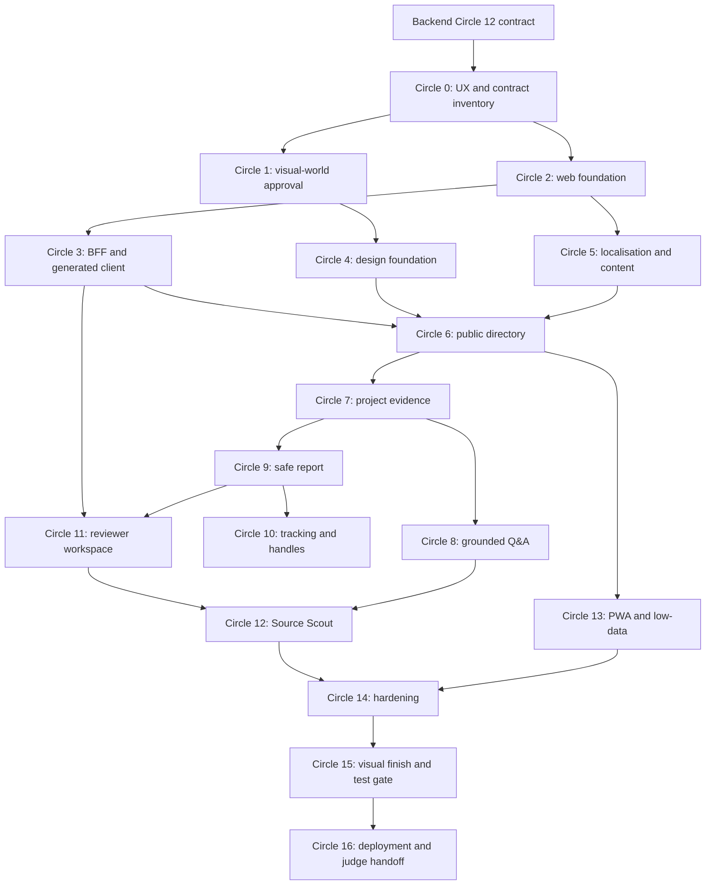

# ShaidaGo frontend and BFF build order

- **Status:** execution specification
- **Applies to:** `apps/web`, browser-facing BFF routes, design system, localisation, PWA, frontend tests, and web deployment
- **Primary runtime:** Node.js 24 LTS, Next.js 16 App Router, React 19.3, strict TypeScript, Tailwind CSS 4.3, Base UI/shadcn, `next-intl`
- **Pilot:** Abuja — AMAC and Bwari Area Councils
- **Public locales:** English (`en`), Hausa (`ha`), Igbo (`ig`), Yoruba (`yo`)
- **Last updated:** 20 September 2026

This document starts after the backend execution plan has produced a stable contract package. It converts the frontend architecture in [`IMPLEMENTATION_PLAN.md`](IMPLEMENTATION_PLAN.md) into dependency-ordered, closed implementation circles. It covers the Next.js presentation layer and thin BFF only; FastAPI remains the sole domain, authorisation, verification, and publication authority.

## 1. How to execute this build order

### 1.1 A “circle” is a closed implementation group

Every circle repeats one complete loop:

1. **Orient:** inspect the current UI, product truth, backend contract, and prior evidence.
2. **Specify:** define content hierarchy, states, responsive behaviour, accessibility semantics, and BFF/API boundaries.
3. **Implement:** build the smallest complete user-visible slice.
4. **Prove:** run type, unit, component, contract, accessibility, responsive, performance, and E2E checks appropriate to the slice.
5. **Inspect:** render real states at mobile and desktop, inspect screenshots, keyboard flow, network/cache behaviour, and the final diff.
6. **Record:** update messages, fixtures, screenshots, documentation, surface brief, and AI build log.
7. **Hand off:** expose a stable component/route/contract for the next circle.

No circle closes on a happy-path screenshot alone. It closes only when its complete state matrix, four locales, public/private cache rules, and exit gate pass.

### 1.2 Mandatory task packet

Before starting any `FE-*` task, record:

| Field | Required content |
| --- | --- |
| Task | Exact ID/title from this document |
| User | Resident, reporter, repeat reporter, reviewer, journalist/civic user, or judge |
| User outcome | The one thing the user can understand or complete afterward |
| Dependencies | Required backend task IDs, OpenAPI operations, components, content, and visual decision |
| Route/surface | Exact routes and viewports affected |
| States | Initial, loading, empty, success, stale, partial, validation, denied, rate-limited, offline, dependency-down, and recovery as applicable |
| Data classification | Public, public-after-review, private, one-time secret, or operational-only |
| Accessibility | Semantics, focus, keyboard, assistive announcement, zoom, contrast, motion |
| Localisation | Keys/content in all four locales, interpolation/plural/date/number behaviour, review status |
| Performance | Server/client boundary, JavaScript/image/font/network/cache budget |
| Verification | Exact commands, browsers, viewports, fixtures, and expected results |
| Evidence | Tests, screenshots, traces, bundle reports, contract diffs, or review verdict |
| Handoff | What later tasks may reuse and what remains prohibited |

If the backend contract or visual authority required by a task is missing, stop that task. Do not infer fields from database models, invent an API, or let a generic component library choose the visual identity.

### 1.3 Global frontend rules

- Start every task with `git status --short --branch`; preserve unrelated work, including the currently untracked `CLAUDE.md` unless its owner asks to include it.
- The browser calls the Next.js origin only. Never expose `API_INTERNAL_URL`, internal credentials, provider keys, storage keys, or backend hostnames in a client bundle.
- Server Components call the private API through a server-only generated client. Browser mutations/polling/uploads use purpose-built same-origin Route Handlers. Do not add a generic catch-all proxy.
- Domain rules remain in FastAPI. Frontend validation improves usability but never grants permission, changes verification, or determines publishability.
- Prefer Server Components and HTML-first content. Use a client island only for interaction that cannot be expressed safely on the server.
- No tracking code, handle passphrase, report/contact text, signed URL, or private result in a URL, browser log, analytics event, service-worker cache, or persistent browser storage.
- English is the source locale; missing Hausa/Igbo/Yoruba critical keys fail CI rather than silently falling back.
- Every component has real empty, error, long-content, low-data, keyboard, and 200% zoom behaviour before reuse.
- Keep factual source material and project claims exact. Synthetic UI fixtures are labelled; no real allegation or fabricated source is shown as fact.
- Commands become real only after the task that creates them. Never report a planned command as executed.

### 1.4 Dependency map



## 2. Target frontend repository shape

```text
apps/web/
├── app/
│   ├── api/                         # purpose-built same-origin BFF routes
│   ├── [locale]/
│   │   ├── layout.tsx
│   │   ├── page.tsx
│   │   ├── projects/
│   │   ├── report/
│   │   ├── track/
│   │   ├── handle/
│   │   ├── trust/
│   │   └── reviewer/
│   ├── global-error.tsx
│   ├── not-found.tsx
│   └── robots.ts
├── components/
│   ├── primitives/
│   ├── evidence/
│   ├── forms/
│   ├── layout/
│   └── states/
├── messages/
│   ├── en.json
│   ├── ha.json
│   ├── ig.json
│   └── yo.json
├── public/
│   ├── icons/
│   ├── manifest.webmanifest
│   └── sw.js
├── src/
│   ├── features/
│   │   ├── projects/
│   │   ├── questions/
│   │   ├── reports/
│   │   ├── tracking/
│   │   ├── reviewer/
│   │   └── discovery/
│   ├── lib/
│   │   ├── api/generated/           # generated; never hand-edit
│   │   ├── api/server.ts
│   │   ├── bff/
│   │   ├── i18n/
│   │   ├── security/
│   │   └── telemetry/
│   └── test/
├── tests/
│   ├── unit/
│   ├── component/
│   ├── contract/
│   ├── e2e/
│   ├── accessibility/
│   └── fixtures/
├── proxy.ts
├── next.config.ts
├── package.json
└── tsconfig.json
```

Colocate a component with a feature when it has one domain owner. Promote it to `components/` only after it is proven reusable without domain leakage.

## 3. Circle 0 — contract, journey, content, and state inventory

- **Purpose:** remove ambiguity before framework or visual implementation.
- **Entry:** backend Circle 12 contract package, product documents, and six-project evidence set.
- **Exit:** every route has a data owner, state matrix, content range, and proof path.

### FE-000 — Reconcile frontend scope and authority

> **Execution status (2026-09-20): complete.** [`FRONTEND_REQUIREMENTS_TRACEABILITY.md`](FRONTEND_REQUIREMENTS_TRACEABILITY.md) maps all accepted journeys, capabilities, acceptance criteria, routes, data classes, backend operations, enforcement boundaries, and proof owners. Its dependency-free validator checks frontend task and OpenAPI-operation coverage.

1. Read `PRODUCT.md`, `AGENTS.md`, `docs/PRODUCT_BRIEF.md`, `docs/IMPLEMENTATION_PLAN.md`, `docs/BACKEND_BUILD_ORDER.md`, and the committed OpenAPI contract.
2. Map every frontend acceptance criterion to a circle/task in this document.
3. Confirm route ownership and render/cache rules from the implementation plan.
4. Mark each displayed field as public, private, one-time secret, or operational-only.
5. Record which rules are display-only and which must be enforced by FastAPI.
6. Reject any route that requires reading backend tables or undocumented fields.

### FE-001 — Route and user-journey inventory

> **Execution status (2026-09-20): complete.** [`FRONTEND_ROUTE_MATRIX.md`](FRONTEND_ROUTE_MATRIX.md) defines all twelve routes, seven journey sequences, operation dependencies, render/cache/auth rules, locale/canonical/robots policy, material states, safe interruption, and route handoffs.

Create a route matrix covering:

- `/{locale}` landing;
- `/{locale}/projects` directory;
- `/{locale}/projects/{slug}` detail;
- `/{locale}/projects/{slug}/sources/{id}` source view;
- `/{locale}/report/{projectSlug}` report wizard;
- `/{locale}/report/complete` one-time confirmation;
- `/{locale}/track` tracking and optional handle report list;
- `/{locale}/handle` create/delete handle;
- `/{locale}/trust` trust/privacy/AI limits;
- `/{locale}/reviewer/sign-in`;
- `/{locale}/reviewer/reports`;
- `/{locale}/reviewer/reports/{id}`.

For each route define: audience, primary job, primary action, required backend operations, rendering mode, cache policy, authentication, source of locale, canonical URL, metadata/robots policy, empty/error/offline states, and handoff to the next route.

### FE-002 — Complete state matrices

> **Execution status (2026-09-20): complete.** [`FRONTEND_STATE_MATRIX.md`](FRONTEND_STATE_MATRIX.md) defines the shared state semantics and 304 stable UI fixture names across 28 async surfaces, including public/private offline separation, idempotent recovery, reviewer security failures, and Source Scout lifecycle behavior.

For each async feature, enumerate fixtures and UI behaviour for:

- first load and revalidation;
- no records/no search matches;
- success with minimum, typical, and maximum content;
- stale public data and unavailable source;
- partial translations or machine-assisted translation label;
- field validation and server validation;
- unauthenticated, forbidden, expired session, and CSRF/origin rejection;
- rate limit with retry time;
- backend unavailable, provider unavailable, timeout, cancelled job, and dead letter where relevant;
- offline with cached public content versus non-cacheable private content;
- retry success without duplicate mutation;
- JavaScript disabled for public pages.

Every state gets a stable MSW/fixture name shared by component and E2E tests. Do not use one generic “Something went wrong” state for materially different recovery paths.

### FE-003 — Content and range inventory

> **Execution status (2026-09-20): complete.** [`FRONTEND_CONTENT_RANGE_INVENTORY.md`](FRONTEND_CONTENT_RANGE_INVENTORY.md) and its synthetic JSON fixture source provide minimum, typical, and maximum range cases for every requested public/private surface. The validator prevents source-register leakage, private/one-time fixture fields, undocumented currency/tracking-history UI, and incomplete locale/discovery coverage.

Record realistic minimum/typical/maximum ranges:

- project title, locality, institution, contractor, fact count, source count, timeline length, currency/dates;
- translated strings, including long Yoruba/Igbo/Hausa labels;
- source title/publisher/excerpt and unavailable-source message;
- report description, category, contact option, file count/size/name, and validation errors;
- tracking status/history/message;
- reviewer queue size, internal notes, evidence, status history;
- discovery result count up to ten, citation count, contradictions/gaps, and five questions.

Provide synthetic fixtures for layout testing and clearly distinguish them from the six real cited project records.

### FE-004 — BFF operation map

> **Execution status (2026-09-20): complete.** [`FRONTEND_BFF_OPERATION_MAP.md`](FRONTEND_BFF_OPERATION_MAP.md) gives every 35 implemented non-health operations one direct Server Component read or exact purpose-built same-origin BFF route, with typed input bounds, safe forwarding, Origin/CSRF/cookie policy, timeout, response allowlist, cache, and redaction rules. Its validator rejects coverage drift and forbidden generic boundary designs.

Map each browser action to one purpose-built Route Handler, backend operation ID, accepted content type, body limit, forwarded safe headers, cookie/CSRF/origin behaviour, timeout, response mapping, cache header, and redaction rule. Map each Server Component read directly to the private API operation.

Explicitly forbid:

- a catch-all `/api/proxy/[...path]`;
- arbitrary header/cookie forwarding;
- client import of server environment/config;
- browser construction of the private API URL;
- BFF reinterpretation of reviewer roles, report state, citations, or publishability.

### Circle 0 exit gate

> **Gate status (2026-09-20): closed.** FE-000 through FE-004 provide validated authority, route, state, content-range, and operation ownership contracts. All 35 non-health OpenAPI operations have an owner; long/minimum/maximum fixtures, data classification, cache policy, and prohibition of undocumented frontend fields are explicit.

- Every route and mutation has a documented owner and backend operation.
- Every async surface has named fixtures for all material states.
- Long/empty/min/max content exists before component implementation.
- Data classification and cache policy are explicit for every operation.
- No frontend requirement depends on an undocumented backend field.

## 4. Circle 1 — human-approved visual world and interaction direction

- **Purpose:** prevent a low-level implementer or default component library from inventing ShaidaGo's identity.
- **Entry:** Circle 0 route/content inventory; no incumbent UI, `DESIGN.md`, tokens, logo, or approved visual direction.
- **Exit:** the maintainer approves one coherent visual world, build path, first-viewport thesis, and interaction grammar.

This circle must pause for human choice. It may run in parallel with non-visual Circle 2 scaffolding, but Circle 4 and all visible surfaces wait for its exit gate.

### FE-010 — One-round design discovery

> **Execution status (2026-09-20): complete.** The maintainer selected the Field ledger visual world. [`FRONTEND_VISUAL_DIRECTION.md`](FRONTEND_VISUAL_DIRECTION.md) records its human-approved trust, cultural, low-data, and accessibility constraints; FE-012 records the selected execution path.

Ask no more than three questions that materially change the work:

1. What should a resident feel and understand in the first viewport, and what would make the product feel untrustworthy or wrong even if polished?
2. Which real Abuja/Nigerian civic, documentary, publication, wayfinding, public-record, or community artifacts should the visual world feel culturally at home beside—and which should it avoid copying?
3. Should the standing build workflow be comp-led or code-led when image generation is available?

Do not ask for CSS values, trendy style names, or a colour preference detached from product truth. Record answers as constraints, not implementation.

### FE-011 — Generate and compare visual directions

> **Execution status (2026-09-20): complete.** The Impeccable direction round compared the Field ledger, District index, Evidence panes, Accountability board, declined challengers, and category-standard exit. The maintainer selected Field ledger; [`FRONTEND_VISUAL_DIRECTION.md`](FRONTEND_VISUAL_DIRECTION.md) records the comparison, system grammar, signature interaction, and honest risk.

Use the repository's available visual-direction workflow when present; with the Impeccable tooling, run the new-world concept process in the appropriate visitor modes (`Persuade` for landing, `Operate` for application/reviewer surfaces, `Read` for trust/source surfaces).

Each candidate must specify:

- the world and cultural source, without costume-like copying;
- palette strategy and material language;
- typography character and why it belongs;
- first viewport and product-specific proof;
- navigation, evidence labels, forms, tables/queues, and state grammar;
- signature interaction that reinforces evidence or safe action;
- mobile transformation and low-data fallback;
- honest risk to clarity, accessibility, performance, or trust.

Candidates must avoid generic civic-tech dashboards, startup gradients, glass cards, default shadcn styling, and ungrounded government symbolism. Evaluate on audience identification and product clarity. Present equal-fidelity options plus the conventional category-standard exit; obtain explicit human selection.

### FE-012 — Choose comp-led or code-led execution

> **Execution status (2026-09-20): complete.** The maintainer's selected decision state uses the standing code-led workflow, committed in [`.impeccable/config.json`](../.impeccable/config.json). [`FRONTEND_VISUAL_DIRECTION.md`](FRONTEND_VISUAL_DIRECTION.md) defines its non-negotiable spatial, interaction, responsive, and review obligations.

- **Comp-led:** create/approve a north-star first-viewport composition before code. The approved comp becomes a spatial contract; later screenshots are compared at the same dimensions.
- **Code-led:** define exact first-viewport composition, signature interaction, and motion grammar in writing; absence of a comp does not reduce the craft bar.

Record the standing preference in `.impeccable/config.json` if that workflow is used. A per-session exception does not silently rewrite team preference.

### FE-013 — Direction contract and surface brief

> **Execution status (2026-09-20): complete.** [`FRONTEND_VISUAL_DIRECTION.md`](FRONTEND_VISUAL_DIRECTION.md) defines the Field ledger contract, semantic starting tokens, `/{locale}` surface brief, cross-surface grammar, exact code-led first viewport, citation stitch, responsive transformation, and review boundaries. `DESIGN.md` remains intentionally absent until Circle 15 documents a reviewed implementation.

Write a compact direction contract containing:

- **THESIS:** what ShaidaGo's interface uniquely demonstrates and which category default it rejects;
- **OWN-WORLD:** palette strategy, typography character, materials, component and evidence language;
- **STORY:** what the visitor understands, trusts, and does;
- **FIRST VIEWPORT:** exact composition, dominant proof, hierarchy, and primary action;
- **FORM:** chosen structural system and decision reference;
- **FINISH:** review, documentation, and asset-provenance exit condition.

Plan for this contract to survive as the first emitted body comment in the root layout. Create a small surface brief for the initial route/flow if the tooling supports it. Do not create `DESIGN.md` from intention; it is written at Circle 15 from the implemented, reviewed world.

### Circle 1 exit gate

> **Gate status (2026-09-20): closed.** The maintainer approved Field ledger and the code-led workflow; FE-010 through FE-013 record the human constraints, comparison, execution preference, exact first viewport, token roles, citation interaction, and cross-surface grammar. Visible Circle 4+ tasks may begin only from this contract, not library defaults. `DESIGN.md` remains deferred until Circle 15.

- Human has selected one direction and build path.
- Direction handles public, report, reviewer, and source-reading modes within one world.
- First viewport and signature interaction are concrete, not mood adjectives.
- Mobile, low-data, reduced-motion, and accessibility implications are stated.
- No visible component may begin from unstyled library defaults after this gate.

## 5. Circle 2 — deterministic Next.js and TypeScript foundation

- **Purpose:** establish a strict, reproducible web package before product routes.
- **Entry:** Circle 0 complete; visual approval may still be pending.
- **Exit:** a clean clone can install, lint, type-check, test, and build without contacting the private API.

### FE-020 — Scaffold the pnpm workspace and Next.js app

> **Execution status (2026-09-20): complete.** Root pnpm workspace configuration and the strict `apps/web` Next.js 16.3.5/React 19.3.0 package are pinned in `pnpm-lock.yaml`. A clean frozen install, `tsc --noEmit`, and `next build` all pass with `API_INTERNAL_URL=http://127.0.0.1:1`; the non-visual scaffold performs no API fetch.

1. Create root `package.json`, `pnpm-workspace.yaml`, pinned `packageManager`, `.nvmrc`, and `apps/web` package.
2. Pin Node 24 LTS and Next.js/React/TypeScript lines from the accepted plan; commit `pnpm-lock.yaml`.
3. Configure strict TypeScript including no unchecked indexed access, exact optional properties where compatible, and no emitted JS from typecheck.
4. Use ESM consistently. Define import aliases that do not hide feature ownership.
5. Add Next standalone output, server-only environment separation, and no build-time API fetch.
6. Verify frozen installation from an empty `node_modules` and build with `API_INTERNAL_URL` unreachable.

### FE-021 — Quality toolchain and commands

> **Execution status (2026-09-20): complete.** `apps/web` now has pinned ESLint, Prettier, Vitest, Testing Library, MSW, Playwright, and axe-core foundations, with named package scripts and root `make web-*` targets. Empty unit/component/browser layers fail explicitly; their first meaningful tests arrive with their owning feature tasks. The frozen install, format, lint, type, and frontend-contract checks pass.

Configure:

- ESLint with Next/React/accessibility/security/import rules that add value beyond TypeScript;
- Prettier only where it does not conflict with Tailwind/CSS strategy;
- Vitest, Testing Library, `user-event`, MSW, and coverage;
- Playwright for Chromium and mobile WebKit smoke;
- axe-core integration;
- bundle analysis and Lighthouse CI when owning circles start.

Create package scripts and root targets: `web-format`, `web-format-check`, `web-lint`, `web-typecheck`, `web-unit`, `web-component`, `web-contract`, `web-e2e`, `web-a11y`, `web-build`, `web-verify`. Each fails honestly and uses pinned local tools.

### FE-022 — Base App Router error boundaries and metadata

Implement the root layout, global error, route error/loading/not-found components, metadata base, viewport/theme metadata, robots policy, and one safe request-ID display path for support. FE-050 owns the locale layout, route negotiation, and message provider; do not introduce a partial locale boundary here. Error boundaries never display stack traces, backend detail, private values, or raw provider errors. Public not-found and hidden-resource responses look equivalent.

> **Execution status (2026-09-20): complete.** The root metadata/viewport/robots policy, semantic foundation shell, safe root and route recovery boundaries, loading/not-found surfaces, and UUID-only support reference are implemented and tested. The route error path ignores raw error data; unknown routes are checked in Chromium and mobile WebKit. Locale routing remains deliberately owned by FE-050, which will replace the temporary root `en` document language with the negotiated locale layout and reviewed messages.

### FE-023 — Environment and server/client boundary

1. Validate server environment at startup/runtime through a server-only module.
2. Permit browser variables only through an explicit public schema; no secret-like names.
3. Add a build test/bundle inspection proving internal URL, service credential, provider keys, storage keys, and server modules are absent from client chunks.
4. Use runtime lookup for the Railway private API URL; no route fetches it during `next build`.
5. Document `.env.example` variables and which service owns each one.

> **Execution status (2026-09-20): complete.** `instrumentation.ts` validates the private Node-runtime settings through a `server-only` Zod module, while a separate public schema permits only an optional public application origin and rejects secret-like `NEXT_PUBLIC_*` names. The root template documents the web-owned runtime URL/public origin alongside the shared BFF credential. `web-boundary` builds with synthetic private canaries and verifies that 13 client JavaScript chunks contain neither internal/service/provider/storage values nor server-only configuration markers; normal builds remain independent of a reachable API.

### FE-024 — Frontend CI foundation

Create least-privilege, SHA-pinned workflow jobs for frozen install, format/lint/types, unit/component tests, OpenAPI client drift, production build with API unreachable, and artifact-safe E2E when available. Do not upload traces/screenshots containing one-time secrets or private content; tests use synthetic values and redact artifacts.

> **Implementation status (2026-09-20): ready for hosted proof.** `.github/workflows/frontend.yml` has read-only permissions, pinned `checkout`/`setup-node` action SHAs, frozen pnpm install, deterministic foundation checks, private-canary client-bundle inspection, and standalone Chromium/mobile-WebKit E2E plus axe jobs. It neither uses secrets nor uploads artifacts. `web-ci-check` validates these invariants with negative cases locally. The workflow has not yet run on GitHub because this branch has not been published; do not mark the Circle 2 CI exit condition complete until its first hosted execution succeeds.

### Circle 2 exit gate

> **Gate status (2026-09-20): closed.** Local foundation, boundary, browser, and accessibility proof pass, and the hosted workflow has run: on pull requests #19 to #22 the jobs `Deterministic web foundation`, `Standalone browser and accessibility checks`, and `Frontend required` passed, and on `main` at `fe14bf7` the `frontend`, `backend`, and `security` workflows all succeeded. The first hosted runs exposed and fixed two workflow defects (`corepack enable` must precede `setup-node` for pnpm caching, and the secret scan needed documented allowlists).

- Frozen pnpm install and strict typecheck pass.
- Production build succeeds with the API deliberately unreachable.
- Base error/not-found paths render safely.
- Secret/server-only modules are absent from client output.
- CI proves the same deterministic foundation.

## 6. Circle 3 — generated API client and thin BFF security boundary

- **Purpose:** create one typed path to FastAPI without duplicating domain models or exposing the private service.
- **Entry:** backend Circle 12 OpenAPI package and frontend foundation.
- **Exit:** server reads and browser mutations use typed, tested, purpose-built transports with correct security/cache behaviour.

### FE-030 — Deterministic OpenAPI generation

> **Execution status (2026-09-20): complete.** Pinned OpenAPI generation now writes warning-header `schema.ts` and `client.ts` under `apps/web/src/lib/api/generated/`; `web-contract` fails when either no longer matches `contracts/openapi.json`. Compile-time assertions cover the project list, report submission, and problem-details contract.

1. Generate TypeScript types/client into `src/lib/api/generated/` using pinned tooling.
2. Add a generated-file warning and prohibit manual edits in review/CI.
3. Normalize schema ordering/output so identical OpenAPI yields identical files.
4. `web-contract` regenerates and fails on an uncommitted diff.
5. Add compile-time assertions for critical operations and problem details.

### FE-031 — Server-only private API client

> **Execution status (2026-09-20): complete.** `apps/web/src/lib/api/server.ts` is a `server-only` transport built on the generated client: runtime-loaded URL and `web.<credential>` bearer, validated request-ID/locale/client-HMAC/`If-None-Match` forwarding, 5 s timeout, one bounded retry only for a transient 503 or network failure on reads, and a typed `ok`/`not_modified`/`problem`/`unavailable` result that never carries backend title or detail. It contains no logging and no mutation path. Unit tests cover headers, injection, 304, problems, retry bounds, timeout, malformed bodies, and a source-scan boundary test that fails on a client component importing a server module. Public reads (`getLocalities`, `listProjects`, `getProject`, `getProjectSource`) exist; reviewer reads wait for FE-034's session extraction. Public revalidation is set to the API's 60 s policy and is verified end to end by FE-063.

Build a server-only wrapper that:

- reads runtime internal URL and credential;
- uses generated operations/types;
- forwards safe locale and request ID;
- applies operation-specific timeout and cache/revalidation settings;
- parses `application/problem+json` into a typed internal result;
- never logs body, cookies, credentials, tracking code, or private content;
- rejects accidental import from client components through `server-only` and a test/lint boundary.

Do not add automatic mutation retries. Reads retry only on explicitly safe transient failures with a small bound.

### FE-032 — BFF request guard library

> **Execution status (2026-09-20): complete.** `apps/web/src/lib/bff/` provides exact-Origin policy (configured public origin in deployed stages, local request origin in development/test, forwarded headers never trusted, unconfigured deployed stage fails closed), constant-time CSRF verification, header-only body preflight plus streaming byte caps and bounded JSON parsing, lower-case-UUID idempotency keys, an allowlist-only backend header builder, client-abort/timeout signal propagation, and browser-safe `application/problem+json` shaping with stable codes and no-store. `guardMutation` orders Origin, CSRF, body preflight, and key validation before any body is read. 84 unit tests cover spoofed forwarded headers, repeated/null/cross-site Origin, missing/malformed CSRF, oversized declared and streamed bodies, aborts, and problem shaping. Open for FE-034: how the reviewer's CSRF token reaches the browser is not fixed by the contract, so the verifier takes already-resolved presented/expected values.

Create shared helpers for:

- allowed Origin/Host validation using trusted proxy configuration;
- CSRF token extraction/verification for cookie-authenticated mutations;
- body/content-type/size preflight before parsing or forwarding;
- request ID creation/propagation;
- idempotency-key validation/generation contract;
- safe header allowlist;
- backend timeout/abort propagation;
- problem-details mapping and safe localisation code;
- no-store/private response headers.

Unit-test spoofed forwarded headers, multiple Origin values, missing/malformed CSRF, oversized declared and streamed bodies, aborted requests, and backend problem responses.

### FE-033 — Purpose-built public mutation handlers

> **Execution status (2026-09-20): complete.** Nine explicit `runtime = "nodejs"`, `force-dynamic` Route Handlers under `apps/web/app/api/` (question, discovery start/poll, report multipart, tracking lookup, follow-up answer, handle create/list/delete) each name exactly one typed backend operation through `src/lib/bff/public-handler.ts`, with strict Zod input schemas, per-route body caps, Origin-before-body ordering, mandatory idempotency keys where the operation map requires them, no mutation retry, safe problem mapping, and `no-store`. Reports stream under a 30 MiB + 64 KiB cap without buffering. Unit tests cover every handler for success, validation, unknown fields, backend problem, timeout, network loss, cancellation (499), wrong content type, oversized body, foreign/missing/repeated Origin, cookie and forwarded-header exclusion, and secret-free URLs. Cancel-a-public-run and public follow-up are correctly absent because the API forbids public callers those actions. Client HMAC is now forwarded (see the AI build log, FE-043 addendum): HMAC-SHA256 of the address the trusted edge appended and the UTC day, keyed by server-only `CLIENT_HMAC_KEY` (required in staging/production) with `TRUSTED_PROXY_HOPS`. Real-API integration is still not run.

Create explicit Route Handlers for project question, public discovery start/poll/cancel/follow-up, report submission, status lookup, reporter handle create/list/delete, and report follow-up answers.

Each handler declares:

- allowed method/content type;
- public versus cookie-authenticated origin/CSRF policy;
- maximum body/time;
- exact backend operation;
- safe forwarded headers and locale;
- response allowlist or generated schema;
- cache header;
- error mapping;
- whether idempotency is mandatory.

No handler accepts an arbitrary backend path, method, query, or header from the browser.

### FE-034 — Reviewer session and mutation handlers

> **Execution status (2026-09-20): complete.** Seventeen explicit reviewer Route Handlers under `apps/web/app/api/reviewer/` (sign-in and sign-out on one route; notes, follow-up ask/withdraw, status transition, publication draft/preview/publish/withdraw, discovery plan/create/get/cancel/review/answer, source decision, and the evidence download broker) plus reviewer read methods in the server-only client for Server Components. Sign-in turns the API's one-time tokens into two `HttpOnly` `SameSite=Lax` cookies (`__Host-sg_session`/`__Host-sg_csrf` with `Secure` in staging/production; `sg_session`/`sg_csrf` in development/test), refuses an API cookie policy that would weaken them (and revokes that session), and returns only role and expiry. Every mutation checks Origin, then the session (401 clears cookies), then CSRF, then the body; a backend 401 clears cookies, while 403/404/409 stay generic or verbatim by code. Evidence is streamed through an explicit header allowlist (attachment, `nosniff`, sandbox CSP, no-store) with no signed URL. 246 unit/component tests cover these paths. Decisions recorded for review: the CSRF token is held only in an `HttpOnly` cookie and forwarded server-side (SameSite=Lax plus exact Origin is the BFF defence; the API re-verifies the token), and public-update withdraw takes no body because the API defines none. No handler has been exercised against a running API.

Implement explicit sign-in, sign-out, queue/detail fetch where client polling is needed, notes, status events, public-update preview/confirm, evidence download broker, reviewer discovery, source decisions, and follow-up handlers.

- Convert the backend's internal one-time session response into the exact environment-specific same-origin `Set-Cookie`/clear-cookie header; the token exists only in server execution and never reaches browser JavaScript, logs, traces, or response bodies.
- Enforce Origin and CSRF before forwarding mutations.
- Map expired/revoked session consistently to the sign-in recovery flow without leaking report existence.
- Signed evidence URLs are never logged or persisted; download navigation remains no-store.

### FE-035 — BFF contract/security tests

> **Execution status (2026-09-20): complete.** `bff-contract.test.ts` parses `docs/FRONTEND_BFF_OPERATION_MAP.md` and proves the 26 implemented browser routes match its method and path list exactly, with no unlisted route and no generic proxy; asserts no `console`/logger/stdout use in handlers or BFF libraries and, at runtime, that failures carrying canary tracking codes, credentials, cookies, and an internal host emit no output and echo none of them. The handler suites gained cancellation (499) coverage for every reviewer mutation and the public poll. `bundle:check` now also fails on BFF wire markers (session/CSRF/client-HMAC headers, `Bearer web.`, session cookie names, `/v1/reviewer`, `/v1/reports`, BFF/API-server module paths) in client JavaScript. 258 unit tests pass.

For every handler, test success, validation, backend problem, timeout, cancellation, wrong content type, oversized body, forbidden origin, CSRF failure where applicable, cookie forwarding, no-store headers, and sensitive-value log redaction. Add a build-time/client-bundle search for internal host and credentials.

### Circle 3 exit gate

> **Gate status (2026-09-20): closed with caveats.** Met: the generated client is reproducible and drift-checked; the client bundle scan finds no internal URL, credential, BFF header, or server module; all 26 browser routes are purpose-built, guarded, and covered by success/validation/problem/timeout/cancellation/content-type/size/Origin/CSRF/cookie/no-store/log-redaction tests; reviewer tokens exist only in server memory and `HttpOnly` cookies; the BFF maps errors by stable code and makes no domain decision. Open, not claimed: no handler has run against a live FastAPI (the local API and Docker were not started), the pseudonymous client HMAC and the HttpOnly-cookie CSRF design were decided and implemented afterwards (client HMAC in `src/lib/bff/request-context.ts`; CSRF as recorded under FE-034), and the operation map's public-update withdraw row now matches the API (empty body).
>
> **Live integration (2026-09-20).** The open "no live-API run" caveat is closed for local development. With the database migrated to `0027`, the API running in replay provider mode, and the built web app pointed at it, these flows were exercised through the browser-facing handlers with fictional data only: question (honest insufficient-evidence answer), unknown-code lookup (generic 404), report submission with an image (201, one-time tracking code, `published: false`), tracking lookup of the new report, reporter-handle create with idempotent replay, list, delete, and the generic failure afterwards, tracking follow-up ask and answer, public discovery start and poll (results labelled "discovered — not yet reviewed"), reviewer sign-in (two `HttpOnly` cookies, no tokens in the body), note, status transition, stale-version conflict, evidence download (attachment, `nosniff`, sandbox CSP, `no-store`), sign-out (session dead afterwards), and 401/403/404 paths. The run found and fixed two defects the mocked tests could not: empty-body POSTs were rejected with 413 because the framework always supplies a body stream object, and in development a browser using `127.0.0.1` was refused because the framework reports `localhost` (development and test now also accept the browser's own `Host`). Not exercised live: the reviewer publication publish path, reviewer discovery, and source decisions, which need a verified report and a completed report-scoped run. The local ClamAV container's mapped port did not match the API's scanner setting, so real scanning (`scan_failed`) was not exercised; the evidence check used the demo scanner mode.

- Generated client is reproducible and drift-checked.
- Browser has no import/path to the private API client or internal URL.
- Every mutation has a purpose-built handler and complete guard tests.
- Reviewer cookies and one-time secrets never enter client JavaScript/logs.
- BFF maps errors but does not decide domain outcomes.

## 7. Circle 4 — implemented visual foundation and application shells

- **Purpose:** translate the approved direction into reusable, accessible primitives without flattening it into library defaults.
- **Entry:** Circle 1 visual approval and Circle 2 app foundation.
- **Exit:** public and reviewer shells plus core primitives express one distinctive world at mobile and desktop.

### FE-040 — Implement tokens from the approved world

> **Execution status (2026-09-20): complete.** `apps/web/app/globals.css` now exposes the approved Field Ledger semantic token roles through native CSS and Tailwind 4.3.3 aliases. Unit checks prove base-palette contrast and preference overrides; browser checks prove the compiled token stylesheet is served from standalone output in Chromium and mobile WebKit. `DESIGN.md` remains deliberately absent until Circle 15.

Implement semantic CSS/Tailwind tokens for:

- canvas/surface/text/muted/accent/danger/success/warning/information roles;
- evidence classes and verification states without colour-only distinction;
- typography roles and fluid scales;
- spacing rhythm, measure, layout gutters, and density modes;
- corner, border, elevation/material, icon/stroke, motion duration/easing;
- focus ring and selected/disabled/read-only states.

Tokens name purpose, not colours (`--status-reviewed`, not `--green`). Test contrast in every state and high-contrast/forced-colours behaviour. Do not write `DESIGN.md` yet; implementation is provisional until finish review.

### FE-041 — Accessible primitive layer

> **Execution status (2026-09-20): complete.** `apps/web/src/components/primitives/` now provides button, icon button, link, field (label, description, error, and required state wired to input/textarea/select/combobox/file picker through context), label-sized checkbox/radio/switch, disclosure, progress, skeleton, callout, status label, cursor-safe previous/next pagination, live region, toast, modal, sheet, confirmation dialog, and popover. No primitive carries product copy, so no English can leak into `ha`/`ig`/`yo`. 19 component tests cover names, descriptions, errors, read-only versus disabled, keyboard activation, and focus restoration to the trigger for every overlay; a Playwright suite renders the real components under the compiled stylesheet in Chromium and mobile WebKit and asserts zero axe violations, 44 px targets, reflow at 320 px and 200% text, token-only styling, a 3 px focus ring plus forced-colours borders, and no motion under reduced motion. Screenshots at desktop and phone widths exposed native-styled progress and switch controls and a WebKit select that ignored its minimum height; all three were fixed. Tabs are deliberately not built: no accepted surface needs them. Not proven: real screen-reader speech, and fluent-language review of long-label fit beyond one worst-case Yoruba string. Styling was later migrated at the maintainer's request to Tailwind CSS 4 utilities and the shadcn structure: `components/ui/*` (button, field, choice, feedback, toast, overlay, pagination) built with `cva`, `clsx`, and `tailwind-merge` (`cn`), `data-slot` attributes, a `components.json`, and shadcn semantic theme names mapped onto the Field ledger tokens in `globals.css`. The custom stylesheet was removed; `components/primitives/primitives.tsx` remains as a compatibility barrel. Element-level base rules moved into `@layer base` so utilities can override them.

Build project-owned primitives using Base UI/shadcn internals only where useful: button, link, icon button, input, textarea, select/combobox, checkbox/radio, switch, dialog/sheet, popover, tabs only if justified, disclosure, toast/live region, progress, skeleton, callout, badge/status label, pagination, file picker, and confirmation dialog.

For each primitive test:

- semantic role/name/value/state;
- keyboard interactions and focus restoration;
- disabled versus read-only;
- errors/descriptions association;
- reduced motion and forced colours;
- long translated labels and 200% zoom;
- mobile target size;
- no default-library styling leakage.

### FE-042 — Evidence-specific components

> **Execution status (2026-09-20): complete.** `apps/web/src/components/evidence/` provides verification label, information-class marker, date group (mandatory last-checked shown as unknown when absent), source card with availability, claim with citation controls, citation entry, official/community timeline item, translation notice, AI-explanation notice, and contradiction/information-gap/insufficient-evidence callouts. Props derive from the generated public types; all text arrives through exhaustive label records so a missing state is a compile error, and a claim with no citation renders nothing. Verification is passed explicitly and never inferred from source count. 17 component tests plus browser axe, reflow, and stitch checks (Chromium and mobile WebKit) pass. Limitation: the stitch marks the cited entry via `:target` and shares the visible "Source N" label with the claim's control, but the claim end has no highlight without per-ID CSS or script; FE-071 owns the full interaction. These components were converted to Tailwind utilities in the same migration; their stylesheet was removed and tests select by `data-slot`.

Create components that encode product truth without domain authority:

- fact with citation trigger;
- source identity/availability card;
- verification label with text/icon;
- last-checked/publication/retrieval date group;
- information-class marker;
- official versus reviewed-community timeline item;
- translation-status notice;
- AI-generated explanation notice;
- contradiction, information-gap, and insufficient-evidence callout.

Require typed props derived from public DTO/view models. Components never infer verified state from source count or colour.

### FE-043 — Public and reviewer shells

> **Execution status (2026-09-20): complete.** `apps/web/src/components/shell/` provides a server-rendered public shell (skip link that moves focus to `main`, banner, labelled main/language navigation, an empty polite status region for offline and stale notices, content container, footer with trust/source links and the not-an-emergency statement) and a reviewer shell of plain anchors (no prefetch of private routes) with a `SignOutButton` that calls the same-origin handler and states a failure. All copy is typed messages (`src/content/en/`). Decisions: the public navigation has four short items that wrap on narrow screens, so there is no hidden menu and nothing to trap focus in; languages without reviewed content show as "not yet reviewed" text, never as dead links; no low-data control is rendered until one exists (a slot is reserved). Links to routes later circles build (localities, trust, report, projects) resolve to the safe not-found page until then. Reviewer routes do not exist yet, so the reviewer shell is proven by component tests only; those routes must be dynamic and `no-store`.

Implement skip link, landmark structure, responsive navigation, locale control, low-data control placeholder, offline/status region, content container, footer/trust links, and reviewer navigation/session controls.

- Public shell is useful without JavaScript.
- Reviewer shell is no-store and never prefetches private route data unintentionally.
- Mobile navigation traps/restores focus correctly and closes on route change/Escape.
- Hero/first viewport follows the direction contract rather than a generic header-card layout.

### FE-044 — First-viewport proof

> **Execution status (2026-09-20): complete.** The landing `/` now renders the Field ledger first viewport from the direction contract (`src/components/landing/first-viewport.tsx`): quiet navigation row; a seven-column record field with locality and record labels, the heading, actions, a clearly labelled fictional example record (state, source count, last-checked date, citation control) and a four-column dated evidence rail beside it on wide screens and after it on narrow ones; browse is the filled primary action and private reporting is outlined and secondary with its privacy note. Browser tests in Chromium and mobile WebKit check above-the-fold placement, rail topology, action hierarchy, no horizontal scroll, axe, keyboard skip link (Chromium; iOS WebKit does not Tab to links by default), no-JavaScript operation including the citation link, and a public cacheable document; desktop and phone screenshots were inspected. The example is invented and says so; FE-060 replaces it with API data.

If comp-led, render the first viewport at the comp dimensions and compare side by side before building later sections; save the proof artifact when implementation begins. If code-led, test the written composition and signature interaction against the direction contract. Correct scale, density, typography, material, and primary-action hierarchy now; do not postpone identity to polish.

### Circle 4 exit gate

> **Gate status (2026-09-20): closed with caveats.** Met: the Field ledger world is recognisable on the landing with its rules, paper ground, evidence rail, and citation slips; primitives pass names, keyboard, focus-restoration, contrast (axe), 44 px target, 320 px/200% text reflow, forced-colours, reduced-motion, and long-label tests; evidence components show state in words plus shape and refuse uncited claims; shells preserve cache and privacy boundaries (public page static, reviewer shell anchor-only); the first viewport matches the contract at desktop and phone widths. Caveats, not claimed: no screen-reader speech run, no real browser zoom (emulated), no fluent-language review (English copy only; `ha`/`ig`/`yo` await Circle 5), and nav links to unbuilt routes resolve to the safe not-found page.

- Approved visual world is recognisable with placeholder content removed.
- Core primitives pass keyboard, semantics, focus, contrast, zoom, translation-length, and mobile tests.
- Evidence components communicate state without inference or colour alone.
- Public/reviewer shells preserve cache and privacy boundaries.
- First viewport satisfies the approved direction before downstream surfaces inherit it.

## 8. Circle 5 — locale routing, content architecture, and four-language integrity

- **Purpose:** make localisation structural rather than end-stage string replacement.
- **Entry:** app foundation and route/content inventory.
- **Exit:** all routes, messages, validation, formatting, and critical content work in four locales without silent fallback.

### FE-050 — Locale routing and negotiation

> **Execution status (2026-09-20): complete.** `next-intl` 4.14.5 (MIT) configures `en`, `ha`, `ig`, and `yo` with an always-present prefix. `proxy.ts` negotiates from the `NEXT_LOCALE` cookie, then `Accept-Language`, else English, keeps the path and query, canonicalises case (`/EN` to `/en`), treats any other first segment as a path under `/en`, and never redirects off origin; its matcher leaves `/api`, `/_next`, and any file path untouched, so BFF URLs stay unprefixed. Pages moved under `app/[locale]/` (the locale layout is the root layout and sets `lang`; unknown paths 404 inside it via a catch-all, and `loading.tsx` sits in a `(site)` group so it cannot force a 200 on a 404). Only English copy is reviewed (`REVIEWED_LOCALES`): `/ha`, `/ig`, and `/yo` render the English original with `<html lang="en">`, a visible "no translation available" notice, and a "(not yet reviewed)" label beside each unreviewed language link, rather than presenting English as another language. The language cookie holds only a locale code and is documented in `docs/PRIVACY_AND_SAFETY.md`. 10 proxy unit tests, 1 shell test, and 9 browser tests (Chromium and mobile WebKit) cover negotiation, hostile cookies, open-redirect paths, query preservation, the truthful `lang`, 404s per locale, unprefixed BFF and `robots.txt`, and no-JavaScript language links. FE-051 supplies the message catalogues; the static English strings in recovery pages remain English until then.
Configure `next-intl` with explicit `en`, `ha`, `ig`, `yo` locale-prefixed routes. Implement `proxy.ts` negotiation using supported locale cookie/header only, with safe default to `en`, canonical redirects, and no loss of query filters. Reviewer routes remain locale-prefixed. Unsupported locale segments return/redirect consistently without open redirects.

### FE-051 — Message structure and parity tooling

> **Execution status (2026-09-20): complete.** English source copy now lives in `apps/web/messages/en.json`, organised by domain (`shell`, `evidence`, `landing`, `recovery`), with `ha.json`, `ig.json`, and `yo.json` created immediately with identical keys and nesting. `messages/status.json` records per locale and domain whether copy is `reviewed`, `machine_assisted`, or `pending`, who reviewed it and when, and which domains are critical. Non-English values are `null` (pending): no Hausa, Igbo, or Yoruba text was written or simulated. `scripts/messages-parity.mjs` (run by `pnpm run messages:check`, part of `make web-contract` and therefore CI) enforces identical keys and nesting, non-empty leaves, valid ICU, the same variable names and types, identical `select` branches, an `other` branch for plural and select, valid plural categories, and status consistency (pending means no text, otherwise no gaps plus a named reviewer and date; English must be reviewed). The runtime loader `resolveDomain` serves a locale's own text only when the domain is `reviewed` and complete, and otherwise returns the English original flagged `isOriginal`; the landing page shows the translation notice whenever any domain is an original, and `lang` follows the true language, so there is no silent fallback. Plural and number formatting use ICU (`1 source`, `Source 1`). 13 checker tests, 6 loader tests, and the existing suites pass. The Circle 5 exit criterion that critical copy exists in all locales with review status is therefore met structurally, with every non-English domain honestly `pending` until a fluent reviewer supplies and approves text. Recovery pages (`not-found`, `error`, `global-error`, `loading`) read the English catalogue directly because they cannot read the request locale without becoming dynamic; they are `lang="en"`.
1. Organise messages by domain/surface, not component filename churn.
2. Define English source keys and copy; create all four files immediately.
3. Add a parity script checking identical keys, nesting, ICU syntax, plural/select branches, and interpolation variable names/types.
4. Ban runtime silent fallback for critical keys.
5. Record translation status and reviewer for safety/legal-sensitive copy. **Update (2026-09-20):** the maintainer then authored and added the Hausa, Igbo, and Yorùbá copy for every existing key, and `messages/status.json` now marks every locale and domain `reviewed`, with the maintainer as reviewer on a self-reported basis (they wrote the text; no independent fluent reviewer exists). All four locales are therefore served as their own language (`REVIEWED_LOCALES` is `en`, `ha`, `ig`, `yo`), the translation notice no longer appears, and the parity check passes with no nulls. The global error screen's separate `recovery.fatal.title` key was dropped (it was added after the translations began) and that screen reuses the page-error title; a distinct title can return as one key in all four files when the maintainer's full translation pass happens at the end of the build. Browser checks now cover each language: its `lang`, heading and actions from its own catalogue, no fallback notice, axe, and reflow at 320 px and 200% text with no clipped control (32 accessibility checks, 41 browser tests). **Pending-key tracking (2026-09-20):** at the maintainer's direction, every new key is added to all four catalogues at once with `null` in `ha`, `ig`, and `yo`, and translated in one pass at the end of the build. `messages/status.json` carries `pendingKeysAllowed: true` for the build phase, under which a reviewed domain may hold `null` keys; `pnpm run messages:check` lists them per language (36 at this point, including the restored `recovery.fatal.title`) and fails on any remaining `null` once that switch is set to `false`. A domain that still has a `null` key is served as the flagged English original, so adding keys to a served domain would show a notice; new keys therefore go into new domains until the translation pass.

### FE-052 — Locale-aware formatting

> **Execution status (2026-09-20): complete.** `apps/web/src/lib/format/formatters.ts` (`createFormatters(language)`) provides presentation-only formatting: `date` and `dateTime` (instants shown in `Africa/Lagos`; a date-only value formats in UTC so it never shifts a day), `relativeWithExact` ("3 days ago" always paired with the exact Lagos time, and absent for calendar dates or bad input), `number`, `naira` (NGN symbol, two decimals, string decimals to keep full precision, no conversion), `list`, and `languageName`. Unformattable dates are returned as given; an amount that is not a plain decimal is rejected with a `RangeError`, so a wrong value is never invented, and nothing parses a display string back into data. The landing page now uses `createFormatters(...).date`. 13 unit tests cover the Lagos day boundary (23:00 UTC to 22:59:59 UTC), offsets, calendar dates at year edges, relative unit thresholds in both directions, naira precision up to 15 digits, digit invariance across all four locales, rejection cases, list order, and language-name fallback. The API currently exposes no monetary field, so `naira` has no consumer yet. Limitation: the runtime's CLDR data for Igbo and Yorùbá is thin (for example `-3 d` for relative days and `11:0` for a time), so formatted output in those languages must be reviewed with their copy before they are served.
Create tested formatters for NGN, numbers, UTC timestamps displayed in `Africa/Lagos`, absolute dates, relative times paired with exact dates, list formatting, and source language labels. Do not parse formatted display values back into domain data. Names, identifiers, dates, amounts, citations, and quoted source claims remain factually unchanged across locales.

### FE-053 — Localised validation and problem mapping

> **Execution status (2026-09-20): complete for the mapping layer.** `apps/web/src/lib/problems/` maps every code the BFF or API contract can return (32 codes, checked against `BFF_PROBLEM_CODES` and the documented API codes) to one of 24 reviewed messages in the new `problems` catalogue domain; `describeProblem` chooses copy only from the code, adds a formatted Retry-After hint, adds a "check before sending again" hint after a timeout or network loss on a mutation, and gives an unknown code the generic message with the support reference. `readBrowserProblem` reads only `code`, `request_id`, field rule codes, and `Retry-After`; `title`, `detail`, and submitted values are never read, and a wrong content type or malformed body becomes `internal_error`. Validation rule codes (pydantic and zod) map to seven reviewed sentences. `mapFieldErrors` maps API paths to a form's control IDs (one message per control, unmapped messages kept visible), `preservedValues` restores non-secret entries and never secrets, contacts, or files, and `ErrorSummary` takes focus when errors appear, states the count, and links each message to its field, which keeps its value and is programmatically invalid with its message as its description. 18 unit tests and 4 component tests cover exhaustiveness, hostile bodies and inherited-key codes, plural hints, focus, and keyboard use. The full-page and field wiring lands with the first forms. Open: the `problems` domain is untranslated (`null`) in `ha`, `ig`, and `yo` and marked non-critical, so it does not flip those languages back to English; it must be translated, reviewed, and marked critical before the first form ships, and the Circle 5 exit criterion for critical validation copy in every language stays open until then.
Map stable backend problem codes and field paths to reviewed frontend messages. Unknown code uses a safe generic message plus request ID; it never displays raw backend `detail` unless explicitly safe. Validation preserves entered non-secret fields, focuses the error summary/first invalid field appropriately, and associates field messages programmatically.

### FE-054 — Language-switch behaviour

> **Execution status (2026-09-20): complete for the landing and the shared shell.** Language links are ordinary anchors to the equivalent page, built by `localeHref` from parsed route state (path segments and an allowlist of shareable filters, never the raw URL), so they cannot carry an open redirect, a draft, a tracking code, or contact data; `cursor` is always dropped because the API says a cursor is valid only for the same filters and locale, so a switch starts from the first page. With JavaScript, `LanguageLink` warns through a confirmation dialog before leaving a page that has an unsaved private draft (a memory-only flag in `src/lib/draft-guard.ts`; no draft content is stored and nothing is written to storage), lets the visitor stay with focus back on the link or leave explicitly, and marks the switch with a one-word `sessionStorage` flag. `LanguageAnnouncer` reads and clears that flag on the next page and, only when it matches the page's language, puts "Language changed to {language}." into the shell's polite `role=status` region, in the language its copy is actually written in (English until translated), for 8 seconds. Without JavaScript the links simply navigate. A language whose copy is not reviewed is labelled beside its link and the page shows the original with a notice. Tests: 4 URL-builder cases (including hostile segments and values), the draft guard, 3 link cases (no draft, stay, Escape, explicit leave), 3 announcer cases, a shell integration case, and 3 browser tests (real switch, announcement once and not on reload, link targets), plus the earlier no-JavaScript switch test. Not exercised end to end: the draft warning in a real page, because the report form (Circle 9) does not exist yet; it is proven at component level and must be re-checked there. New keys live in the new `language` domain with `null` translations (5 keys) until the translation pass.
- Preserve equivalent route, slug, filters, pagination where valid.
- Warn before language navigation would discard an unsaved private report draft; never encode draft in URL.
- Announce language change accessibly.
- Show unavailable/machine-assisted content status honestly instead of substituting English invisibly.
- Test no-JS server navigation and client-enhanced navigation.

### Circle 5 exit gate

> **Gate status (2026-09-20): closed with caveats.** Met: locale-prefixed routes exist for all four languages and the routing tests cover every existing surface (landing, unknown paths, the not-found page) in each; key, nesting, ICU, variable, and select-branch parity plus status consistency are enforced by `make web-contract`, which CI runs; dates, times, numbers, lists, and naira render through tested formatters that never change the underlying value; reviewed shell, safety, status, evidence, and recovery copy exists in all four languages with a recorded reviewer, and the reviewer shell copy is translated; long translations reflow at 320 px and 200% text with no clipped control in every language, with axe clean. Caveats, not claimed: the validation and problem copy (`problems`), the language-switch copy (`language`), and `recovery.fatal.title` are `null` in `ha`, `ig`, and `yo` (41 keys per language) by the maintainer's decision to translate them in one pass at the end of the build, so the requirement for critical validation copy in every language is open until then and must be closed before the first form ships; `pendingKeysAllowed` in `messages/status.json` must be set to `false` at the end so the checker fails on any remaining `null`; the language reviewer is the maintainer, self-reported, with no independent fluent reviewer; Igbo and Yorùbá CLDR formatting data in the runtime is thin and must be reviewed before clock or relative times are shown in those languages; and no page yet renders a problem message or a draft, so those paths are proven at unit and component level only.
- Route tests pass for all locale/surface combinations.
- Key/ICU/interpolation parity is enforced in CI.
- Dates/numbers/NGN render correctly and facts remain unchanged.
- Critical validation, safety, status, and reviewer copy exists in all locales with review status.
- Long strings do not truncate meaning or break shell/primitives.

## 9. Circle 6 — landing and public project directory

- **Purpose:** let a resident understand the offer and find an AMAC/Bwari project quickly on a weak mobile connection.
- **Entry:** public backend contract, design foundation, i18n.
- **Exit:** landing and directory work server-first across locales, filters, empty/error states, and mobile/desktop.

### FE-060 — Landing page

Build `/{locale}` as a server-rendered public page with:

- first-viewport product proof, not a generic marketing claim;
- clear AMAC/Bwari entry and search action;
- short trust promise with sources/human-review/privacy links;
- project-category entry points based on actual seeded categories;
- concise “how it works” across public evidence, safe report, and review;
- visible non-emergency/prototype limitation where appropriate;
- no invented impact numbers, partners, testimonials, or project claims.

Implement minimum/typical/long copy, no-JS navigation, metadata, social preview only from approved assets, and low-data behaviour.

### FE-061 — URL-owned directory filters

Implement typed parsing/serialisation for query, locality, category, status, verification, and cursor/page controls. Unknown values are ignored or safely corrected with canonical URL behaviour; they never cause backend arbitrary filters. Compact removable filter pills work by keyboard and maintain focus. “Clear all” is one action with an accessible announcement.

### FE-062 — Server-rendered directory results

Fetch initial results directly from the private API in the Server Component. Render project cards with title, locality, category, public status, verification text, last checked, and source count. Do not turn every field into an equal-weight card chip. Use real hierarchy and one clear detail action.

Implement loading, no projects, no matches, stale/revalidation, backend unavailable, malformed cursor recovery, and pagination. Preserve current filters across pagination and locale change.

### FE-063 — Public caching and revalidation

Use tag-based or equivalent safe server caching for public list/detail data only. Cache key includes locale and all public filters. Backend public update invalidation/revalidation must not flush private data because none enters the cache. Test stale data indicator, ETag/tag behaviour, and that report/reviewer/tracking calls never use the public cache wrapper.

### FE-064 — Directory accessibility and performance proof

Test headings/landmarks, search label, filter group names, result count live announcement without verbosity, focus after filter/page change, mobile target sizes, 200% zoom, and screen-reader card/link clarity. Measure first-load JavaScript and confirm directory filtering works through URL/form navigation with minimal client code.

### Circle 6 exit gate

- First-time user understands purpose, location, trust promise, and next action.
- Directory functions with JavaScript disabled and URL state is shareable.
- Empty/error/stale/pagination/filter states exist in all locales.
- Public caching is locale/filter-safe and cannot include private operations.
- Mobile layout and JavaScript budget meet the plan.

## 10. Circle 7 — project evidence, timeline, sources, and trust page

- **Purpose:** answer what was promised, what evidence exists, what is happening, and what remains unknown.
- **Entry:** directory complete and backend project/source operations stable.
- **Exit:** every displayed public fact opens its evidence and uncertainty is explicit.

### FE-070 — Project detail hierarchy

Build server-rendered `/{locale}/projects/{slug}` in this order:

1. project identity, locality/category, and plain-language promise;
2. current evidence-backed state and verification label;
3. funding/dates/responsible institution/contractor only when sourced;
4. fact-level citation actions and last checked;
5. official/reviewed-community timeline;
6. unknown, disputed, stale, or unavailable information;
7. grounded question and report actions;
8. Source Scout as a related task panel, not a separate product.

Do not collapse facts into one uncited summary or imply all source claims are verified equally.

### FE-071 — Citation and source interaction

Citation triggers have accessible names tied to the fact, visible source count, keyboard behaviour, and direct fallback link. Use a responsive disclosure/dialog only when it improves context; URL source page remains canonical and no-JS reachable.

Build `/{locale}/projects/{slug}/sources/{id}` with publisher/type, publication/last-checked/availability, permitted excerpt, exact source location, original link, translation notice, and relationship to facts. External links indicate destination safely and do not leak private referrers where policy requires.

### FE-072 — Timeline and uncertainty states

Render official and reviewed-community events with distinct text/icon treatment, exact dates, citations, and public-safe author/source class—not reviewer identity. Provide honest states for no updates, disputed, outdated, source unavailable, partial data, and future scheduled date. Timeline order and responsive reading order match.

### FE-073 — Trust page

Build `/{locale}/trust` explaining information classes, verification states, citations, AI limits, Source Scout labels, human publication review, anonymous reporting boundaries, metadata stripping, prototype/non-emergency limitation, and how to challenge/correct information. Use concrete UI examples drawn from actual labels; do not make legal or protection guarantees.

### FE-074 — Project detail proof

Component/E2E tests prove every fact opens at least one correct source, unavailable sources stay explained, no private field appears, long excerpts do not overwhelm, Q&A/report actions retain project context, and all content works at mobile/desktop/200% zoom/four locales/no-JS for read paths.

### Circle 7 exit gate

- A resident can identify promise, responsible body, status, date/funding where available, and source.
- Every fact/timeline item resolves to the correct public citation.
- Unknown/disputed/stale/unavailable states are explicit.
- Source and trust pages are accessible, locale-complete, and no-JS readable.
- No public surface exposes reviewer/private metadata.

## 11. Circle 8 — grounded project Q&A

- **Purpose:** offer a small client-enhanced question flow without making AI appear authoritative.
- **Entry:** project evidence page and backend Q&A contract/evaluations.
- **Exit:** questions return validated cited answers or a clear insufficient-evidence response, with safe failure/retry behaviour.

### FE-080 — Question client island

Create the smallest client component containing question field, submit, response region, and retry. Bound length before submit, retain the question during retry but do not persist it, generate/forward request ID, prevent accidental duplicate submit, and allow cancellation/navigation abort. Do not prefetch or ask automatically.

### FE-081 — Answer and citation rendering

Render AI label, generation time, retrieval mode, confidence/coverage note, statement-linked citations, and open-source actions. Citations must be navigable from each statement, not a detached generic bibliography. Preserve source titles/names/amounts/dates exactly.

### FE-082 — Insufficient and degraded behaviour

Create distinct states for insufficient evidence, provider unavailable, keyword-only retrieval, rate limit, backend timeout, invalid server response, offline, and retry success. Never replace insufficient evidence with speculative prose. On provider outage, project facts and sources remain fully usable.

### FE-083 — Q&A tests

Use MSW fixtures for four-language supported answers, conflicts, multiple citations, insufficient evidence, injected source text, provider outage, slow/cancelled request, malformed response, and long strings. E2E verifies keyboard submit, focus/announcement, citation navigation, no question in URL/log/storage, and no private cache entry.

### Circle 8 exit gate

- Supported statements show exact validated citations.
- Unsupported questions fail closed in all locales.
- AI identity/limits and generation/retrieval metadata are visible.
- Question text stays out of URL, analytics, logs, and persistence.
- Provider failure never breaks the project evidence page.

## 12. Circle 9 — privacy-first report wizard and one-time confirmation

- **Purpose:** let a person submit a fictional concern safely with informed choices and recoverable network failure.
- **Entry:** project detail, BFF report handler, backend report/file contract.
- **Exit:** keyboard/mobile user can submit a fictional anonymous report, understand attachment handling, and receive a one-time tracking code without private-data leakage.

### FE-090 — Report flow specification and step state machine

Implement a typed client state machine for:

1. safety/privacy notice and non-emergency warning;
2. observation/category/description;
3. optional evidence;
4. anonymity choice: fully anonymous default, optional handle, or separate contact;
5. review/redaction awareness;
6. submit;
7. one-time confirmation.

Define allowed next/back transitions, per-step validation, server-error return step, navigation guard, and cleared-on-success behaviour. Progress communicates steps semantically and never traps a screen-reader user.

### FE-091 — Anonymous/contact/handle choices

- Fully anonymous is selected first and loses no capability except contact/handle-specific follow-up.
- Contact inputs do not render or enter state until explicitly chosen; switching away deletes them immediately.
- Handle credentials are verified only by backend at submission; never create a browser session or remember them.
- Show the warning that handle-linked reports can be recognised as related by reviewers and may be unsuitable for very sensitive reports.
- Review screen makes the chosen mode explicit without displaying secret passphrase after entry unless the user requests reveal with accessible control.

### FE-092 — Private draft policy

Ask before local draft storage with a shared-device warning. If accepted:

- store only category, non-contact description, current step, and project reference;
- exclude files, contact, tracking code, handle/passphrase, server errors, and hidden metadata;
- expire after 24 hours using stored version/time;
- provide visible “remove draft” and clear on success;
- scope by app/version but not account;
- test corrupt/old/version-incompatible data and storage unavailable/private mode.

Default without consent is in-memory only.

### FE-093 — Client image preparation

For supported images, inspect size/type, decode with bounded dimensions, normalise orientation, and re-encode without EXIF/IPTC/XMP before preview/upload. Show resulting preview/size and state clearly that the server repeats security sanitation. Never claim client processing is the security boundary. Unsupported or failed processing gets a safe actionable message and is not uploaded silently.

Files never enter local draft/storage/cache. Object URLs are revoked on removal/unmount. Test GPS fixture, corrupt image, extreme dimensions, MIME mismatch, cancellation, multiple replacement, and memory cleanup.

### FE-094 — Streamed submission and retry

Use the purpose-built BFF route, multipart body, idempotency key stable across retry of the same reviewed payload, upload progress where the platform path supports it, cancel, and clear separation of report acceptance versus attachment rejection.

Handle:

- validation preserving safe form state;
- offline before submit;
- disconnect/timeout with retry using same idempotency key;
- accepted report with rejected/unavailable attachment;
- duplicate response;
- rate limit;
- server unavailable;
- success exactly once.

Never log/form-serialize to analytics or error trackers.

### FE-095 — One-time confirmation

Render tracking code only from the just-completed in-memory/response state on a dynamic no-store route. Provide copy, print/download-as-text, recovery warning, expected next step, status-link without code, and safe exit. Do not put the code in URL, local/session storage, service worker, page metadata, logs, clipboard automatically, or analytics. Back/refresh after secret is gone shows an honest cannot-recover state, not a stale cached code.

### FE-096 — Report accessibility, localisation, and E2E

Test all steps by keyboard and mobile WebKit, focus on step headings/errors, announcement without leaking field text, 200% zoom, long translated safety copy, shared-device warning, reduced motion, file picker/preview removal, offline/retry/idempotency, partial attachment, and one-time secret loss. Use fictional data only; redact screenshots/traces.

### Circle 9 exit gate

- Anonymous path is first and works without account/contact/handle.
- Draft never stores attachments, contacts, credentials, or tracking code.
- Client and server sanitation roles are accurately explained.
- Retry cannot create a duplicate report.
- Tracking code is shown once and absent from persistent/browser-observable channels.
- Complete flow passes keyboard, mobile WebKit, four-language, offline, and failure tests.

## 13. Circle 10 — tracking status and optional reporter handles

- **Purpose:** provide safe follow-up without converting anonymity into an account system.
- **Entry:** report flow and backend tracking/handle endpoints.
- **Exit:** code lookup and optional handle workflows expose only public-safe statuses and one-time credentials.

### FE-100 — Tracking-code lookup

Build `/{locale}/track` with POST-backed form state only. Normalise separators for usability but let backend decide validity. The code never enters URL, autocomplete history, persistent storage, analytics, or logs. After submit, replace/clear visible input as appropriate and render public-safe status, exact last update, message, next action, and allowed questions.

Use one generic not-found/invalid response and handle rate limit, offline, backend unavailable, and retry. Do not reveal reviewer, contact, report text, evidence, handle, internal notes, or private discovery.

### FE-101 — Handle creation and one-time credentials

Build `/{locale}/handle` creation with explanation of benefits/risks, no identity fields, explicit create action, and one-time handle/passphrase display with copy/print. Never auto-copy, persist, or offer recovery. Refresh/back after loss shows cannot recover and allows creating a new unrelated handle.

### FE-102 — Handle report list

Accept handle and passphrase in POST body through BFF, keep them in form memory only, and list public-safe report statuses. Do not call it an account, sign-in, identity, reputation score, or proof. Wrong credentials and missing handle share one generic state. Apply backoff feedback without revealing which part was valid.

### FE-103 — Handle deletion

Explain that deletion unlinks reports but does not delete the reports. Require explicit confirmation and current credentials, handle failure generically, clear credentials/state after success, and never imply the reports or public updates disappeared. Test race/backoff/retry and accessible confirmation/focus.

### FE-104 — Tracking/handle test matrix

Test malformed/valid code, generic missing, rate limit, success states, follow-up available, offline, session/history navigation, no persistence, no code/credential in artifacts, handle creation one-time display, list, wrong credentials, deletion/unlink explanation, four locales, mobile, keyboard, and screen reader announcements.

### Circle 10 exit gate

- Tracking and handle credentials remain body/in-memory only.
- All responses are public-safe and generic on missing/invalid credentials.
- One-time credential loss is honest and unrecoverable.
- Handle language never implies verified identity or proof.
- Deletion semantics exactly match backend unlink behaviour.

## 14. Circle 11 — reviewer sign-in, queue, report detail, and publication

- **Purpose:** give authorised reviewers a fast, minimal-data workspace without weakening public/private boundaries.
- **Entry:** reviewer backend, BFF session handlers, design/reviewer shell.
- **Exit:** reviewer can sign in, triage, inspect evidence safely, transition, note, preview, and publish a separate safe update.

### FE-110 — Reviewer sign-in and session recovery

Build no-store sign-in with username/password labels, password manager compatibility, generic errors, rate-limit/backoff display, CSRF/origin flow, and no credential persistence/logging. On success navigate to the intended safe reviewer route only; prevent open redirect. Expired/revoked sessions return to sign-in with a generic explanation and preserve no private page data.

### FE-111 — Minimal-data reviewer queue

Server-render initial queue behind session validation; use URL-owned filters and cursor pagination. Show only backend-provided triage projection: safe identifier, project/category, status, risk flag, received date, evidence count/safety state, follow-up need, optional handle marker/history summary as allowed. Do not reveal contact/description in list.

Implement empty, filter-empty, loading/revalidation, expired session, forbidden, backend unavailable, and large queue states. Avoid dense desktop-only tables; mobile must remain scannable without hiding critical status.

### FE-112 — Report detail information architecture

Order the page:

1. report status/risk and controlled actions;
2. fictional/private-data warning in demo;
3. observation and project/source context;
4. evidence with sanitation/scan state;
5. contact behind explicit reveal if authorised;
6. status history and reporter-safe messages;
7. internal notes;
8. handle context as non-proof;
9. Source Scout private panel;
10. separate public-update composer/preview.

Prevent accidental shoulder-surfing where reasonable through progressive reveal for contact/evidence, but do not make critical review context inaccessible.

### FE-113 — Evidence download and notes

- Download only on explicit action; do not prefetch signed links or render unsafe files inline.
- Show sanitised filename/type/size and scan state, including `not_scanned_demo` limitation.
- Expired link triggers a fresh authorised request, not storage of the old URL.
- Notes are plain text, append-only in UI, clearly private, length-limited, and protected by confirmation if submission cannot be edited.
- Never render arbitrary HTML from report/note/source.

### FE-114 — Status transition controls

Render only backend-advertised/contract-allowed transitions as a usability aid; backend remains authority. Require reviewer-safe reporter message when applicable, explicit confirmation for consequential transitions, optimistic version, pending lock, conflict recovery with refreshed history, and result announcement. Never use status change to publish report text.

### FE-115 — Public-update composer and exact preview

Create a visually separate neutral public-update form. Link only approved citations/evidence supplied by backend. Preview must use the same component/view model as the eventual public timeline entry. On confirmation, show exactly what becomes public, re-auth/confirmation if policy requires, handle stale preview/conflict, then link to the public project result. Private report text is never prefilled into the public field.

### FE-116 — Reviewer security/accessibility/E2E

Test expired/revoked/wrong-role, direct URL access, CSRF/origin failure, back/forward cache, no-store headers, contact reveal audit path, signed-link expiry, note, every state transition/conflict, publication preview/confirm, no implicit publish, logout, mobile queue/detail, keyboard, focus after dialog/mutation, and no private values in traces/screenshots/logs.

### Circle 11 exit gate

- Queue is minimal and mobile usable.
- Private detail, contact, notes, and evidence are accessed only after auth/policy.
- Status transitions use exact backend state and concurrency contract.
- Publication is visibly separate, neutral, citation-backed, previewed, and confirmed.
- Reviewer pages are no-store and absent from public caches/artifacts.

## 15. Circle 12 — Source Scout public and reviewer experiences

- **Purpose:** make discovery transparent, stoppable, cited, and visibly unverified while protecting report context.
- **Entry:** backend Source Scout contract, project/reviewer surfaces, Q&A citation components.
- **Exit:** public and report-scoped runs handle query approval, progress, result review, follow-up, cancellation, and failure without crossing privacy scopes.

### FE-120 — Shared discovery state model

Model backend states exactly: queued, searching, analysing, needs review, complete, failed, cancelled. Define allowed UI actions, polling cadence/backoff, visibility, terminal behaviour, resume after navigation where safe, and stale run handling. Do not invent progress percentages; use stage and counts supplied by backend.

### FE-121 — Public project discovery panel

Integrate into project detail as a task panel. Explain scope and unverified status. Starting a run may return a fresh shared 24-hour run; display its date and replay/live status. Handle global budget exhaustion by showing latest completed run. Poll through BFF, allow cancellation of future work, and stop polling on terminal/offline/navigation.

### FE-122 — Reviewer query preview and approval

On private report detail, show the exact privacy-safe outbound query and why each public term is included. Explicitly state excluded private categories. Reviewer can approve, edit only through allowlisted controls, cancel, or return to report. Any material change requires backend revalidation/new preview. Never render hidden private report text beside a copyable external query if it increases accidental disclosure risk.

### FE-123 — Results, provenance, and analysis

Render at most ten result cards with publisher/type, publication/discovery/last-checked date, permitted excerpt, availability/retrieval state, original link, and duplicate grouping. Label every result `discovered — not yet reviewed`.

Analysis sections are distinct:

- supported facts with sentence citations;
- reported claims attributed to source;
- contradictions showing both sides;
- information gaps;
- safety/coverage note.

Search rank and model confidence never appear as truth/verification scores.

### FE-124 — Follow-up questions

Render up to five questions with why asked and sensitivity. Reporter/reviewer can answer, skip, or mark unsafe. Private answers remain in-memory until POST, never enter URL/draft/analytics, and show only safe acknowledgement afterward. Prevent answering a question from another run/report through stale UI state.

### FE-125 — Reviewer source decisions

Provide attach/reject/defer with reason where required, explicit confirmation, optimistic version/conflict handling, and audit-result feedback. Attaching does not silently mark a fact verified or publish it; UI reflects backend result and keeps discovery history visible.

### FE-126 — Discovery failure, offline, and tests

Implement no results, provider unavailable, fetch blocked/unsafe, extraction failed, analysis invalid/needs review, rate/budget exhausted, cancelled with partial results, dead letter, stale source, offline with current in-memory results, and retry/resume states.

E2E proves exact query approval, no canary private term in browser/provider fixture request, result cap, citations, contradiction/gap, five-question cap, public/private run isolation, cancellation, replay label, source decision, four locales, keyboard, and screen-reader progress announcements without noisy polling.

### Circle 12 exit gate

- Exact outbound query is visible/approved for report-scoped discovery.
- No private term enters request logs, URLs, caches, analytics, or provider fixture.
- Every result remains visibly unreviewed until decision.
- Analysis claims link to retrieved citations and separate claim categories.
- Cancellation/failure/offline/budget states are usable and do not loop forever.
- Public and reviewer scopes cannot cross through run IDs or UI cache keys.

## 16. Circle 13 — PWA, offline public revisit, low-data, and resilience

- **Purpose:** preserve the public evidence journey on weak connections without caching private flows.
- **Entry:** public routes and key private flows implemented.
- **Exit:** installable shell and bounded public cache work offline; private data is proven absent from service-worker storage.

### FE-130 — Manifest and installability

Create manifest with real product name, short name, approved theme/background colours, scope/start URL, locale-aware start strategy, purpose-made icons, and no unverified marketing screenshots. Validate icons/masks and standalone navigation. Installation is optional and never blocks use.

### FE-131 — Explicit service-worker allowlist

Use native service-worker/Cache Storage APIs. Precache only versioned shell assets, required icons/fonts, offline page, and static locale messages. Runtime-cache only approved public project list/detail/source GETs under bounded stale-while-revalidate with versioned names and entry/age limits.

Explicitly deny caching for:

- `/api` mutations and POST bodies;
- report, confirmation, tracking, handle, reviewer, auth, Q&A, and private discovery;
- cookies, signed URLs, contact/evidence, response with `no-store/private`;
- cross-origin source pages/provider responses.

Add automated cache inspection after exercising every route.

### FE-132 — Offline and update UX

- Public cached page shows saved/last-checked date and offline status.
- Uncached public navigation shows a useful offline page with retry and saved-page path.
- Private/report/reviewer actions never pretend to succeed offline; preserve only explicitly consented safe draft fields.
- Service-worker update is announced non-disruptively and activates without losing an in-progress report.
- Clear old cache versions on activate without deleting current safe draft storage unexpectedly.

### FE-133 — Low-data mode

Implement a non-sensitive persisted preference that disables decorative imagery/animations, prefetching, source thumbnails, and non-essential font/asset cost; uses text-first Source Scout; and preserves all facts/actions. Respect browser data-saving signals as a suggestion without overriding explicit preference unexpectedly. Test toggle across locales, no layout break, and equivalent task completion.

### FE-134 — Network resilience

Use timeouts/AbortSignal, clear retry ownership, idempotency for retried mutations, resumable polling rather than duplicate runs, upload progress/cancel, and online/offline events as hints rather than truth. Test slow 3G, flapping connection, offline mid-read, offline before/after mutation, reconnect, stale public cache, and no silent data loss.

### Circle 13 exit gate

- App is installable with approved assets.
- Recently viewed public project can be revisited offline with timestamp.
- Automated cache inspection finds no private URL/body/response/signed link.
- Low-data mode retains every core action while reducing transfers/prefetch/media.
- Submission/discovery retries do not duplicate work.

## 17. Circle 14 — composed accessibility, localisation, security, and performance hardening

- **Purpose:** test the complete experience across boundaries rather than trusting component-level checks.
- **Entry:** all feature circles complete.
- **Exit:** four-language, accessibility, performance, privacy, and failure matrices meet declared budgets.

### FE-140 — Full accessibility audit

For every core route/flow:

- valid landmarks/headings and one page title;
- skip links and predictable navigation;
- keyboard-only completion and visible focus;
- focus management/restoration after route, dialog, step, mutation, and error;
- correct labels/descriptions/errors/status/live regions;
- no colour/motion/icon-only meaning;
- 200% text zoom and 400% narrow reflow where applicable;
- touch target and pointer alternative;
- reduced motion and forced colours;
- screen-reader smoke in at least one desktop and one mobile-relevant setup.

Run automated axe plus manual scripts. Automated zero violations does not replace manual proof.

### FE-141 — Four-language and content stress pass

Run every critical journey in `en`, `ha`, `ig`, and `yo`; use longest production/synthetic strings, plural branches, interpolation, names, NGN, dates, source excerpts, validation, offline, and errors. Human reviewers inspect critical safety/trust/status copy. Record untranslated/machine-assisted status visibly. Fix overflow by layout, not ellipsis that removes meaning.

### FE-142 — Responsive/device matrix

Test at minimum narrow low-end mobile, modern mobile, tablet/narrow desktop, and desktop. Include browser text enlargement, virtual keyboard, safe areas, orientation, pointer/hover absence, slow CPU/network, and reviewer dense data. Avoid breakpoint-only thinking; test content-driven widths and prevent horizontal page scroll.

### FE-143 — Client privacy and security audit

1. Inspect browser history, address bar, local/session/IndexedDB/Cache Storage, cookies, console, network URLs/headers, error events, analytics/telemetry, Playwright artifacts, and HTML source after each sensitive flow.
2. Confirm CSP, frame denial, referrer, MIME sniff, permissions, HSTS production contract, and secure external links.
3. Test XSS with report/source/note/discovery payloads; render text by default and sanitise any explicitly allowed markup.
4. Test CSRF/origin, open redirect, clickjacking, cache poisoning/vary, signed-link leakage, service-worker scope, and client bundle secrets.
5. Ensure third-party scripts/fonts/assets are absent or documented with data/consent/performance review.

### FE-144 — Performance budgets

Measure and enforce:

- public first route compressed JavaScript below 170 KB as planned;
- route-scoped code for report/reviewer/discovery;
- Core Web Vitals/Lighthouse targets on representative mobile throttling;
- no layout shift from evidence labels/fonts/images;
- bounded image/font sizes and self-hosting/subsetting where licensed;
- server response/cache behaviour;
- no N+1 browser requests or polling storm;
- long list pagination rather than DOM explosion.

Record environment, route, locale, fixture size, result, and variance. Optimise measured causes, not scores in isolation.

### FE-145 — Error and recovery consistency

Audit every named fixture from FE-002. Errors state what happened safely, whether the user's work is preserved, and the next action. Retry buttons are idempotent, focusable, and disabled while pending. Unknown errors include safe request ID. Expired auth, offline, provider unavailable, source unavailable, conflict, and validation are not collapsed into one generic state.

### Circle 14 exit gate

- Core flows pass manual/automated WCAG 2.2 AA evidence.
- All four locales pass key and visual stress; critical copy has review status.
- Mobile/desktop/zoom/keyboard/slow-network matrices pass.
- Browser/privacy audit finds no private data outside permitted in-memory/request channels.
- JavaScript/Core Web Vitals/polling/media budgets pass or have explicit blocking findings.
- Every material failure offers a safe, accurate recovery path.

## 18. Circle 15 — end-to-end proof, visual finish, and durable design documentation

- **Purpose:** prove the whole product, compare the render to the approved direction, and document the system that actually shipped.
- **Entry:** Circle 14 hardening complete.
- **Exit:** deterministic full frontend gate is green, visual review is closed, and `DESIGN.md` describes implemented reality.

### FE-150 — Deterministic E2E journeys

Implement Playwright journeys for:

1. landing → AMAC/Bwari filter → project → fact citation/source;
2. project question → cited answer and insufficient evidence;
3. fictional anonymous report → attachment sanitation outcome → one-time code;
4. tracking lookup → public-safe status/follow-up;
5. reviewer sign-in → queue/detail → transition/note/evidence;
6. public-update preview/confirm → public timeline;
7. public Source Scout → shared/replay result;
8. reviewer safe-query approval → private discovery → follow-up → source decision;
9. optional handle create → linked report list → delete/unlink;
10. offline cached public revisit and low-data mode.

Run critical public/report/reviewer smoke in Chromium and mobile WebKit. Use synthetic secrets and sanitise traces/screenshots/videos.

### FE-151 — Canonical frontend verification

Make `make web-verify` run in documented order:

1. frozen pnpm install check;
2. format/lint;
3. strict TypeScript;
4. unit/component coverage;
5. message parity/ICU checks;
6. generated-client/OpenAPI drift;
7. production build with API unreachable;
8. contract/BFF security tests;
9. Playwright deterministic E2E;
10. accessibility suite;
11. service-worker private-cache inspection;
12. bundle/performance budgets;
13. secret/client-bundle scan.

Run from a clean checkout locally and in CI. Report targeted and full-suite outcomes separately.

### FE-152 — Bounded visual inspection

Capture one batched round at approved desktop and mobile sizes, plus any known user viewport. Settle/disable entrance motion first, capture from top, and open each image to confirm it is valid. Compare comp-led builds side by side at the comp dimensions; code-led builds against the direction contract and chosen quality reference.

Inspect hierarchy, product-specific first viewport, typography, spacing/rhythm, evidence clarity, form craft, state consistency, translation lengths, mobile transformations, and reviewer density. Apply one batched fix round and one confirmation capture; do not enter unbounded micro-polish.

When the Impeccable workflow is active and no hook is installed, run its detector once over changed UI targets after the fix batch, address mechanical findings, and pass remaining findings into finish review. Do not run the detector repeatedly.

### FE-153 — Independent finish review

Use a fresh reviewer context/agent when available, passing original brief, confirmed visual answers, artifact paths, valid screenshot paths, direction contract, detector findings, quality reference, approved comp if any, and craft-floor reference. The reviewer disposition is `recapture`, `rebuild`, `fix`, or `ship`; follow it exactly. A fix verdict covers named fixes only and is not whole-surface approval.

If another fix/rebuild round creates raster assets, preserve prompt/origin provenance and delete abandoned assets. Do not self-certify after a reviewer identifies material failures.

### FE-154 — Write `DESIGN.md` from shipped reality

After final corrections, document the implemented world:

- thesis and modes;
- palette/token roles with measured values;
- typography roles and responsive scales;
- spacing/layout/density;
- evidence/status language;
- primitive/component grammar and states;
- public, report, reviewer, and read-surface adaptations;
- motion and reduced-motion rules;
- responsive transformations;
- accessibility, low-data, and asset/provenance rules;
- anti-patterns that would dilute the identity.

Update the surface brief and ensure the emitted direction contract survives the production build. Documentation describes the final render, not the earlier intention.

### Circle 15 exit gate

- Ten end-to-end journeys pass with deterministic fixtures.
- `make web-verify` passes locally and in CI.
- Visual evidence is valid and finish review is closed at its actual disposition/scope.
- `DESIGN.md` and surface brief reflect the corrected implementation.
- Shipping raster assets contain provenance.
- No screenshot, trace, video, or report contains a real/private secret.

## 19. Circle 16 — Railway deployment and judge-facing handoff

- **Purpose:** deploy the verified frontend through one public origin and make the complete repository judgeable.
- **Entry:** frontend Circle 15 and backend Circle 12 complete.
- **Exit:** signed-out judges can open, understand, run, and verify the complete fictional demonstration.

### FE-160 — Production Next.js container/service

Build standalone Next.js output in a pinned, multi-stage, non-root container. Build receives no private API network dependency. Runtime receives `API_INTERNAL_URL` and internal credential through Railway secrets only. Verify graceful termination, health route, read-only filesystem where practical, OCI revision label, container scan, and no source maps/secrets exposed publicly unless deliberately configured.

### FE-161 — Public-origin security and cache configuration

Configure production CSP, frame denial, strict referrer, MIME sniff protection, permissions policy, HSTS, secure cookie forwarding, asset/public-page cache, and no-store private routes. Validate headers on actual hosted routes, not config files alone. Confirm FastAPI remains private and inaccessible from the public internet/browser bundle.

### FE-162 — Hosted smoke matrix

In a signed-out/private browser and reviewer session, run the same demonstration path used in the video. Test all four locales, mobile and desktop, low-data, cached offline public revisit, fictional report, tracking, reviewer transition/publication, Q&A, public and private discovery, logout, expired session, provider replay/live labels, and one deliberate dependency outage/degradation.

Check every external source, demo, video, and documentation link. Record absolute date/time, commit/image, browser/viewports, safe outcomes, and limitations.

### FE-163 — Judge-facing evidence package

Update root README with verified setup/test commands, architecture, screenshots, trust/privacy, AI usage, low-bandwidth/accessibility, known limitations, demo/video links, and MIT licence. Add screenshots for narrow mobile, desktop project evidence, report safety, reviewer queue/detail, and Source Scout. Screenshots use cited public or clearly synthetic data and no one-time credentials.

Update `docs/AI_BUILD_LOG.md` with material AI assistance, human decisions/rejections, verification, and commit/PR. Finish demo script using one coherent six-project narrative and a sub-four-minute path.

### FE-164 — Repository release gate

Run root `make verify` from a clean clone and empty database twice: local/CI. Confirm backend and frontend generated artifacts have no diff, seed is idempotent, public links work signed out, GitHub required checks pass, security findings are triaged, main matches hosted revision, and submission tag points to that commit. Do not call targeted tests a full pass.

### Frontend final definition of done

Frontend/BFF is complete only when:

- every public, reporting, tracking, reviewer, Q&A, and Source Scout surface implements its complete state matrix;
- browser never contacts or learns the private FastAPI service;
- all sensitive mutations use guarded purpose-built BFF routes and no-store policies;
- English, Hausa, Igbo, and Yoruba critical journeys pass automated parity and human review status;
- WCAG 2.2 AA evidence includes keyboard, focus, screen reader, contrast, zoom, reduced motion, and mobile;
- first-load JavaScript, media, polling, and Core Web Vitals budgets pass;
- service-worker inspection proves no private data is cached;
- visual direction is human-approved, review-closed, and documented from the shipped UI;
- a clean clone can run the deterministic demo without live provider keys;
- hosted signed-out smoke and every judge link have been checked;
- no real report, personal data, secret, tracking code, or unsupported factual claim appears in code, logs, fixtures, screenshots, traces, or docs.

## 20. Frontend task completion report template

Every task handoff ends with:

```text
Task: FE-___ — title
User outcome delivered:
Routes/components changed:
Backend operations/contract version:
Public/private data handled:
States implemented:
Accessibility evidence:
Locales reviewed:
Performance/cache impact:
Commands run and results:
Screenshots/traces/artifacts checked:
Known limitations/open decisions:
Commit/PR:
Next task may rely on:
```

Never write only “responsive”, “accessible”, “translated”, or “tests pass.” Name viewports, checks, locales, commands, states, and evidence.
