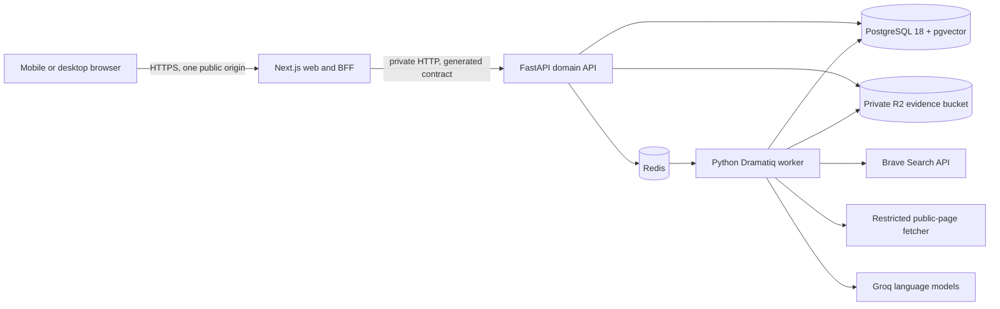

# ShaidaGo implementation plan

**Status:** architecture decision and build plan
**Prepared:** 19 September 2026
**Pilot:** Abuja — AMAC and Bwari Area Councils
**Public languages:** English, Hausa, Igbo, and Yoruba
**Source brief:** [`docs/PRODUCT_BRIEF.md`](PRODUCT_BRIEF.md)

## 1. Outcome

Build one polished, judgeable vertical product rather than a collection of demos. A resident must be able to find a cited project, understand it, ask a grounded question, submit a fictional private concern, retain a non-identifying tracking code, see its public-safe status, and watch an authorised reviewer assess it. Source Scout must add public evidence without leaking private context or turning search results into facts.

The Abuja pilot is one deployment with two configured localities (`amac` and `bwari`), not two separate applications. Start with six projects—three per area council—and expand to eight only after all five journeys pass end-to-end tests.

## 2. Architecture decision

### Chosen stack

| Area                     | Choice                                                                    | Reason                                                                                                                                                                                                                                                       |
| ------------------------ | ------------------------------------------------------------------------- | ------------------------------------------------------------------------------------------------------------------------------------------------------------------------------------------------------------------------------------------------------------ |
| Frontend runtime         | Node.js 24 LTS                                                            | Current supported LTS rather than Node 26 Current or an end-of-life release.                                                                                                                                                                                 |
| Web framework            | Next.js 16 App Router, React 19.3, strict TypeScript                      | Server-rendered public pages, small client islands, native BFF route handlers, streaming, metadata, and a strong PWA path.                                                                                                                                   |
| UI system                | Tailwind CSS 4.3, shadcn/ui with Base UI primitives, project-owned tokens | Modern CSS-first tokens with accessible, inspectable components that remain in the repository.                                                                                                                                                               |
| Frontend data and forms  | TanStack Query for polling/mutations, React Hook Form, Zod                | Keep public reads server-rendered; use client state only where uploads, polling, and multi-step forms need it.                                                                                                                                               |
| Internationalisation     | `next-intl`, locale-prefixed routes, ICU messages                       | Server Components support, key parity, plural/date/number formatting, and explicit`en`, `ha`, `ig`, `yo` URLs.                                                                                                                                       |
| Frontend package manager | pnpm with a committed lockfile                                            | Fast, deterministic Node installs without coupling Python dependencies to JavaScript tooling.                                                                                                                                                                |
| Backend runtime          | Python 3.14                                                               | Current stable Python line with a mature FastAPI ecosystem.                                                                                                                                                                                                  |
| API framework            | FastAPI, Pydantic 2 strict models, SQLAlchemy 2 async, Alembic, psycopg 3 | Typed REST/OpenAPI contracts, explicit validation, async I/O, migrations, and strong AI/document tooling.                                                                                                                                                    |
| Python tooling           | `uv`, Ruff, Pyright, pytest                                             | Reproducible lockfile, fast environment setup, one formatter/linter, strict types, and mature tests.                                                                                                                                                         |
| Database                 | PostgreSQL 18 with`pgvector`                                            | Relational integrity, full-text search, JSON where justified, row security/grants, audit history, and hybrid retrieval without another database.                                                                                                             |
| Jobs and rate limits     | Redis 8 and Dramatiq                                                      | Discovery and file work cannot block requests; bounded retries and dead letters are visible and testable. Redis also provides shared token-bucket limits.                                                                                                    |
| Evidence storage         | Private Cloudflare R2 buckets through the S3 API                          | Encrypted object storage, short-lived signed access, and no public bucket. Local development uses MinIO.                                                                                                                                                     |
| Search provider          | Brave Search API behind a provider interface                              | Returns search results rather than making truth judgments; the application retains control of safe fetching, provenance, and review.                                                                                                                         |
| AI                       | Groq OpenAI-compatible Chat Completions with strict JSON schemas; configurable model IDs (ADR-0009 supersedes the original OpenAI choice) | Strict output schemas, multilingual responses, and provider isolation. Use `openai/gpt-oss-120b` for the few complex discovery syntheses and `openai/gpt-oss-20b` for short Q&A/explanations (both served by Groq), and local FastEmbed `multilingual-e5-large` for retrieval (ADR-0010). |
| Deployment               | Railway for web, private API, worker, PostgreSQL, and Redis; R2 for files | One public origin, private service-to-service networking, background workers, and a reproducible container topology.                                                                                                                                         |
| CI/CD                    | GitHub Actions, Docker BuildKit, GitHub code/security scanning            | The repository itself proves formatting, types, tests, contracts, migrations, security checks, and buildability.                                                                                                                                             |

All dependency versions are pinned in `pnpm-lock.yaml` and `uv.lock`. Runtime major versions are pinned in `.nvmrc`/`package.json`, `.python-version`, and Dockerfiles; patch releases are upgraded through reviewed pull requests.

### Choices deliberately rejected

| Alternative                            | Why it is not the default                                                                                                                                                                    |
| -------------------------------------- | -------------------------------------------------------------------------------------------------------------------------------------------------------------------------------------------- |
| Vite SPA only                          | Excellent for a client application, but it would require a separate Node BFF or expose the Python API directly. It also gives weaker first-load and public-page behaviour for low bandwidth. |
| Next.js as the whole backend           | It would erase the requested stack separation and make document extraction, retrieval, and worker code less natural. Next remains the presentation/BFF layer only.                           |
| NestJS backend                         | A sound option, but Python has the clearer path for safe document parsing, retrieval, embeddings, and structured AI workflows while preserving a distinct backend stack.                     |
| Browser-to-FastAPI calls               | They bypass the BFF, expand CORS and token exposure, and make cookie and response-shaping rules harder to audit.                                                                             |
| GraphQL                                | The domain has bounded resource workflows and benefits more from explicit REST operations and generated OpenAPI clients than from a second query language.                                   |
| Supabase/Firebase direct client access | Direct database/auth access would blur public/private boundaries and make the BFF less authoritative. Managed PostgreSQL remains acceptable; browser database access does not.               |
| A vector database or agent framework   | Six to eight projects do not justify another datastore or autonomous orchestration. PostgreSQL hybrid retrieval plus explicit jobs is easier to test and safer.                              |
| Live maps and dashboards               | They cost data and attention without improving the core evidence journey. Location is text-first; a map is a post-hackathon enhancement.                                                     |
| Blockchain                             | It does not improve source quality, reporter safety, or human review in this product.                                                                                                        |

## 3. System topology and BFF boundary



The boundary is intentionally asymmetric:

- The browser calls only the Next.js origin. It never receives the FastAPI hostname, database credentials, search key, AI key, or object-storage credentials.
- Next.js Server Components read public data directly from the private API. They do not call their own Route Handlers and incur an unnecessary extra hop.
- Browser-originated mutations, polling, uploads, and authenticated reviewer actions go through thin Next.js Route Handlers.
- The BFF owns same-origin cookies, CSRF/origin checks, locale propagation, safe response shaping, request IDs, and browser-friendly error mapping.
- FastAPI owns every domain rule: validation, authorisation, visibility, encryption, state transitions, audit events, citations, and publication policy.
- The BFF must not decide whether evidence is verified, a report is publishable, or a reviewer has permission. Duplicating those rules would create two security authorities.
- FastAPI is a Railway private service. Only `/health/live` and `/health/ready` are exposed through the BFF as limited health signals.

## 4. Repository layout

```text
shaidago/
├── apps/
│   └── web/                         # Next.js frontend and thin BFF
│       ├── app/[locale]/
│       ├── components/
│       ├── messages/                # en.json, ha.json, ig.json, yo.json
│       ├── src/lib/api/generated/   # generated; never hand-edited
│       └── public/sw.js
├── services/
│   └── platform/                    # one Python deployable, two entry points
│       ├── src/shaidago/
│       │   ├── api/
│       │   ├── auth/
│       │   ├── projects/
│       │   ├── reports/
│       │   ├── review/
│       │   ├── discovery/
│       │   ├── retrieval/
│       │   ├── files/
│       │   ├── audit/
│       │   └── shared/
│       ├── migrations/
│       ├── tests/
│       └── pyproject.toml
├── contracts/
│   └── openapi.json                 # generated backend contract
├── data/
│   ├── seed-projects.json
│   ├── seed-demo-reports.json       # explicitly fictional
│   ├── source-notes/
│   └── discovery-fixtures/
├── docs/
│   ├── README.md
│   ├── PRODUCT_BRIEF.md
│   ├── IMPLEMENTATION_PLAN.md
│   ├── TRUST_MODEL.md
│   ├── PRIVACY_AND_SAFETY.md
│   ├── THREAT_MODEL.md
│   ├── AI_BUILD_LOG.md
│   ├── API.md
│   └── DEMO_SCRIPT.md
├── infra/
│   ├── docker/
│   └── railway/
├── scripts/
├── .github/workflows/
├── docker-compose.yml
├── Makefile                          # cross-stack judge commands only
├── package.json                      # pnpm workspace root
├── pnpm-lock.yaml
├── uv.lock
├── .env.example
├── AGENTS.md
├── CONTRIBUTING.md
├── PRODUCT.md
├── SECURITY.md
├── LICENSE
└── README.md
```

The stacks stay separate: pnpm controls `apps/web`; `uv` controls `services/platform`. The root `Makefile` only provides memorable orchestration commands such as `make setup`, `make dev`, `make seed`, `make test`, and `make verify`.

## 5. Frontend plan

### Routes

| Route                                      | Purpose                                                           | Rendering/cache rule                            |
| ------------------------------------------ | ----------------------------------------------------------------- | ----------------------------------------------- |
| `/[locale]`                              | Purpose, AMAC/Bwari entry, search, trust promise                  | Server-rendered; public cache                   |
| `/[locale]/projects`                     | Paginated directory and filters                                   | Server-rendered initial page; URL-owned filters |
| `/[locale]/projects/[slug]`              | Facts, timeline, sources, Q&A, report action                      | Server-rendered; tag-revalidated public cache   |
| `/[locale]/projects/[slug]/sources/[id]` | Source metadata and permitted excerpt                             | Public only when source is approved             |
| `/[locale]/report/[projectSlug]`         | Privacy-first multi-step report                                   | Dynamic; never cached                           |
| `/[locale]/report/complete`              | One-time tracking code and safety guidance                        | Dynamic; no-store; back navigation protected    |
| `/[locale]/track`                        | Tracking-code status lookup, or all reports for a reporter handle | POST-backed; never cached                       |
| `/[locale]/handle`                       | Create or delete an optional anonymous reporter handle            | Dynamic; no-store; credentials shown once       |
| `/[locale]/trust`                        | Trust, AI limits, privacy, labels                                 | Static/server-rendered                          |
| `/[locale]/reviewer/sign-in`             | Reviewer session creation                                         | Dynamic; no-store                               |
| `/[locale]/reviewer/reports`             | Minimal-data queue                                                | Authenticated; no-store                         |
| `/[locale]/reviewer/reports/[id]`        | Evidence review and Source Scout                                  | Authenticated; no-store                         |

No route fetches from the API at build time. Railway private networking (`api.railway.internal`) is unavailable during the build phase, so a prerendered fetch fails the deploy. Public routes render on request and cache the result: `generateStaticParams` returns an empty list, data reads happen inside request scope, and cache entries are tagged and revalidated after the first request. CI runs `next build` with the API unreachable to prove this.

Source Scout is a task panel inside project and reviewer detail screens, not another disconnected product. On small screens it becomes a full-screen dialog with resumable progress.

### Information hierarchy

The public project screen answers, in order:

1. What was promised?
2. What is the current evidence-backed state?
3. Who is responsible and what dates or funding are published?
4. Which sources support each fact?
5. What is unknown, disputed, stale, or unavailable?
6. What safe action can the resident take next?

The central UI object is a **fact with evidence**, not a generic card. Each fact shows a text verification label, last-checked time, and citation control. Official updates and reviewed community evidence use distinct labels and timeline markers; colour is never the only distinction.

### Interaction and state rules

- Filters live in the URL and remain compact, removable pills on mobile.
- Every async surface implements initial loading, empty, stale, partial, retryable failure, forbidden, and offline states.
- Q&A shows the retrieved answer, generation time, evidence scope, sentence-linked citations, and an explicit insufficient-evidence state.
- The report flow has short steps: safety notice, observation, evidence, anonymity/contact, review, submit.
- The browser re-encodes supported images before preview/upload and explains that the server repeats the sanitation check; client-side processing is a usability and data-minimisation layer, not the security boundary.
- Anonymous mode is selected by default. Contact fields do not render until the user explicitly opts in.
- The anonymity step offers three choices, in this order: fully anonymous (default), anonymous with my reporter handle, or anonymous with a separate contact channel. Choosing a handle shows a plain warning first: reviewers can see that your reports came from the same handle, so for a very sensitive report, don't use one.
- A draft is saved only after a shared-device warning. It excludes attachments and contact details, expires after 24 hours, is cleared after submission, and has a visible “remove this draft” action.
- The tracking code is shown once with copy and download/print actions. The application does not silently place it in analytics, URLs, or local storage.
- Reviewer destructive/status actions require explicit confirmation and show the resulting append-only history item.
- Motion is progressive enhancement. Reduced-motion users and low-data mode receive the complete journey without animation.

### Internationalisation

- Locale routes use `en`, `ha`, `ig`, and `yo`; English is the source locale, not a fallback that silently masks missing keys.
- CI checks identical message-key sets, interpolation variables, and valid ICU syntax across all four files.
- Navigation, forms, validation, privacy/safety text, statuses, escalation guidance, trust explanations, and the reviewer UI are translated.
- Six seed-project summaries are stored per locale and carry `translation_status` (`reviewed`, `machine_assisted`, or `unavailable`). Do not label machine-assisted text as human reviewed.
- Original source titles and excerpts remain visibly connected to the source language. A translation is an explanation, not a replacement for the source.
- AI answers use the selected locale but preserve source titles and citations. Prompts prohibit translating names, amounts, dates, and quoted claims into different facts.
- Dates use `Africa/Lagos`; money uses `NGN` with locale-aware formatting; stored timestamps remain UTC.
- Hausa, Igbo, and Yoruba copy must receive a human language review before the final video. Automated translation is only a draft accelerator.

### PWA and low-data behaviour

- Use the native service-worker and Cache Storage APIs rather than a large generic offline plugin.
- Precache only the shell, fonts/icons needed for first paint, the offline page, and static locale messages.
- Cache public project list/detail GET responses with a bounded stale-while-revalidate policy and an explicit “saved on / last checked” timestamp.
- Never cache reviewer pages, report requests/responses, tracking lookups, Q&A POST bodies, discovery results from private reports, contact data, or attachment URLs.
- If connectivity drops, already-rendered discovery results remain usable in the current in-memory view and polling can resume; private results are not persisted into an offline cache.
- Low-data mode removes decorative imagery, disables prefetching, uses text-first Source Scout results, and is remembered as a non-sensitive preference.
- Public pages remain useful without JavaScript; search refinement, Q&A, uploads, and polling enhance the server-rendered base.
- Target the public first route at less than 170 KB of first-load compressed JavaScript and keep feature code route-scoped.

## 6. Backend plan

### Modular monolith

Use one FastAPI codebase with two process entry points: `api` and `worker`. Modules communicate through typed services and repository interfaces, not HTTP. This is easier to deliver and inspect than microservices while keeping boundaries clear enough to split later.

| Module        | Owns                                                                            |
| ------------- | ------------------------------------------------------------------------------- |
| `projects`  | Localities, projects, facts, translations, timelines, public projections        |
| `sources`   | Source metadata, approved excerpts, versions, availability, citations           |
| `reports`   | Anonymous submission, encrypted private content, tracking lookup, state machine |
| `review`    | Reviewer queue, authorisation, internal notes, public-safe publication          |
| `discovery` | Safe query plans, jobs, retrieval, deduplication, result review                 |
| `retrieval` | Source chunking, embeddings, hybrid search, citation validation                 |
| `files`     | MIME checks, metadata removal, malware scanning, private storage                |
| `auth`      | Reviewer credentials, opaque sessions, CSRF support, roles                      |
| `audit`     | Append-only security and reviewer events with sensitive-field denylist          |

### Database model

Use UUIDv7 primary keys and UTC `timestamptz`. Avoid PostgreSQL enum types during the sprint; use text columns with named `CHECK` constraints so states remain reviewable and migrations reversible.

#### Public accountability

- `localities`: Abuja parent, AMAC, Bwari, stable slugs, supported locales.
- `projects`: identity, locality, category, current public status, last checked, public visibility.
- `project_translations`: locale, title, plain summary, promised deliverable, review status.
- `project_facts`: typed fact key/value, display value, verification state, observed/effective dates.
- `sources`: publisher, type, canonical URL/document reference, publication/check dates, availability, public/review state.
- `source_versions`: immutable retrieval metadata, content hash, source language, permitted excerpt, retrieval time.
- `fact_citations`: many-to-many links from each fact to a source/version and exact supporting passage.
- `project_updates`: official or reviewed-community timeline entries, visibility, verification state.
- `update_citations`: evidence links for each public timeline entry.
- `source_chunks`: approved-public, project-scoped chunks only, exact source offsets, content hash, language, section label, text-search vector, embedding, token count, and active state.
- `escalation_routes`: locality, category, locale, organisation, instructions, verified date.

This corrects the brief's most important modelling gap: sources do not become facts merely because they exist. Public facts and updates have explicit citations, and database constraints prevent public rows without at least one approved citation at publication time.

#### Private reporting

- `reports`: project, category, encrypted description, risk level, anonymous flag, current projection, timestamps.
- `report_contacts`: separate encrypted contact channel/value; never joined by public repositories.
- `reporter_handles`: server-generated handle, Argon2id passphrase hash, created date, last-used **date** (day granularity only), deleted flag. No email, phone, IP, device, or recovery field exists in the schema.
- `reports.reporter_handle_id`: nullable foreign key; null for fully anonymous reports. Reviewers see the handle; public and tracking responses never do.
- `report_tracking_keys`: keyed hash, checksum version, lookup attempt metadata without raw code.
- `evidence_files`: private storage key, sanitised display name, sniffed MIME, size, hashes, sanitation/scan state.
- `report_status_events`: append-only previous/new state, public-safe message, actor, time.
- `review_notes`: encrypted internal notes, author, time.
- `public_updates`: reviewer-authored neutral text physically separated from the private report, with approval state.
- `reviewer_users` and `reviewer_sessions`: Argon2id password hash, role, opaque-session HMAC, expiry, revocation.

#### Discovery and audit

- `discovery_runs`: public project or private report scope, exact approved safe query, provider, lifecycle state, prompt version.
- `discovered_sources`: canonical URL, publisher/type, dates, excerpt, content hash, retrieval/review states, duplicate pointer.
- `discovery_analyses`: schema-versioned structured result, model, prompt hash, creation time.
- `follow_up_questions`: question, reason, sensitivity, answer state; private answers encrypted.
- `audit_events`: append-only actor, action, target type/ID, before/after status only, request ID, time. No descriptions, contacts, codes, file contents, or prompt bodies.

Use separate PostgreSQL roles for migrations, public reads/submission, reviewers, and workers. Public API repositories can select only from public views. Anonymous submission can insert but cannot select reports. Because `INSERT … RETURNING` requires `SELECT` privilege (and a `SELECT` policy under row security), the submission path generates UUIDv7 keys and timestamps in the application, disables implicit `RETURNING` on the private-report mappers (`implicit_returning=False`, no server-generated defaults read back), and never flushes in a way that reads rows back. An integration test runs the full submission as the restricted role. Tracking lookup is a narrowly scoped database operation that returns a public-safe projection. Private-table row security and grants are defence in depth; FastAPI authorisation remains mandatory.

### API contract

All endpoints are under `/v1`; all JSON uses explicit Pydantic request and response models. Errors use `application/problem+json` with stable machine codes and safe human messages. Lists use cursor pagination. Mutating creates accept an `Idempotency-Key`.

#### Public/BFF-facing operations

```text
GET  /v1/localities
GET  /v1/projects
GET  /v1/projects/{slug}
GET  /v1/projects/{slug}/sources/{source_id}
POST /v1/projects/{slug}/questions
POST /v1/projects/{slug}/discovery-runs
GET  /v1/discovery-runs/{run_id}
POST /v1/discovery-runs/{run_id}:cancel
POST /v1/discovery-runs/{run_id}/follow-up-answers
POST /v1/reports                         # multipart, streamed through BFF
POST /v1/report-status:lookup            # code in body, never in URL
POST /v1/report-status:answer-follow-up  # code remains in body
POST /v1/reporter-handles                # returns handle + passphrase once
POST /v1/reporter-handles:list-reports   # credentials in body
POST /v1/reporter-handles:delete         # credentials in body; unlinks, never deletes reports
POST /v1/auth/sessions
DELETE /v1/auth/sessions/current
```

#### Reviewer operations

```text
GET  /v1/reviewer/reports
GET  /v1/reviewer/reports/{report_id}
POST /v1/reviewer/reports/{report_id}/status-events
POST /v1/reviewer/reports/{report_id}/notes
POST /v1/reviewer/reports/{report_id}/public-updates
POST /v1/reviewer/reports/{report_id}/discovery-runs
GET  /v1/reviewer/discovery-runs/{run_id}
POST /v1/reviewer/discovery-runs/{run_id}:cancel
POST /v1/reviewer/discovery-runs/{run_id}/follow-up-answers
POST /v1/reviewer/discovered-sources/{source_id}/decision
POST /v1/reviewer/discovered-sources/{source_id}/attach
GET  /v1/reviewer/evidence/{file_id}/download
```

The brief's `GET /reports/status/{tracking_code}` is intentionally replaced. Secrets in paths leak into browser history, access logs, observability systems, and referrer data; tracking lookup is a rate-limited POST body with `Cache-Control: no-store`.

FastAPI emits `contracts/openapi.json`. `openapi-typescript`/`openapi-fetch` generates the web client. CI regenerates both and fails on an uncommitted diff, preventing frontend/backend contract drift.

## 7. Critical workflows

### Grounded project Q&A

1. Resolve the selected public project and selected locale.
2. Retrieve only chunks linked to sources that are public, approved, and currently available.
3. Combine PostgreSQL full-text rank and pgvector cosine similarity with reciprocal-rank fusion; exact vector search is enough at pilot size.
4. Send the minimal selected passages and opaque citation IDs to the Responses API with `store: false` and no tools.
5. Require a strict schema: `answer`, `statements[{text,citation_ids}]`, `insufficient_evidence`, `confidence_note`, `generated_at`.
6. Reject any unknown citation, citation from another project, uncited factual statement, or malformed output.
7. If evidence coverage is weak or validation fails, return “The available sources do not confirm this” and useful source links.
8. Store metrics and prompt/model versions, not the user's question when it could be sensitive; never mix private reports into this index.

Embeddings are local (ADR-0010): FastEmbed with `intfloat/multilingual-e5-large`, 1024 dimensions, run in-process, so there is no provider key and no question leaves the server. Chunk vectors are checked in at `data/embeddings/intfloat__multilingual-e5-large.jsonl`, keyed by chunk content hash, regenerated by `make embeddings` (needs the model from `make embedding-model`), and loaded by `make seed-demo` without any model. A question is embedded on the server that received it, before any database session is held, when `EMBEDDING_BACKEND=fastembed`. If the backend is off, the model fails to load, an embedding call fails or is busy, or a chunk has no stored vector, retrieval falls back to PostgreSQL full-text search only, and the answer metadata records `retrieval_mode: "keyword"` so the degradation is visible and tested.

### Anonymous report submission

1. The BFF checks origin, body size, content type, honeypot, and rate limit, then streams the multipart request to FastAPI.
2. FastAPI validates text, creates no public content, and processes each attachment before persistent storage.
3. Images are MIME-sniffed, decoded with resource limits, orientation-normalised, resized if needed, and re-encoded without EXIF/IPTC/XMP. PDFs are size/type checked, rejected if encrypted, stripped of metadata/embedded files/actions, and served later as downloads rather than inline content.
4. ClamAV scans the temporary content in local development and CI (Compose service, EICAR fixture). If the scanner is configured but unavailable, the file remains unavailable and the report can still submit without it. The hosted demo does not run ClamAV (its 1.5–3 GB signature footprint is not justified for fictional data); it sets `SCANNER_MODE=not_deployed`, which records `malware_scan_state = "not_scanned_demo"`, shows that label to reviewers, and still permits reviewer download of sanitised files. Production cannot start with that mode, and the limitation is stated in the README.
5. Only the sanitised artifact is uploaded to the private bucket; the temporary raw file is deleted.
6. Description and optional contact values are encrypted independently with AES-256-GCM, random nonces, and a key version. Production keys move to a managed KMS; demo keys come only from environment secrets.
7. Generate `SG-XXXXX-XXXXX-XXXXX-XXXXX-C`: 100 random bits in Crockford Base32 plus a typo checksum. Store only `HMAC-SHA-256(server_pepper, normalised_code)`.
8. Return the raw code exactly once. Emit an append-only `received` status event and a non-sensitive audit event.

### Tracking-code lookup

- POST the code in the request body; normalise and check the checksum before database work.
- Rate-limit on a rotating HMAC of IP plus code prefix; never log the raw IP or code.
- Return the same generic response shape/timing for not-found and inaccessible records as far as practical.
- Return only current public-safe status, last update, reviewer-safe message, and next action.
- Never return the description, evidence, contact, reviewer identity, internal notes, or private discovery results.

### Anonymous reporter handles (optional)

A handle lets a repeat reporter build a track record without an identity. It is opt-in; fully anonymous reporting stays the default and loses nothing.

1. **Creation.** The server generates both parts. The handle is `SG-H-XXXX-XXXX` (Crockford Base32, not secret). The passphrase is six words from the EFF long wordlist (about 77 bits). User-chosen names and passwords are not allowed, because people reuse them and they can identify someone. Both are shown once with copy/print actions and the warning "We cannot recover this. Nobody can."
2. **Storage.** Store the handle and an Argon2id hash of the passphrase. Nothing else about the person exists to store.
3. **Use.** On the anonymity step, the reporter enters the handle and passphrase. They are verified at submission only; no session, cookie, or browser storage is created. If the credentials are wrong, the submission fails with a generic message and the draft is kept, so a report is never silently submitted unlinked.
4. **Tracking.** `/track` accepts either one tracking code or a handle with its passphrase, and lists public-safe statuses for every report under that handle.
5. **Track record, reviewer-only.** The reviewer queue shows the handle's history: reports submitted, verified for public update, closed without verification. It is shown as context for prioritising reports, never as proof. The report's own evidence still has to be verified.
6. **Deletion.** The reporter can delete the handle. The link is removed from every report; the reports remain as fully anonymous reports.
7. **Abuse limits.** Rate-limit credential checks on a rotating IP HMAC and apply per-handle exponential backoff. There is no hard lockout, which an attacker could use to lock out a real reporter.

Public corroboration is worded as a reviewer finding, not a count of people: "A reviewer found *N* consistent reports." Anonymous reports cannot prove they come from different people. Reports sharing a handle count once.

### Reviewer publication

- Allowed transitions are defined by the backend-owned contract in [`CONTROLLED_VOCABULARY.md`](CONTROLLED_VOCABULARY.md). It includes `received -> needs_information | under_review | closed`, the complete review paths, and explicit audited reopening; unlisted transitions fail closed.
- A status event does not publish report text.
- A reviewer writes a separate neutral `public_update`, links approved evidence/citations, previews exactly what the public will see, and confirms publication.
- The publication transaction checks role, report state, attachment safety, citation visibility, and prohibited private-field references before inserting a public timeline update.

### Source Scout

1. Build candidate query terms from an allowlist of public project fields. For private reports, extract only approved incident concepts; reject names, contacts, tracking codes, attachment text, exact private addresses, and internal notes.
2. Run deterministic PII/secret rules after AI assistance. AI may suggest terms but cannot bypass the denylist.
3. Show the exact outbound query for approval before a report-scoped run.
4. Queue a Dramatiq job containing IDs only—not private report text.
5. Query Brave for at most ten URLs. Do not persist Brave snippets or ranks unless the active plan explicitly grants storage rights; fetch permitted public pages and derive metadata independently.
6. For each URL, allow only `http`/`https`, ports 80/443, and public IPs. Resolve and validate every address; revalidate every redirect; block loopback, private, link-local, multicast, reserved, and cloud-metadata ranges. Stream with strict connect/read/total timeouts, content-type allowlists, and byte caps.
7. Respect `robots.txt`, publisher access controls, rate limits, and terms. Never bypass login, paywall, CAPTCHA, or no-access responses.
8. Extract inert text from HTML or public PDFs. Scripts, styles, forms, instructions, and active content are discarded. Retrieved text is untrusted data and has no tools or system authority.
9. Deduplicate by normalised canonical URL, SHA-256 content hash, and near-duplicate SimHash. Preserve each discovery and retrieval time.
10. Ask the model for the strict `summary`, `supported_facts`, `reported_claims`, `contradictions`, `information_gaps`, `follow_up_questions`, citations, safety note, and confidence note schema.
11. Deterministically validate every cited source/chunk and cap questions at five. Invalid analysis fails closed to `needs review`.
12. Label every result `discovered — not yet reviewed`. Only a reviewer can attach it to the approved project source set.

Public project-scoped runs are anonymous, so they are cost-bounded:

- One shared run per project per 24 hours. A public `POST` returns the existing fresh run instead of starting another, so repeated clicks and scripted calls cost nothing.
- A new public run also requires a per-IP-HMAC rate limit and a global daily provider budget (`DISCOVERY_PUBLIC_DAILY_RUNS`, default 20). When the budget is spent, the public panel shows the latest completed run with its date.
- Public runs use the smaller configured model; only reviewer-started runs may use the synthesis model.
- Reviewer runs are authenticated, audited, and exempt from the shared cache but have their own per-reviewer daily cap.

Runs move through `queued`, `searching`, `analysing`, `needs_review`, `complete`, `failed`, or `cancelled`. Jobs are idempotent by run ID, use bounded exponential retries, and move exhausted work to a dead-letter state visible to reviewers. Cancellation stops future fetches but preserves results already retrieved for review. No job retries forever.

## 8. Privacy, security, and trust controls

### Non-negotiable controls

- No real whistleblower data in the hackathon environment.
- Private reports, contacts, attachments, and report-scoped discovery never enter public caches, analytics, AI retrieval, error tracking, or logs.
- Use opaque reviewer sessions in `Secure`, `HttpOnly`, `SameSite=Lax`, `__Host-` cookies; store only an HMAC of the session token. Reviewer passwords use Argon2id. Cookie name and `Secure` come from configuration: production and staging require `__Host-sg_session` and refuse to boot otherwise; `APP_ENV=development`/`test` uses `sg_session` without `Secure`, because WebKit rejects `Secure` cookies on `http://localhost` and would break the mobile WebKit reviewer E2E. A unit test asserts the production `Set-Cookie` attributes.
- Check `Origin` and a CSRF token on state-changing authenticated requests. Rotate the session at sign-in and privilege changes.
- Apply Content Security Policy, frame denial, strict referrer policy, MIME sniffing protection, permissions policy, and HSTS in production.
- Validate request/response bodies at both BFF and API boundaries, but keep domain enforcement in FastAPI.
- Public DTOs are allowlists. Never serialise ORM entities directly.
- Disable or authenticate API documentation in production; retain generated OpenAPI in the repository.
- Use short-lived reviewer evidence links, `Content-Disposition: attachment`, and `Cache-Control: private, no-store`.
- Redact secrets centrally before structured JSON logging. CI tests the log denylist with canary values.
- Dependency, container, and secret scans run in CI. High/critical exploitable findings block release.

### Threat tests that must exist

- Tracking-code enumeration, timing, malformed code, replay, and rate-limit tests.
- Reporter-handle tests: the handle never appears in public, tracking, or log output; wrong credentials give the same response for a missing and an existing handle; backoff applies without hard lockout; deleting a handle unlinks every report; the schema has no contact or recovery column.
- Horizontal/vertical reviewer authorisation tests for every private operation.
- Public response snapshots proving private fields are absent.
- EXIF GPS fixtures proving client and server removal.
- MIME spoof, decompression bomb, oversized file, SVG/script, malicious PDF, and EICAR fixtures.
- SSRF fixtures for loopback, RFC1918, IPv6 local/link-local, decimal/octal IPs, DNS rebinding simulation, unsafe redirects, metadata IPs, and unsupported schemes.
- Prompt-injection pages that tell the model to reveal data, ignore policy, attach a source, or publish a claim.
- Duplicate, contradictory, stale, unavailable, and citation-forgery discovery fixtures.

## 9. Test strategy and quality gates

| Layer                   | Tools                                                          | Required evidence                                                                                     |
| ----------------------- | -------------------------------------------------------------- | ----------------------------------------------------------------------------------------------------- |
| Frontend unit/component | Vitest, Testing Library, MSW                                   | Forms, labels, status text, locale rendering, retry/offline states                                    |
| Backend unit            | pytest, Hypothesis, Pyright                                    | State machines, code generation/hash, redaction, URL guard, citation validator, encryption envelope   |
| Database/integration    | pytest + Testcontainers for PostgreSQL/Redis/MinIO             | Migrations, grants/RLS, repositories, jobs, idempotency, file pipeline                                |
| Contract                | Generated OpenAPI client, Schemathesis                         | No schema drift; safe errors; malformed request coverage                                              |
| End-to-end              | Playwright                                                     | Five journeys in all critical states; Chromium plus a mobile WebKit smoke pass                        |
| Accessibility           | axe-core, keyboard scripts, manual screen-reader smoke         | WCAG 2.2 AA, focus order, 200% zoom, reduced motion, no colour-only status                            |
| AI evaluation           | Versioned golden corpus with mocked and live opt-in runs       | Correct citations, insufficient-evidence behaviour, contradictions, four-language answer preservation |
| Security                | Semgrep, CodeQL, Gitleaks,`pnpm audit`, `pip-audit`, Trivy | No committed secrets; no high/critical release blocker                                                |
| Performance/resilience  | Lighthouse CI, Playwright network throttling                   | Public JS budget, narrow viewport, offline revisit, failed-upload retry, low-data mode                |

Set overall coverage floors at 80% frontend and 85% backend, but require 100% branch coverage for the tracking-code normaliser, public-response allowlists, privacy-safe query builder, SSRF guard, citation validator, and report state machine.

`make verify` is the judge-facing gate and must run formatting checks, lint, types, unit tests, contract generation/diff, migrations from empty, integration tests, production builds, and deterministic end-to-end tests. Live provider tests are separate and opt-in so a missing third-party key does not make the repository unverifiable.

## 10. Deployment and operations

### Hosted demo

- `web`: public Railway Next.js service, standalone output, one custom domain.
- `api`: Railway private FastAPI service reachable only as `api.railway.internal`. Uvicorn binds `::` so it is reachable on IPv6-only private networks. The web service reads `API_INTERNAL_URL` at runtime only, never at build.
- Postgres uses a pgvector-enabled PostgreSQL 18 image (the stock Railway Postgres template does not guarantee the extension); the first migration runs `CREATE EXTENSION IF NOT EXISTS vector` and readiness fails if it is missing.
- `worker`: Railway worker using the same Python image with a different command.
- Managed PostgreSQL and Redis: private connections only.
- R2: one private `evidence` bucket; object keys are random and contain no project, report, or person names. Raw uploads are sanitised in bounded temporary storage and are never persisted to an object-store quarantine.
- Groq and Brave keys: worker/API environment secrets only.
- Staging and production have separate databases, Redis instances, buckets, keys, and reviewer credentials.

Readiness checks verify database migrations, Redis, and object storage. AI/search outages do not take down project pages or reporting; those features show a retryable unavailable state. Deployments run migrations as a pre-deploy job and do not auto-seed production.

### Local and judge setup

Docker Compose provides PostgreSQL 18 + pgvector, Redis, MinIO, and ClamAV. Web and Python processes can run natively for fast reload or through Docker for parity.

The clean path must be:

```text
cp .env.example .env
make setup
make infra-up
make migrate
make seed-demo
make dev
make verify
```

Without Groq or Brave keys, explicit fixture adapters keep the full workflow runnable using checked-in, clearly labelled demo responses. The UI displays “demo replay” so recorded data is never misrepresented as a live search. At least one pre-submission run must exercise the real providers and preserve only safe evidence of success.

## 11. Build order

The order below creates vertical, demonstrable increments. Its critical path is approximately 42–49 focused build hours plus recording, leaving only a small contingency before the stated deadline. Do not build all database tables first and postpone the user journey.

This section is the milestone summary. Use [`BACKEND_BUILD_ORDER.md`](BACKEND_BUILD_ORDER.md) and [`FRONTEND_BUILD_ORDER.md`](FRONTEND_BUILD_ORDER.md) for the task-level dependency order, implementation steps, failure cases, tests, evidence, and circle exit gates. Those documents operationalise this plan; this plan remains authoritative if wording conflicts.

### Gate 0 — evidence and scope lock (2–3 hours)

1. Select six real projects: three AMAC, three Bwari, with at least one health, education, water, and road/public-works example across the set.
2. Create a source register with URL/document, publisher, date, exact supporting passage, last checked, access/reuse notes, and unresolved gaps.
3. Confirm report categories, verification states, status transitions, and locality-specific escalation routes.
4. Draft English source copy and translation glossary; identify Hausa, Igbo, and Yoruba reviewers.

**Gate:** every seeded fact has a source candidate; no accusation or unsupported completion/abandonment label appears.

### Gate 1 — reproducible foundation (3 hours)

1. Initialise the repository, license, CODEOWNERS, issue/PR templates, Node/Python locks, Compose, `.env.example`, and root commands.
2. Scaffold Next.js, FastAPI, worker, migration, health, structured logging, and request IDs.
3. Add GitHub Actions for formatting, lint, types, unit tests, OpenAPI generation, migrations, and builds.
4. Create the database roles/schemas and first migration.

**Gate:** a clean clone reaches healthy web/API/database/Redis with documented commands; CI is green.

### Gate 2 — public accountability slice (5–6 hours)

1. Implement locality, project, fact, source, citation, translation, and update tables.
2. Write an idempotent seed command and load the six cited projects.
3. Build landing, directory, project detail, source viewer, trust labels, timelines, and responsive states.
4. Add locale routing and complete static UI message files early, not as final polish.

**Gate:** a resident can explain the promise, responsible body, current evidence state, and source; every displayed fact opens a citation.

### Gate 3 — safe reporting and review slice (10–12 hours)

1. Implement encrypted report/contact storage, tracking keys, append-only events, sessions, roles, and audit events.
   - Implement optional reporter handles: generation, Argon2id verification at submission, handle-based tracking, reviewer track record, deletion, and backoff. Build this after the fully anonymous path passes end to end, never before.
2. Implement streamed upload validation, metadata removal, scanning, and private storage.
3. Build the report wizard, one-time confirmation, POST status lookup, reviewer sign-in/queue/detail, status transition, and public-update preview.
4. Add authorisation, privacy-field, tracking enumeration, and file-safety tests before moving on.

**Gate:** the fictional report journey works end to end; no private field appears in public API snapshots, logs, caches, or public UI.

### Gate 4 — grounded Q&A (4 hours)

1. Chunk only approved source text, create embeddings, and add hybrid retrieval.
2. Implement structured Responses output and deterministic citation validation.
3. Add project Q&A UI, insufficient-evidence state, four-language responses, and golden eval cases.

**Gate:** supported questions cite the exact project sources; unsupported, cross-project, injected, and malformed cases fail closed.

### Gate 5 — Source Scout (6–7 hours)

1. Implement safe-query plan/preview, provider adapter, Dramatiq lifecycle, safe fetcher, extraction, provenance, and deduplication.
2. Implement structured analysis, citation validation, contradictions/gaps, up to five safe follow-up questions, and reviewer decisions.
3. Add public-project and private-report scopes while proving the private scope cannot become public automatically.
4. Add replay fixtures and failure/dead-letter states.

**Gate:** one live project search and one reviewer-controlled fictional incident search complete with exact safe query, at most ten results, citations, contradiction/gap handling, and no private-query leakage.

### Gate 6 — resilience, localisation, and PWA (4–5 hours)

1. Add the explicit service-worker cache allowlist and offline project revisit.
2. Add low-data mode, upload progress/retry, stoppable discovery review, stale/source-unavailable states, and local-draft warnings.
3. Run key parity and human translation review; test long Yoruba/Igbo/Hausa strings and 200% zoom.
4. Meet bundle, viewport, keyboard, focus, contrast, and reduced-motion gates.

**Gate:** narrow mobile, throttled network, offline revisit, all four locales, and keyboard completion pass.

### Gate 7 — adversarial hardening (4–5 hours)

1. Run the threat fixtures, dependency/container scans, API fuzzing, and public-response snapshots.
2. Confirm CSP/security headers, no-store rules, session expiry/revocation, rate limits, and generic error handling.
3. Review every log/trace/error payload with canary secrets.
4. Run the full clean-database `make verify` twice: locally and in CI.

**Gate:** all mandatory checks are green; any accepted limitation is specific, visible, and documented.

### Gate 8 — judge package (4 hours plus recording)

1. Finish the README, architecture/trust/privacy/threat docs, AI build log, API docs, screenshots, limitations, and source acknowledgements.
2. Write and rehearse a sub-four-minute scenario spanning public, private, reviewer, and discovery flows.
3. Record the video, export the PDF deck, and complete the written summary using the same six-project narrative.
4. Test clean setup and every public link in a signed-out browser; tag the submitted commit.

**Gate:** a fresh reviewer can understand, run, test, and watch the complete product without oral explanation.

### Scope cut order if time slips

Never cut privacy isolation, human review, source citations, authorisation tests, or insufficient-evidence behaviour. Cut in this order:

1. Reduce eight seed projects to six, then to the brief minimum of five.
2. Reduce Source Scout results from ten to five.
   - Before cutting further, drop handle deletion and handle-based tracking UI (keep creation, linking, and reviewer track record). If time is still short, drop reporter handles entirely; reporting stays fully anonymous with tracking codes.
3. Remove decorative imagery and all non-essential animation.
4. Keep text location instead of adding any map.
5. Keep one complete report attachment path rather than multiple attachment types.

Do not cut the four public languages, but prioritise essential journey and safety copy over non-essential marketing copy if language review time is constrained.

## 12. Feature-to-proof matrix

| Brief capability            | Implementation proof                                                                                       |
| --------------------------- | ---------------------------------------------------------------------------------------------------------- |
| Browse/search projects      | Paginated`/projects`, URL filters, AMAC/Bwari seeds, mobile E2E                                          |
| Project profile             | Source-backed facts and public response snapshots                                                          |
| Official/community timeline | Typed update labels plus citation and visibility constraints                                               |
| Plain-language explanation  | Reviewed locale summary or visibly labelled AI explanation                                                 |
| Trusted questions           | Hybrid retrieval, strict schema, citation validator, golden evals                                          |
| Anonymous concern           | No-account report E2E and encrypted-row integration test                                                   |
| Metadata stripping          | GPS EXIF fixture absent from stored output                                                                 |
| Private reviewer queue      | Authz E2E and direct public-access rejection                                                               |
| Random tracking code        | Randomness/checksum/hash unit tests and enumeration limits                                                 |
| Optional reporter handle    | No-PII schema test, public/log absence snapshots, generic-failure and backoff tests, unlink-on-delete test |
| Escalation options          | Locality/category/locale seed records with checked dates                                                   |
| Evidence review/status      | State-machine tests and append-only audit history                                                          |
| Trust labels/timestamps     | Component/accessibility tests and project-page E2E                                                         |
| Controlled web search       | Approved safe-query preview and provider adapter contract test                                             |
| Discovery provenance        | URL/publisher/publication/discovery/check/retrieval fields                                                 |
| Cited discovery analysis    | Strict structured output plus unknown-citation rejection                                                   |
| Focused follow-up questions | Five-question cap, sensitivity validation, reviewer controls                                               |
| Four-language support       | Key parity, route tests, seed-summary coverage, human review record                                        |

## 13. Judge-facing repository evidence

The repository should make quality visible before a judge runs the app:

- concise root README with a one-command happy path and architecture diagram;
- small, coherent commits aligned to the build gates;
- checked-in OpenAPI contract and generated client warning header;
- migrations, idempotent seed scripts, fictional-data labels, and source notes;
- `AI_BUILD_LOG.md` entries that record suggestion, developer review, rejection/change, and result;
- threat model with concrete trust boundaries and tests, not generic security prose;
- test names that correspond to the acceptance criteria;
- screenshots for narrow mobile, desktop public project, safe report, reviewer queue, and Source Scout;
- a limitations section that distinguishes proof-of-concept controls from production requirements.

## 14. Explicit non-goals

- Public user accounts, profiles, comments, likes, or social feeds.
- Real-time emergency handling or promises of reporter protection beyond the documented technical boundary.
- Automatic truth scores, corruption labels, guilt inference, or legal findings.
- Automatic publication by an AI model, search provider, worker, or report status change.
- Nationwide data ingestion, generic crawling, live maps, complex analytics, or native apps.
- Storing full third-party pages without explicit rights.
- Production handling of real sensitive reports until legal/privacy assessment, operational staffing, incident response, key management, retention/deletion policy, and independent security review exist.

## 15. Inputs still required

Architecture is no longer blocked, but implementation needs:

1. Six verified AMAC/Bwari projects and their public source passages.
2. Reviewed Abuja escalation routes and the prominent non-emergency disclaimer.
3. Human review for Hausa, Igbo, and Yoruba safety/product copy.
4. Railway, R2, Brave Search, and Groq credentials for the hosted demo.
5. A visual-direction choice before UI implementation; the standing comp-first/code-first preference is intentionally not stored until confirmed.

## 16. Current primary references

These choices were verified against official documentation on 19 September 2026:

- [Next.js Backend-for-Frontend guide](https://nextjs.org/docs/app/guides/backend-for-frontend)
- [Next.js PWA guide](https://nextjs.org/docs/app/guides/progressive-web-apps)
- [Next.js 16 release](https://nextjs.org/blog/next-16)
- [React 19.3 release](https://react.dev/blog/2026/09/09/react-19-3)
- [Tailwind CSS 4](https://tailwindcss.com/blog/tailwindcss-v4)
- [shadcn/ui Base UI default](https://ui.shadcn.com/docs/changelog/2026-07-base-ui-default)
- [FastAPI container deployment](https://fastapi.tiangolo.com/deployment/docker/)
- [uv project locking](https://docs.astral.sh/uv/concepts/projects/sync/)
- [PostgreSQL 18 documentation](https://www.postgresql.org/docs/18/)
- [pgvector hybrid search](https://github.com/pgvector/pgvector)
- [Groq OpenAI compatibility](https://console.groq.com/docs/openai)
- [Groq structured outputs](https://console.groq.com/docs/structured-outputs)
- [Brave Search API](https://brave.com/search/api/)
- [Railway private networking](https://docs.railway.com/networking/private-networking)
- [Cloudflare R2 presigned URLs](https://developers.cloudflare.com/r2/api/s3/presigned-urls/)
- [Cloudflare R2 data security](https://developers.cloudflare.com/r2/reference/data-security/)
