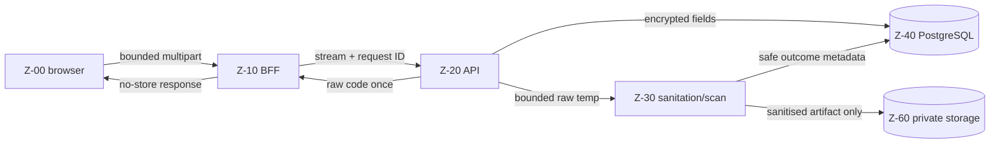
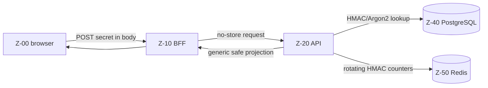
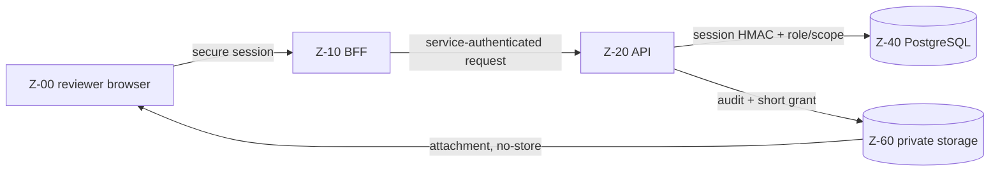
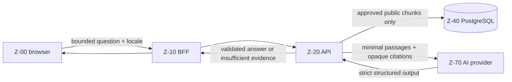
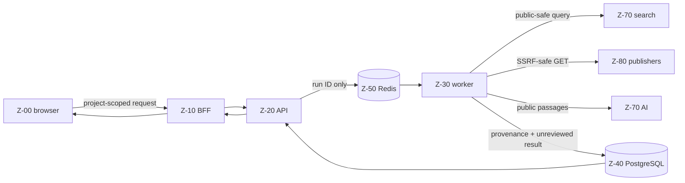
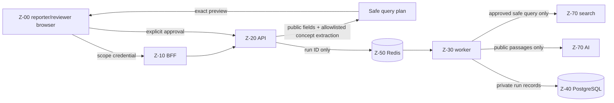

# Threat model and trust boundaries

- **Task:** BE-003
- **Version:** 1.0
- **Reviewed baseline date:** 2026-09-19
- **Pilot:** Abuja, limited to AMAC and Bwari Area Councils
- **Environment constraint:** hackathon and hosted-demo data is fictional; production handling of real sensitive reports is closed
- **Method:** asset and data-flow review with STRIDE threat enumeration

This document is a design contract, not evidence that a control has been implemented. A control becomes real only when the named task, test, and deployment configuration pass. The product and security invariants in [`AGENTS.md`](../AGENTS.md), [`PRODUCT.md`](../PRODUCT.md), and [`IMPLEMENTATION_PLAN.md`](IMPLEMENTATION_PLAN.md) remain authoritative.

## 1. Scope and security objectives

The model covers the Next.js public origin and BFF, private FastAPI API, Dramatiq worker, PostgreSQL roles, Redis, private object storage, search and AI providers, public-source fetches, and operational telemetry. It covers six critical flows:

1. anonymous report submission;
2. tracking-code or reporter-handle status lookup;
3. authorised reviewer evidence download;
4. public project Q&A;
5. public project Source Scout; and
6. report-scoped Source Scout.

The primary security objectives are:

- keep reports, contacts, credentials, evidence, reviewer work, and report-scoped discovery private by default;
- expose public facts only through allowlisted projections backed by approved citations;
- ensure only authorised humans can approve evidence, change review states, or publish a separately authored update;
- keep secrets out of URLs, logs, caches, metrics, prompts, search queries, object keys, and client bundles;
- contain hostile uploads, URLs, fetched content, and model output;
- preserve append-only, non-sensitive accountability for privileged actions; and
- degrade search, AI, scanning, storage, and queue failures without exposing data or disabling public project browsing.

### Assumptions and explicit non-goals

- The browser and reporter device may be shared, monitored, compromised, or abandoned. Browser storage is not trusted for durable secrets.
- External source pages, files, DNS, redirects, search results, and model output are untrusted.
- Cloud providers are trusted only for the narrow data explicitly allowlisted below and only under configured accounts, credentials, regions, and retention settings.
- ShaidaGo is not an emergency service and does not promise protection, investigation, or an external response.
- The proof of concept does not accept real whistleblower data. Production must remain disabled until legal basis, notice, retention periods, incident response, operational staffing, provider agreements, and security review are approved.
- Nation-wide ingestion, arbitrary crawling, public accounts, public report feeds, automatic truth scoring, and automatic publication are out of scope.

## 2. Data classification

| Classification | Meaning | Default handling |
| --- | --- | --- |
| `public` | Intentionally public information that has passed its required gate. | May appear in public allowlisted DTOs and public caches within the documented cache policy. |
| `public_after_review` | Candidate public material that is private or restricted until a human approval transaction succeeds. | Treat as private before approval; publish only the separately approved projection. |
| `private` | User, report, evidence, reviewer, or scoped-discovery data not intended for the public. | Encrypt as specified, deny by default, never place in public cache/search/Q&A, and minimise internal access. |
| `secret` | A credential or cryptographic capability whose disclosure enables access or decryption. | Environment or secret manager only; never log, cache publicly, persist in client-accessible storage, or include in source control. |
| `security_metadata` | Data used to authorise, audit, rate-limit, or investigate abuse that can still create privacy or attack risk. | Minimise, pseudonymise where possible, bound retention/cardinality, and restrict to the security purpose. |

Classification is attached to the data, not the component holding it. Moving private data into Redis, a prompt, a metric, or an error tracker does not make it operational metadata.

## 3. Asset register

| ID | Asset | Classification | Authoritative store or lifetime | Critical property |
| --- | --- | --- | --- | --- |
| A-01 | Approved project facts, public statuses, and translations | `public` | PostgreSQL public projection | Every factual value resolves to an approved citation and checked/effective date. |
| A-02 | Source metadata, immutable versions, and exact supporting passages | `public_after_review` | PostgreSQL; permitted excerpts only | Approval, availability, and fact verification remain independent. |
| A-03 | Reviewer-authored public-safe updates | `public_after_review` | PostgreSQL separate from reports | Publication never copies or exposes the private report by implication. |
| A-04 | Private report description and category | `private` | Independently encrypted PostgreSQL fields | Never returned by public/tracking endpoints or sent to search/AI. |
| A-05 | Optional reporter contact values | `private` | Separately encrypted contact table | Access is narrower than report access and deletion is independent. |
| A-06 | Raw tracking code | `secret` | Reporter possession; response lifetime only | Returned exactly once, never persisted or logged in raw form. |
| A-07 | Tracking-code HMAC and lookup metadata | `security_metadata` | PostgreSQL | Cannot be reversed to recover the raw code; lookup shape resists enumeration. |
| A-08 | Reporter handle and report links | `security_metadata` | PostgreSQL | Handle is not identity and is never treated as proof of independent reporters. |
| A-09 | Reporter-handle passphrase | `secret` | Reporter possession; request lifetime only | Server stores only an Argon2id hash and offers no recovery. |
| A-10 | Raw upload bytes and original client filename | `private` | Bounded temporary processing only | Never reach durable object storage; deleted on every outcome. |
| A-11 | Sanitised evidence artifact and safe metadata | `private` | Private object storage plus PostgreSQL metadata | Random object key, no public ACL, scan/sanitation state enforced before access. |
| A-12 | Follow-up answers, internal notes, risk reasons, and reviewer findings | `private` | Independently encrypted PostgreSQL fields | Visible only to the minimum authorised reviewer workflow. |
| A-13 | Report-scoped queries, fetched results, analyses, and review decisions | `private` | PostgreSQL and bounded worker memory | Never enter public discovery, Q&A, caches, logs, or analytics. |
| A-14 | Reviewer password hash and role assignment | `secret` | PostgreSQL restricted auth tables | Password verification does not grant authorisation beyond the stored role. |
| A-15 | Raw reviewer session and CSRF token | `secret` | Browser secure cookie/request lifetime | Opaque, rotated, revocable, and never available to client JavaScript. |
| A-16 | Session HMAC, expiry, revocation, and privilege version | `security_metadata` | PostgreSQL or dedicated session store | Raw session cannot be recovered; privilege changes invalidate old sessions. |
| A-17 | Data-encryption keys, peppers, signing keys, and key versions | `secret` | Environment/managed secret system | No fallback production secret; rotation preserves versioned decryptability. |
| A-18 | Search, AI, storage, database, and queue credentials | `secret` | Environment/managed secret system | Each credential has least privilege and environment isolation. |
| A-19 | Append-only status and audit history | `security_metadata` | PostgreSQL restricted append-only tables | Records actor/action/target/status/request/time, never private bodies or credentials. |
| A-20 | Request ID, route template, error code, latency, bounded actor class | `security_metadata` | Logs/metrics for bounded operational retention | Values have bounded cardinality and no raw user content. |
| A-21 | Rotating IP HMAC and rate-limit counters | `security_metadata` | Redis for the rate-limit window | Full IP is not logged or retained; HMAC key rotates. |
| A-22 | Public Q&A question before screening | `private` | Request memory only by default | Reject or minimise sensitive input before provider use; do not persist raw question. |
| A-23 | Public discovery results labelled not yet reviewed | `public` | PostgreSQL public-run projection | Visibility never implies attachment, verification, or project-status change. |
| A-24 | AI prompts and raw provider output | `private` | Request memory only | Prompt receives only the allowlisted minimum. Only model/prompt/schema versions and aggregate metrics survive the request, and they are handled as A-20. |

## 4. Actors and capabilities

| Actor | Trusted capability | Must never be assumed |
| --- | --- | --- |
| Anonymous visitor | Read public projections; submit a fictional private report; run bounded public Q&A/discovery. | Identity, benevolent intent, browser integrity, or access to any private record. |
| Reporter with tracking code | Read one generic public-safe status and answer an approved follow-up for that report. | Identity, ownership beyond possession of the credential, reviewer privilege, or access to evidence/notes. |
| Reporter with optional handle | Link a new report after handle/passphrase verification and list public-safe statuses for linked reports. | Identity, uniqueness of a person, recovery entitlement, or evidentiary credibility. |
| Reviewer | Perform explicitly authorised review operations for assigned scope. | Admin power, unrestricted database/object access, or authority to bypass evidence/publication checks. |
| Admin | Manage reviewers and perform audited corrections expressly granted by policy. | Direct database mutation, secret access, or exemption from publication/privacy rules. |
| BFF | Authenticate browser context, enforce origin/CSRF/browser limits, propagate locale/request ID, and shape browser-safe errors. | Domain authority, report visibility decisions, or independent authorisation policy. |
| Private API | Enforce domain rules, authorisation, state transitions, encryption, allowlists, citations, and publication transactions. | Trust in browser/BFF validation or external-provider output. |
| Worker | Execute authenticated, idempotent jobs by opaque identifiers with scoped database/storage access. | Human review authority, raw credentials in job payloads, or publication power. |
| Maintainer/migration operator | Deploy reviewed code/migrations and manage environment configuration. | Routine access to decrypted report data or permission to seed production. |
| Search/AI/storage provider | Process only its destination-specific allowlist under contract/configuration. | Domain authority, truth, permanent availability, or permission to reuse unrelated data. |
| Public publisher | Serve a public HTTP/HTTPS resource that passes fetch policy. | Safe DNS/content, accurate claims, permission for unlimited copying, or instruction authority. |
| Attacker | Attempt enumeration, injection, SSRF, credential abuse, resource exhaustion, and privacy leakage. | Any stated identity or benign input. |

## 5. Trust zones

| Zone | Components | Trust level | Required boundary controls |
| --- | --- | --- | --- |
| Z-00 | Browser/shared device/network | Hostile | TLS, same-origin BFF, no secret URLs/storage, no-store responses, accessible generic errors. |
| Z-10 | Public Next.js origin and Route Handlers | Internet-facing constrained edge | Body limits, Origin/CSRF where applicable, secure cookies, request IDs, rate limits, safe error shaping. |
| Z-20 | Private FastAPI API | Domain authority, not public | Private network, authenticated service call, strict request schemas, deny-by-default authorisation, response allowlists. |
| Z-30 | Dramatiq worker and bounded temporary filesystem | Privileged job executor | ID-only jobs, authenticated queue, idempotency, sandboxed parsers, byte/time/resource limits, cleanup. |
| Z-40 | PostgreSQL roles and schemas | Authoritative durable state | TLS, separate migration/public/reviewer/worker roles, grants/RLS/views, encryption, constraints, append-only histories. |
| Z-50 | Redis queue/rate-limit store | Non-authoritative ephemeral infrastructure | TLS/auth, namespace isolation, TTLs, IDs/counters only, no report bodies or contacts. |
| Z-60 | Private object storage | Private evidence store | Private bucket, random keys, scoped service role, encryption at rest, short signed downloads, lifecycle deletion. |
| Z-70 | Search and AI providers | External processor | Destination allowlists, timeout/budget caps, no private-report data, no provider authority, configured non-retention where supported. |
| Z-80 | Public web/DNS/redirect targets | Hostile external content | SSRF controls, DNS and redirect revalidation, robots/terms/access rules, content/size/time limits, inert extraction. |
| Z-90 | Logs, metrics, CI, and operator surfaces | Restricted operational zone | Central denylist, no bodies/secrets/signed URLs, bounded retention/cardinality, environment separation, masked CI secrets. |

### Boundary authentication and direction

| Boundary | Direction | Authentication/validation requirement | Permitted payload class |
| --- | --- | --- | --- |
| TB-01 | Z-00 → Z-10 | TLS, same origin, origin/CSRF for cookie mutations, browser/body/rate limits | Explicit browser request schema only. |
| TB-02 | Z-10 → Z-20 | Private network plus the per-caller internal-service credential from [ADR-0002](decisions/0002-bff-authority-split-and-internal-service-authentication.md); forwarded request ID, locale, and client HMAC are read only after caller authentication | Validated request fields; BFF cannot assert domain authorisation. |
| TB-03 | Z-20/Z-30 → Z-40 | TLS and least-privilege database role selected per process/use case | Parameterised queries and explicit projections. |
| TB-04 | Z-20 ↔ Z-50 | Authenticated TLS, namespaced queue/rate keys, TTL and payload schema | Opaque IDs, job versions, counters, leases; no private bodies. |
| TB-05 | Z-20/Z-30 ↔ Z-60 | Scoped service credential or short-lived signed operation | Sanitised bytes and minimal safe metadata only. |
| TB-06 | Z-30 → Z-70 | Provider TLS/API credential, allowlisted schema, time/size/budget caps | Public-safe query or approved public passages only. |
| TB-07 | Z-30 → Z-80 | SSRF-safe fetcher; validate scheme, port, DNS answers, redirects, content type, bytes, time, robots/access | Public URL and minimal safe fetch headers only. |
| TB-08 | All trusted zones → Z-90 | Central structured-logging/metrics adapters with sensitive-field denylist | A-20 and approved aggregate counters only. |
| TB-09 | Z-00 → Z-60 | Short-lived reviewer-only signed download after API authorisation and audit | One sanitised artifact; attachment response; no list/write ability. |

TB-02 uses per-caller bearer credentials with `current`/`previous` rotation, verified before any router runs ([ADR-0002](decisions/0002-bff-authority-split-and-internal-service-authentication.md)). The worker does not call the API. Until BE-022 implements and tests this, “private hostname” alone is not authentication.

## 6. Critical data flows

Each edge below has an allowlist. Anything not named is denied. All responses carrying A-04 through A-18 use `Cache-Control: no-store` where HTTP applies.

### DF-01 — Anonymous report submission

| Edge | Allowlist | Mandatory controls | Explicitly forbidden |
| --- | --- | --- | --- |
| DF-01.1 browser → BFF | Project ID, concern category, bounded description, anonymous/contact choice, optional contact, optional handle credentials, bounded files | Shared-device warning; body/file count/size limits; honeypot and rate limit; no URL secrets | Analytics payload, persistent browser copy of contact/attachment/tracking code, client authority over risk/status. |
| DF-01.2 BFF → API | Validated/streamed fields above, locale, safe request ID, origin decision | Thin BFF; backpressure; private service auth; browser-safe error mapping | BFF-decided authorisation/status/publication; buffering unbounded uploads; body logs. |
| DF-01.3 API → PostgreSQL | Encrypted report/contact fields, code HMAC, safe metadata, append-only `received`/audit event | Transaction; separate keys/nonces; restricted insert path; no private `RETURNING` to public role | Raw tracking code/passphrase, raw contact/report text, public visibility. |
| DF-01.4 API/worker → temporary processing | Raw bytes, generated temp name, sniffed type, opaque report/file ID | Resource limits; metadata/active-content removal; scan policy; `finally` cleanup | Original filename as path, persistent raw quarantine, network-capable parser. |
| DF-01.5 worker → object storage | Sanitised artifact, random object key, safe MIME/size/hash | Private bucket; encryption; upload only after sanitation; scan state enforced | Raw upload, person/project/report name in key, public ACL. |
| DF-01.6 API → reporter | Raw tracking code exactly once, safe receipt/status guidance | No-store; never log; no recovery promise; generic failure | Report ID, storage key, internal note, reviewer identity, provider detail. |

### DF-02 — Tracking code or reporter-handle lookup

| Edge | Allowlist | Mandatory controls | Explicitly forbidden |
| --- | --- | --- | --- |
| DF-02.1 browser → BFF/API | Tracking code in POST body, or handle plus passphrase in POST body | Normalise/check checksum before DB; origin and rate controls; no-store | Path/query/cookie/local-storage credential, raw code/IP log. |
| DF-02.2 API → Redis | Rotating IP HMAC, code/handle prefix bucket, counters, expiry | Key rotation; bounded TTL; generic throttling | Full IP, raw code, passphrase, report ID/body. |
| DF-02.3 API → PostgreSQL | Code HMAC or handle plus Argon2id verification; bounded status projection query | Constant-work/generic shape as practical; restricted projection | ORM serialisation, evidence/contact/note/discovery joins. |
| DF-02.4 API → browser | Current public-safe status, last update, approved safe message, next action | Same not-found/inaccessible shape; no-store; no reviewer details | Description, category if sensitive, contact, evidence, risk reason, reviewer identity, private discovery. |

### DF-03 — Reviewer evidence download

| Edge | Allowlist | Mandatory controls | Explicitly forbidden |
| --- | --- | --- | --- |
| DF-03.1 browser → API through BFF | Opaque secure cookie, evidence ID, CSRF only if the operation mutates state | Session rotation/revocation; role and report-scope check; generic denial | Object key supplied by browser, report access based on authentication alone. |
| DF-03.2 API → PostgreSQL | Session HMAC, privilege version, report/evidence metadata, sanitation/scan state | Deny by default; horizontal and vertical checks; transactionally append access audit | Decrypted report fields not needed for download decision. |
| DF-03.3 API → storage/browser | One evidence object or short-lived signed GET bound to safe disposition | `Content-Disposition: attachment`; no-store; short expiry; no referrer leakage; clean or explicitly labelled demo state | Bucket listing/write, raw file, stable public URL, URL in logs/analytics. |

### DF-04 — Public project Q&A

| Edge | Allowlist | Mandatory controls | Explicitly forbidden |
| --- | --- | --- | --- |
| DF-04.1 browser → API | Project slug, locale, bounded question | Rate/length limits; sensitive-pattern screen; request not persisted by default | Tracking code, contact, report/evidence text, cross-project context. |
| DF-04.2 API → retrieval | Selected-project ID and query terms after screening | Public, approved, currently eligible source versions only; project isolation | Private reports, discovered-unreviewed sources, hidden chunks. |
| DF-04.3 API → AI | System policy, locale, minimised safe question, selected public passages, opaque citation IDs, strict output schema | `store: false` where supported; timeout/token caps; configurable model | Person/contact/tracking/session data, raw provider secrets, unrelated sources, tools. |
| DF-04.4 AI → API/browser | Structured answer, statement citation IDs, insufficient-evidence flag, safe confidence note | Reject unknown/cross-project/uncited/malformed output; fail closed | Model-proposed status/publication, numerical truth score, uncited factual statement. |

### DF-05 — Public project Source Scout

| Edge | Allowlist | Mandatory controls | Explicitly forbidden |
| --- | --- | --- | --- |
| DF-05.1 browser → API/queue | Public project ID and bounded date/filter choices | Shared run per project/24h; IP-HMAC and global budget; job payload is run ID | Arbitrary raw search string, private report context, provider credentials. |
| DF-05.2 worker → search | Public project title, public locality, responsible body, category, public dates, allowlisted concepts | Query builder allowlist; result cap; provider timeout/budget | Names/contacts, precise private address, attachment text, tracking code, notes, raw report. |
| DF-05.3 worker → publisher | Candidate public HTTP/HTTPS URL and minimal fetch headers | DNS/redirect revalidation; ports 80/443; public IPs; byte/time/content caps; robots/terms/access controls | Cookies/auth headers, credentialed URL, private/metadata IP, login/paywall/CAPTCHA bypass. |
| DF-05.4 worker → AI | Bounded inert public passages, source/chunk IDs, strict discovery schema | No tools; prompt-injection isolation; citation validation; max five questions | Page instructions as authority, private context, automatic verification/publication. |
| DF-05.5 database → browser | Scope-safe progress and completed results labelled `discovered — not yet reviewed` | Bounded cards/excerpts; availability/date/provenance visible | Implication of approval, attached-source status without human decision, private run results. |

### DF-06 — Report-scoped Source Scout

| Edge | Allowlist | Mandatory controls | Explicitly forbidden |
| --- | --- | --- | --- |
| DF-06.1 scoped actor → API | Tracking/handle credential or reviewer session, report ID resolved server-side, request to prepare query | Scope authorisation; no report ID authority from browser; no-store | Public/anonymous access to run or report detail. |
| DF-06.2 API → query preview | Public project fields plus deterministic allowlisted incident concepts; exact outbound terms and policy warnings | PII/secret denylist; unnecessary precision removed; versioned plan | Raw description, contact, person name, exact private address, code, attachment/OCR, internal note. |
| DF-06.3 actor → approval | Query-plan ID/version and explicit approval | Stale-plan rejection; approval audit; reviewer-only changes to terms | Silent automatic dispatch or approval of a different query version. |
| DF-06.4 API → queue/worker | Run ID and approved query-plan ID only | Worker reloads authorised plan; idempotency and cancellation | Report text/contact/evidence in Redis or job args. |
| DF-06.5 worker → search/AI | Exact approved safe query to search; fetched public passages and opaque citations to AI | Same fetch/provider controls as DF-05; output remains report-private | Any private report asset, query expansion from private text, public indexing/cache. |
| DF-06.6 API → scoped browser/reviewer | Private progress/results, gaps, safe follow-up questions, source decisions | Credential recheck every request; no-store; attach requires human review | Public DTO, automatic project status change, raw provider debug/prompt. |

## 7. Outbound destination allowlists

These allowlists apply even when a library, provider SDK, exception handler, or telemetry agent would send more by default.

| Destination | Allowed | Denied | Enforcement and failure mode |
| --- | --- | --- | --- |
| Public browser | A-01 and explicitly public projections of A-02/A-03/A-23 | A-04 through A-22 and A-24 | Pydantic allowlist DTOs, public DB role/views, snapshot denylist tests; fail closed with safe problem response. |
| Scoped reporter browser | Generic safe status/next action and approved follow-up question | Report body, contact, evidence, reviewer/risk details, private discovery sources unless that scoped flow explicitly exposes safe results | Credential verification, no-store, equivalent failure shape, response canary tests. |
| Reviewer browser | Minimum authorised case/evidence view for current scope | Encryption/provider credentials, unrelated cases, raw session server state, unrestricted object access | Role/scope service checks, no-store, download audit, horizontal/vertical tests. |
| Redis | IDs, job/schema versions, leases, attempt counters, rotating rate-limit HMAC keys/counters | Descriptions, contacts, codes/passphrases, attachments, notes, prompts, full URLs containing secrets | Typed payload schema and denylist test; reject enqueue if extra fields exist. |
| Object storage | Sanitised artifact bytes, random object key, safe MIME/size/hash metadata | Raw uploads, names/contacts/report/project identifiers in key, public ACL | Storage adapter schema and spy tests; abort/delete on metadata mismatch. |
| Search provider | Approved public-safe query terms from DF-05.2 or DF-06.2 | Every private/secret asset; raw reports; attachment text; precise private locations; internal notes | Privacy-safe query builder with 100% branch coverage and outbound capture tests; block run on any denylist hit. |
| AI provider | Screened public Q&A question plus approved public passages, or inert fetched public passages plus opaque citation IDs/schema | Private reports/discovery, contacts, credentials, evidence, notes, tracking/handle secrets, unrelated projects | Provider interface, strict request schema, `store: false`, outbound spy and citation validator; return insufficient evidence/needs review on failure. |
| Public publisher | URL, minimal user agent/accept headers, bounded conditional-fetch metadata | Internal cookies/auth, arbitrary headers, private host/IP, credentials in URL | Dedicated SSRF-safe fetcher; reject before connect or on every unsafe redirect/DNS result. |
| Logs/error tracking | Request ID, route template, status, stable error code, latency, bounded actor class, job state, aggregate sanitation/provider outcome | Bodies, contacts, credentials, codes, filenames/content, signed URLs, raw prompts/questions, decrypted values, full IPs | Central logger/exception scrubber and canary tests; drop unsafe event rather than forwarding it. |
| Metrics | Bounded route/job/provider/error labels and numeric aggregates | User/project/report/source IDs, URLs, locales as unbounded free text, bodies, codes, IPs | Fixed label schemas and cardinality tests; unknown label rejected. |
| CI/test artifacts | Deterministic fictional fixtures, synthetic secrets, aggregate reports | Live credentials, production exports, real reports/evidence, decrypted snapshots | Secret scanning and fixture banners; fail build/upload on denylist. |

## 8. Private-data lifecycle, retention ownership, and deletion

No production retention duration is invented for the hackathon. Production startup remains closed until legal/privacy owners approve numeric retention periods and provider deletion terms. In development and the hosted demo, only clearly fictional records are accepted and all private demo data is purged when the environment is torn down or the maintainer runs the future guarded purge workflow.

| Assets | Storage and encryption | Logging/cache rule | Retention owner and trigger | Deletion or unlink behaviour |
| --- | --- | --- | --- | --- |
| A-04 report text/category | Report text encrypted independently with versioned AEAD; category restricted as private case metadata | No body logs, analytics, public cache, Q&A, or public discovery | Privacy/safety owner; until approved report-retention expiry or valid purge request | Destroy ciphertext and wrapped data key/reference; retain only a content-free audit tombstone if policy requires. |
| A-05 contacts | Separate table and separate AEAD field/key context | Never in queue/list projection, metrics, cache, prompt, or search | Privacy/safety owner; delete earlier on reporter request or when follow-up purpose ends | Hard-delete ciphertext and unlink contact reference without deleting the report. |
| A-06/A-07 tracking credentials | Raw code never stored; keyed HMAC in restricted table | Never log/cache raw code; HMAC not an analytics identifier | Report owner; HMAC lasts only while tracking is offered | Delete HMAC and lookup metadata when report tracking ends/purge occurs; code cannot be recovered. |
| A-08/A-09 handle credentials | Handle plus Argon2id passphrase hash; no identity/recovery fields | No passphrase logs/cache; handle excluded from public output | Reporter controls unlink; privacy owner controls environment retention | Delete handle/hash and unlink all reports; reports remain fully anonymous unless separately purged. |
| A-10 raw uploads | Random temp path on encrypted/isolated bounded storage; never durable | No filenames/bytes in logs/cache | File-processing owner; request/job lifetime with a strict short maximum | Delete in `finally` on success, rejection, timeout, crash recovery, and cancellation; cleanup job verifies no orphan. |
| A-11 sanitised evidence | Private object encryption plus restricted metadata; object key is random | No CDN/public cache, inline serving, analytics, or stable signed URL | Privacy/safety owner; same or shorter than parent report | Delete object first, verify absence, delete metadata/key reference, append content-free deletion audit. |
| A-12 notes/follow-ups/risk | Separate encrypted fields/tables and restricted reviewer role | Never public, in metrics, error tracking, search, or public AI | Review operations/privacy owner; report retention with earlier deletion when purpose ends | Delete ciphertext/key reference; status/audit event keeps only non-sensitive state transition. |
| A-13 report-scoped discovery | Restricted tables; sensitive answers encrypted; worker memory bounded | No public cache/index, raw query log, analytics, or public-run reuse | Privacy/safety owner; no longer than parent report unless a source is separately approved | Delete private run/query/analysis/answers. An independently approved public source version may remain, but all report linkage/private rationale is removed. |
| A-14 reviewer password/role | Argon2id hash and restricted role table | Never log hash/password; auth response no-store | Security owner; account lifetime plus required audit period | Disable/revoke immediately; delete hash when account removal is allowed; preserve non-sensitive historical actor reference or tombstone. |
| A-15/A-16 sessions | Raw token only in secure cookie; keyed HMAC and expiry server-side | Never log/cache raw token; no client JS access | Security owner; short configured session TTL and immediate revocation events | Delete/revoke HMAC on sign-out, expiry, password/role change, compromise, or account disable. |
| A-17/A-18 keys/provider credentials | Secret manager/environment; versioned key references only in DB | Never log, persist in repo, include in image/client, or expose in error | Security/operations owner; rotate on schedule and incident | Revoke provider credential immediately. Destroy old data key only after ciphertext migration/purge is verified. |
| A-19 audit history | Append-only restricted table; no private payload | Not sent to public telemetry; export access audited | Security/privacy owner; approved audit-retention period required before production | Do not rewrite events. At retention expiry delete partitions/records under controlled job; preserve no linkable private payload. |
| A-20/A-21 operational metadata | Structured logs and Redis TTL entries; rotating HMAC for IP | Never enrich with user content or stable cross-window identity | Operations/security owner; shortest diagnostic/rate-limit window that meets purpose | TTL expiry and bounded log lifecycle; key rotation prevents long-term linkage. |
| A-22 public Q&A question | Request memory only by default; optional metrics omit text | No logs/cache/database/raw prompt archive | Product/privacy owner; request lifetime | Release memory after request; provider request uses configured non-retention where supported. |
| A-24 AI prompts/raw output | Request memory only; persist only prompt/model/schema versions and aggregate metrics as A-20, never raw input/output | Never error-log prompt/output | AI/security owner; request lifetime | Discard after validated response; provider deletion governed by configured account terms and production gate. |

Backups must inherit the same classification, encryption, access, and expiry policy. A deletion workflow must either age data out of backups within the documented recovery window or record that limitation in the production privacy notice. Restoring a backup must reapply deletions recorded after the backup point before serving traffic.

## 9. STRIDE threats and mandatory verification

Status is **planned** until the named implementation task produces passing evidence.

| ID | STRIDE | Threat and impact | Required control | Mandatory verification owner |
| --- | --- | --- | --- | --- |
| TM-S01 | Spoofing | Attacker steals/replays a reviewer session and reads private cases. | Opaque rotated session, keyed server hash, secure cookie, revocation, short TTL, privilege version. | BE-051/BE-053/BE-054: replay, fixation, expiry, role-change and production-cookie tests. |
| TM-S02 | Spoofing | Attacker guesses a tracking code or handle passphrase. | 100-bit checked code, HMAC storage, Argon2id handle secret, generic response, rate limit/backoff. | BE-062/BE-065/BE-066/BE-100: entropy/property, enumeration, timing-shape, backoff tests. |
| TM-S03 | Spoofing | Public caller reaches the private API or forges BFF context. | Private network plus internal-service authentication; API reauthorises domain action. | BE-004 ADR; BE-022/BE-052 integration tests for missing/forged/stale service identity. |
| TM-S04 | Spoofing | Worker forges a human reviewer decision. | Separate worker identity/DB grants; human actor required by state machine. | BE-071/BE-096: worker attempts every human transition and is denied. |
| TM-T01 | Tampering | Concurrent/stale reviewer requests create an invalid report transition or duplicate event. | Row lock/version compare, canonical state machine, atomic append-only event and idempotency key. | BE-071: full transition matrix, stale-version, race and replay tests; 100% state-machine branch coverage. |
| TM-T02 | Tampering | Source/citation content changes after approval while public facts still cite it. | Immutable content-addressed versions; new version/review required; transactional citation completeness. | BE-041: mutation, wrong-version, missing-passage and publication-race tests. |
| TM-T03 | Tampering | Upload MIME/extension or active content bypasses sanitation. | Sniff/decode/re-encode, PDF active-content removal, hashes, scan state, raw cleanup. | BE-064: MIME spoof, polyglot, EXIF, malformed PDF, EICAR, scanner-down and cleanup tests. |
| TM-T04 | Tampering | Approved report-scoped query is swapped before dispatch. | Version/hash exact preview; explicit approval; worker reloads the approved plan by ID. | BE-091/BE-096: stale plan, changed terms, replay and ID-swap tests. |
| TM-R01 | Repudiation | Reviewer denies reading evidence, changing state, or publishing. | Append-only audit with actor/action/target/status/request/time; evidence access audit. | BE-023/BE-071/BE-073/BE-074: audit completeness and append-only DB tests. |
| TM-R02 | Repudiation | Retries create multiple reports/jobs/public updates with unclear origin. | Idempotency keys, stable run/job IDs, uniqueness constraints, result replay. | BE-034/BE-063/BE-090/BE-074/BE-103: duplicate request and crash/retry tests. |
| TM-R03 | Repudiation | Admin corrects a source/status without preserving the prior state/reason. | Canonical correction transition and before/after status-only audit; immutable history. | BE-041/BE-071: correction requires reason/citation and preserves history. |
| TM-I01 | Information disclosure | ORM/entity serialisation leaks report/contact/note fields into public responses. | Explicit Pydantic public DTO allowlists and public DB role/views. | BE-032/BE-044/BE-045/BE-102: canary-field denylist snapshots and restricted-role tests. |
| TM-I02 | Information disclosure | Tracking not-found versus found responses reveal report existence. | Generic shape/detail/cache policy and comparable work/timing as practical. | BE-065/BE-102: enumeration corpus, status/body/header/timing-distribution tests. |
| TM-I03 | Information disclosure | Request bodies, codes, contacts, filenames, signed URLs, or prompts reach logs/errors. | Central sensitive-field denylist and drop-on-unsafe structured adapters. | BE-023/BE-024/BE-090: canary injection across API, worker, provider, exception and access-log paths. |
| TM-I04 | Information disclosure | Next.js/CDN/service worker caches private reviewer/tracking/discovery data. | No-store at API and BFF, dynamic rendering, cache bypass, service-worker exclusion. | BE-101 and FE-104/FE-116/FE-131: cache header, back-navigation, offline/cache inspection tests. |
| TM-I05 | Information disclosure | Private report text or identifiers enter a search query. | Field allowlist, deterministic denylist, exact preview/approval, outbound capture. | BE-090/BE-091: 100% privacy-query-builder branches and adversarial PII/secret fixtures. |
| TM-I06 | Information disclosure | Private/cross-project content enters AI context or provider storage. | Approved public chunks only, scope filter, minimal payload, `store: false`, provider spy. | BE-080/BE-081/BE-082/BE-095: private canaries, cross-project fixtures and request snapshot tests. |
| TM-I07 | Information disclosure | Signed evidence URL leaks through referrer, logs, cache, or excessive lifetime. | Short expiry, no-store/referrer controls, attachment disposition, audit, no URL logs. | BE-073/BE-101: expiry, reuse, unauthorised, referrer/header and log-canary tests. |
| TM-I08 | Information disclosure | Object key reveals reporter/project identity or permits enumeration. | Random opaque keys, private bucket, no listing grant, key-schema assertion. | BE-064: storage-spy assertions for key entropy/content and ACL/grant tests. |
| TM-I09 | Information disclosure | Reporter handle becomes public identity or report-corroboration proof. | Reviewer-only track record, public exclusion, same-handle counts once, explicit explanatory copy. | BE-066/BE-074/BE-102: public projection and corroboration-count tests. |
| TM-D01 | Denial of service | Oversized, compressed, malformed, or slow uploads exhaust BFF/API/worker. | Layered byte/file/count/time/decode limits, streaming/backpressure, bounded temp disk and concurrency. | BE-063/BE-064/BE-103: boundary, compression/decode bomb, slow stream and disk cleanup tests. |
| TM-D02 | Denial of service | Public discovery exhausts provider budget or queue capacity. | Shared 24-hour run, per-IP-HMAC/global budget, URL cap, bounded retries/dead letters/cancellation. | BE-092/BE-096/BE-100: concurrency, budget, storm, exhaustion and cancellation tests. |
| TM-D03 | Denial of service | Login/status/handle credential abuse consumes Argon2/database capacity. | Shared rate limits, per-handle backoff, bounded password parameters, no hard lockout. | BE-050/BE-054/BE-066/BE-100: burst, distributed-key and recovery tests. |
| TM-D04 | Denial of service | Poison job retries forever or blocks unrelated public browsing/reporting. | Bounded exponential retry, dead-letter visibility, circuit breaker/bulkhead, dependency-specific readiness. | BE-025/BE-090/BE-103: poison fixture, outage and degraded-mode tests. |
| TM-E01 | Elevation of privilege | Authenticated reviewer accesses another scope or admin operation. | Deny-by-default policy and object-level authorisation on every service method. | BE-053/BE-070/BE-073: complete role/action/resource matrix and ID-substitution tests. |
| TM-E02 | Elevation of privilege | Malicious URL/DNS/redirect reaches metadata service, private API, database, or local network. | Parse and reject unsafe forms; validate every A/AAAA and redirect; safe connect; limits. | BE-093: IPv4/IPv6/encoded host, mixed DNS, rebind, redirect, metadata and port fixtures; 100% SSRF-guard branches. |
| TM-E03 | Elevation of privilege | Fetched page prompt injection controls model/tools or publication. | Inert extraction, no tools, fixed system schema, citation validation, human attachment/publication. | BE-094/BE-095/BE-096: hostile markup/PDF, instruction and tool-call fixtures. |
| TM-E04 | Elevation of privilege | Compromised API/worker uses broad DB/storage grants to read or mutate all private data. | Separate roles, RLS/views/grants, no unrestricted ORM projection, scoped storage credentials. | BE-032/BE-064/BE-111: grants/RLS tests under each runtime identity and storage action matrix. |
| TM-E05 | Elevation of privilege | AI/search/worker changes public status or publishes content. | Human-only transition actors and separate publication transaction with citation/private-field checks. | BE-071/BE-074/BE-095/BE-096: negative publication attempt from every non-human path. |

## 10. Security-test catalogue required by repository policy

The implementation must also include the complete adversarial sets below, even where the STRIDE table names only representative cases:

- tracking-code normalisation/checksum/HMAC properties and enumeration resistance;
- authentication versus authorisation, horizontal versus vertical access, session fixation/rotation/revocation, CSRF and Origin checks;
- public-response field allowlists with seeded private canaries;
- report-state, source-review, discovery, translation, sanitation, and scan state-machine forbidden edges;
- rate-limit keys, windows, bypass attempts, concurrency, expiry, and generic responses;
- upload MIME spoofing, polyglots, EXIF/IPTC/XMP, encrypted/active PDFs, malware/scanner outage, decompression/decode bombs, temp cleanup, and storage spying;
- SSRF IPv4/IPv6 variants, numeric/ambiguous hosts, userinfo, mixed DNS, rebinding, every redirect, metadata ranges, ports, content types, byte/time/decompression and concurrency limits;
- prompt injection, unknown/cross-project/uncited citations, malformed schemas, more than five questions, private canaries, and deterministic insufficient-evidence fallback;
- cache/CDN/service-worker exclusions for reviewer, tracking, Q&A bodies, private discovery, contacts, and signed evidence URLs; and
- log/error/metric/provider outbound canaries for every asset classified private or secret.

Coverage floors from `AGENTS.md` apply. Tracking normalisation, public response allowlists, privacy-safe query builder, SSRF guard, citation validator, and report state machine require 100% branch coverage.

## 11. Residual risks and release blockers

| Risk or limitation | Current treatment | Release consequence |
| --- | --- | --- |
| Hosted demo has no ClamAV because of footprint | Record `not_scanned_demo`, show reviewers, use fictional data only, still sanitise supported files | Production must refuse this scanner mode. |
| Fluent Hausa, Igbo, and Yoruba review is not yet recorded | Label non-reviewed text `machine_assisted` or `unavailable` | Final demo review remains open; no false `reviewed` label. |
| Source availability and publisher terms can change | Preserve permitted metadata/version/hash and checked date; do not bypass access controls | UI must show unavailability/staleness without rewriting history. |
| External provider retention/region/contract settings are not yet evidenced | Provider interface and minimum-data allowlist only | Production closed until settings and agreements are reviewed. |
| Numeric private-data retention and backup expiry are not approved | Fictional demo data only; teardown purge; owners and deletion mechanics defined above | Production startup must fail without approved configuration/policy. |
| A compromised reviewer can intentionally misuse authorised access | Least privilege, access audit, narrow queue/projections, revocation, no bulk export | Operational reviewer training/monitoring and incident process required before production. |
| Browser/device compromise can capture a tracking code or viewed evidence | Display once, no storage, no-store, shared-device warnings, short signed downloads | Cannot be eliminated by the service; clearly communicate device risk. |
| ShaidaGo cannot verify identity or independent-person count for anonymous reports | Handles are optional/non-identifying and same-handle reports count once | Never present report count as proof or identity. |

## 12. Exit checklist and change control

BE-003 is reviewable when all boxes below are supported by this document. Implementation remains future work.

- [x] Every required asset and actor has a classification and trust assumption.
- [x] Browser, BFF, API, worker, database roles, Redis, object storage, providers, public fetch targets, and telemetry are separate zones.
- [x] All six critical flows identify each boundary, allowed data, controls, and forbidden data.
- [x] Every external or operational destination has an explicit allowlist and denylist.
- [x] Every private or secret asset has storage, encryption, logging/cache, retention ownership, and deletion/unlink behaviour.
- [x] STRIDE threats map to mandatory implementation/test owners.
- [x] Residual risks and production blockers are explicit and do not claim hackathon controls are production-ready.

Re-run threat modelling when a data class, endpoint, provider, browser storage mechanism, authentication method, database role, object-store flow, job payload, log/metric field, or publication path changes. The change must update this document, its owning ADR where applicable, implementation tests, and the AI build log in one review.
